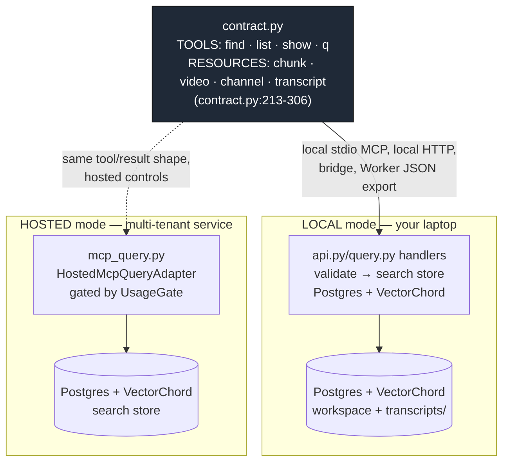
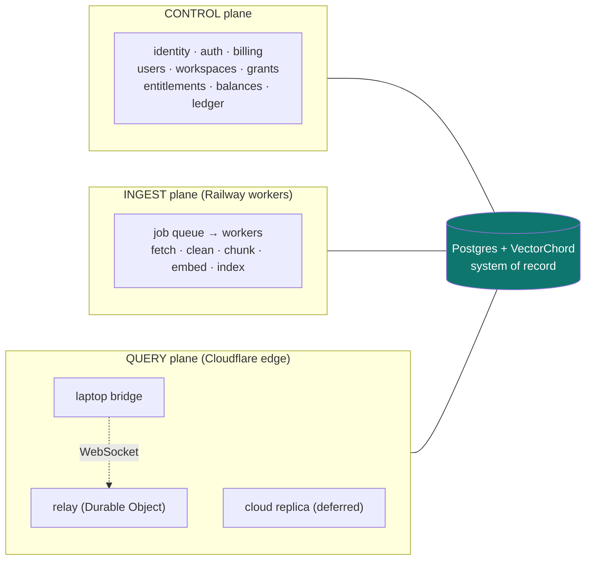

# Yutome architecture

A guided, diagram-first tour of how Yutome is built, written for the maintainer. Each concept is
drawn in the medium that fits its shape — entity-relationship diagrams for schemas, sequence
diagrams for handshakes, state diagrams for lifecycles, flowcharts + truth tables for decision
logic, and reference tables for inventories. Every non-obvious claim carries a `path:line` anchor so
you can check it against the code.

> Vocabulary follows the canonical [`docs/hosted-glossary.md`](../hosted-glossary.md). CLI shape
> follows [`docs/cli-architecture.md`](../cli-architecture.md). Remote-access shape follows
> [`docs/remote-access.md`](../remote-access.md). These docs cross-link rather than restate.

## The one-line model

Yutome is **two delivery modes over one contract and one database shape.** A *local* mode runs on
your laptop against Postgres + VectorChord; a *hosted* mode runs the same search store as a
multi-tenant service. Both speak the same four tools (`find` / `list` / `show` / `q`) and four resources
(`yutome://{chunk,video,channel,transcript}/{id}`) defined once in
[`src/yutome/contract.py`](../../src/yutome/contract.py).

## The contract is the spine

`contract.py` is the single source of truth for the agent-facing surface. Handler signatures there
are introspected by FastMCP to derive JSON Schema for the local server; the same set is serialized
with hand-curated metadata for the TypeScript Worker (`contract.py:1-8`). The MCP tool names never
change shape — CLI nesting is operator ergonomics layered *on top*, never a reshaping of the agent
contract (per `CLAUDE.md`).

**Read this carefully:** the local engine (`query.py`) and the hosted adapter (`mcp_query.py`) are
**two adapters over the same Postgres + VectorChord schema**, not two storage systems. Local executes
directly through `api.py`; hosted wraps the same search store with per-call metering. They agree on
the *result row shape* (`mcp_query.py:_contract_find_row`, ~`:1591`) and the tool names, and diverge
only where the hosted boundary adds account, UsageGate, and tenant controls.

## Hosted deployment topology (three planes)

Postgres is the system of record across all three planes. Cloudflare Workers **never run ingest**.

## Which document answers which question

| You want to understand… | Read |
|---|---|
| The whole system at a glance, the shared contract, deployment topology | this file |
| Multi-tenancy, the Postgres schema, metering/entitlements, auth flows, jobs, the hosted query path (codex-built — **priority**) | [`hosted.md`](hosted.md) |
| The web dashboard: routes, the BFF seam to the hosted API, session auth, what each page shows (codex-built — **priority**) | [`frontend.md`](frontend.md) |
| The CLI command surface and the local retrieval engine: query algebra, store dispatch, ingest pipeline, local storage, local MCP/HTTP serving | [`cli-and-engine.md`](cli-and-engine.md) |
| How hosted SQL is built: SQLAlchemy Core conventions, JSONB rules, parameter naming, and which queries stay raw | [`hosted-sql.md`](hosted-sql.md) |

## How to read the diagrams

All diagrams are inline Mermaid — GitHub, VS Code, and Obsidian render them natively, so the source
stays editable in-repo. Each one is also exported to [`diagrams/`](diagrams/) as a scalable **SVG**
(open in any browser, zoom without pixelation); see [`diagrams/README.md`](diagrams/README.md) for the
index. The command-surface mindmap renders inline only (the offline SVG renderer doesn't support
`mindmap`).
