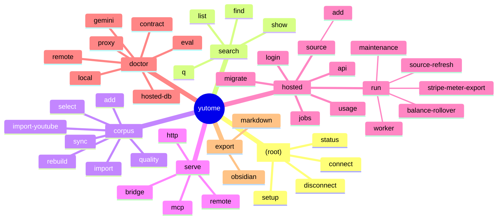
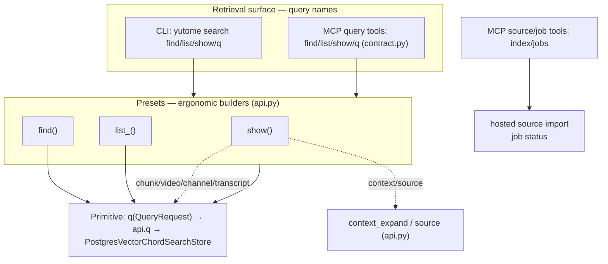
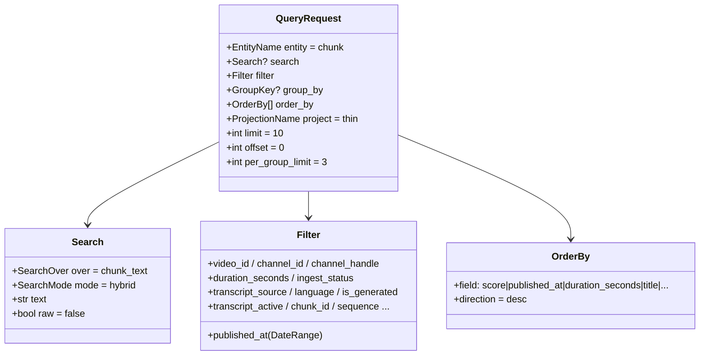
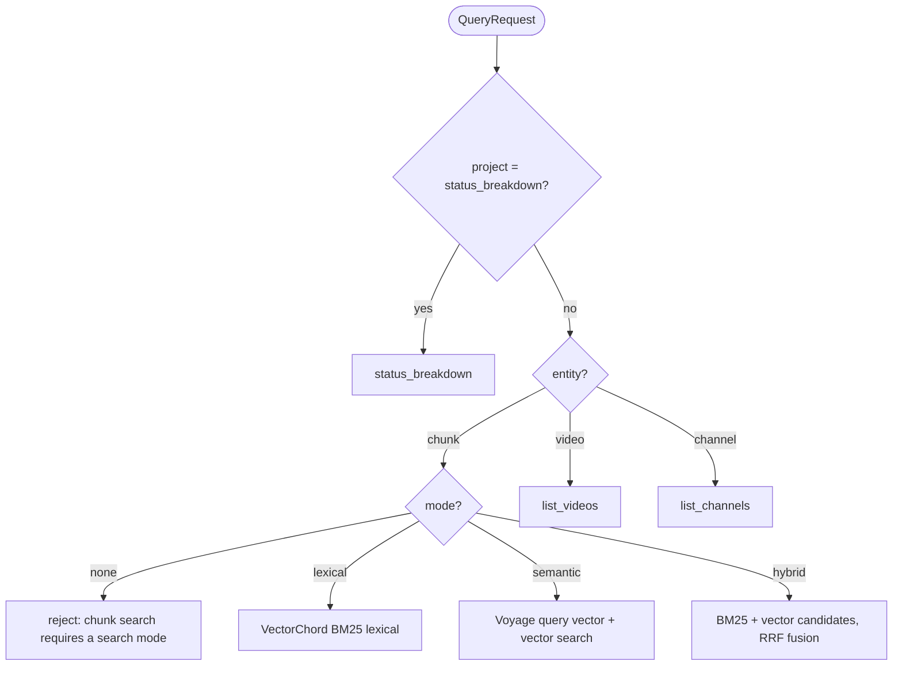
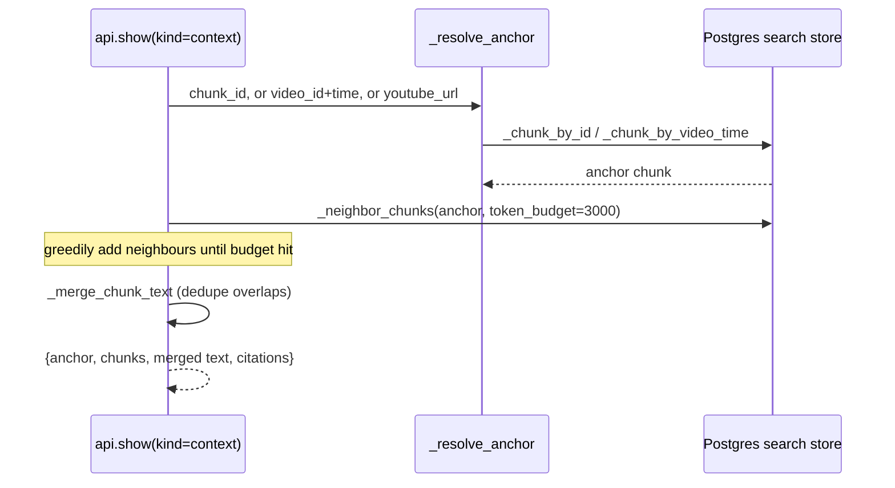
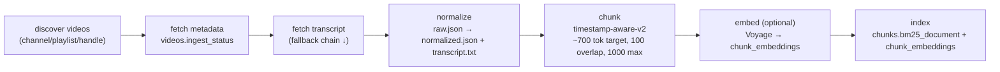
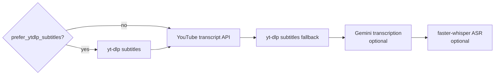
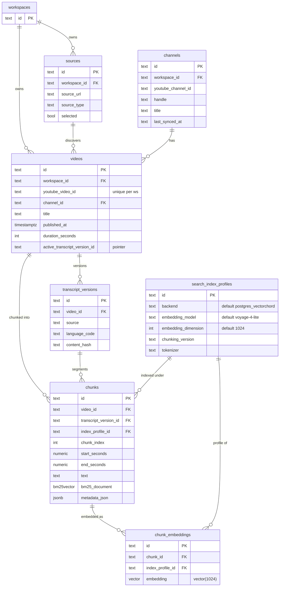
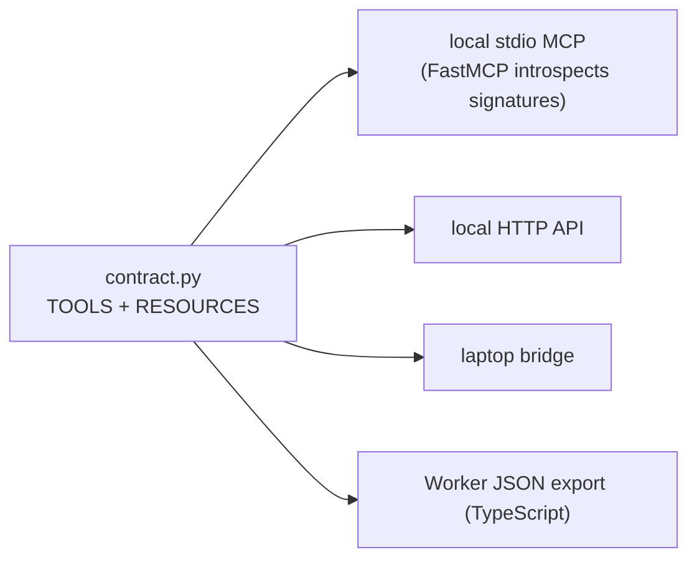
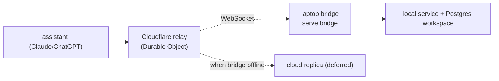

# CLI & the local retrieval engine

The local product: a namespaced CLI over the same retrieval *algebra* and Postgres + VectorChord
search store that hosted mode uses. "Local" means your laptop process and workspace; it no longer
means a second database backend.

Design rule (from [`docs/cli-architecture.md`](../cli-architecture.md)): the CLI is **operator
ergonomics layered over library primitives** — new capability is a parameter or subcommand under an
existing namespace, never a plugin registry or a reshaping of the MCP contract.

---

## 1. Command surface

`cli/__init__.py` builds a Typer app: six namespace sub-apps plus four root commands
(`__init__.py:30-36, 59-175`). Each namespace file is a **thin wrapper** that delegates to
`cli/actions.py`, where command logic opens config, resolves the workspace, and calls the Postgres
helpers or hosted runner.



The retrieval namespace is the load-bearing one and maps directly onto the library API:

| Command | File | Calls | Job |
|---|---|---|---|
| `search find` | `cli/search.py` | `api.find` (`api.py:47`) | search transcript chunks |
| `search list` | `cli/search.py` | `api.list_` (`api.py:100`) | enumerate videos / channels / status |
| `search show` | `cli/search.py` | `api.show` (`api.py:158`) | open a resource or expand a citation/context |
| `search q` | `cli/search.py` | `api.q` (`api.py:42`) | raw `QueryRequest` JSON |
| `corpus sync` | `cli/corpus.py` | `actions.sync` | discover + index videos (the ingest pipeline, §6) |
| `corpus rebuild` | `cli/corpus.py` | `actions.rebuild_chunks` / `rebuild_vectors` | re-chunk or re-embed without re-fetching |
| `serve mcp` / `http` | `cli/serve.py` | local MCP (stdio) / HTTP API | expose the contract locally |
| `serve bridge` / `remote` | `cli/serve.py` | bridge process / authenticated remote | remote access (§9) |

---

## 2. The retrieval algebra (three layers)

Everything on the query path funnels through one primitive. Presets are ergonomic builders on top;
the CLI search commands and MCP query tools share the same `find`/`list`/`show`/`q` names. The MCP
registry also exposes `index` and `jobs` outside this retrieval algebra for source import and job
status.



`q` validates a `QueryRequest` and dispatches to the Postgres search store (`api.py`). `find`/`list`
build the same request shape and call the same helpers; `show` dispatches per `kind` to a resource
lookup or to citation expansion.

---

## 3. The QueryRequest model

The whole engine is parameterized by one Pydantic model (`query.py:126-135`).



- `SearchMode = lexical | semantic | hybrid | none`; default **hybrid** (`query.py:103`).
- `Search.raw` is kept in the request model for surface symmetry, but the Postgres search store owns
  query normalization; callers should pass literal user text, not backend-specific syntax.
- `project` (`ProjectionName`) selects the output schema: `thin`, `chunk`, `metadata`, `video_card`,
  `video_attention`, `channel_card`, `group_video`, `status_breakdown` (`query.py:26-35`).

---

## 4. Query dispatch → store call

`api.q` validates the request and picks the Postgres search-store operation. It is deliberately thin:
request shape lives in `query.py`, storage behavior lives in `hosted/search_store.py`, and the CLI/MCP
surfaces do not get their own retrieval engine.



| entity | request shape | → store call |
|---|---|---|
| any | `project=status_breakdown` | `PostgresVectorChordSearchStore.list_status` |
| chunk | `mode=lexical` | `lexical_search` |
| chunk | `mode=semantic` | embed query with Voyage, then `semantic_search` |
| chunk | `mode=hybrid` | embed query with Voyage, then `hybrid_search` |
| video | metadata listing | `list_videos` |
| channel | metadata listing | `list_channels` |

Semantic/hybrid only work over `chunk_text`; channel and video metadata reads are explicit list/show
operations instead of hidden retrieval plans.

---

## 5. Execution & the search modes

`api.q` opens Postgres through `[database].postgres_url_env` and constructs a
`PostgresVectorChordSearchStore`. The store is VectorChord-first: lexical recall uses VectorChord
BM25, semantic recall uses stored dense vectors, and hybrid recall fuses BM25 and vector candidates.

| Mode | Over | How it runs locally |
|---|---|---|
| `lexical` | chunk_text | VectorChord BM25 over `chunks.bm25_document` |
| `semantic` | chunk_text | Voyage query embedding → `chunk_embeddings.embedding` vector search |
| `hybrid` | chunk_text | VectorChord BM25 + vector candidates fused with **RRF** in Postgres |
| `none` | — | metadata list/show operations only |

> **One hybrid mechanism.** Local and hosted now use the same Postgres search-store hybrid path. The
> hosted adapter wraps it in UsageGate and account/tenant checks; it does not switch to a different
> retrieval backend.

### Citation / context expansion

`show(kind="context")` is how a hit becomes readable surrounding text. Every result already carries a
mandatory `youtube_url` citation; context expansion widens it within a token budget.



Anchors: `context_expand` (`api.py:207-232`), anchor resolution (`api.py:393-411`). `show(kind=source)`
returns just the citation metadata for a timestamp (`api.py:235-248`).

---

## 6. Ingest pipeline (`corpus sync`)

`corpus sync` discovers videos for a source and runs each through fetch → normalize → chunk → embed →
index. Constants are authoritative from `chunking.py:9-12`.



**Transcript fetch is a fallback chain** (`indexer.py`), tried until one yields a transcript and each
attempt recorded in `transcript_attempts`:



**Deterministic chunk IDs.** The chunk id is `sha256` of a seed that includes the video, transcript
version, timestamps, `text_hash`, and `CHUNKER_VERSION` (`chunking.py:77-86`). Same text at the same
timestamps under the same chunker always yields the same id — so re-indexing is idempotent and the
`UNIQUE(transcript_version_id, sequence)` constraint holds.

---

## 7. Local storage model

The local process writes metadata, chunks, BM25 documents, and embeddings into the same Postgres
schema used by hosted mode. `ProjectPaths` still owns filesystem artifacts under `.yutome/`; database
state lives in Postgres, selected by `[database].postgres_url_env` and `[hosted].workspace_id`.



`chunks.bm25_document` is the lexical recall column. Dense vectors live in `chunk_embeddings`, keyed
by the immutable `search_index_profiles` row that names backend, embedding model, dimension, chunking
version, and tokenizer. On disk:

```
{project_root}/.yutome/
  transcripts/{video_id}/
    raw.json              original fetched transcript
    normalized.json       cleaned, timestamped segments
    transcript.txt        plain text for display (capped at 200k chars on read)
  hosted/
    yutome-hosted-cli.json local hosted CLI auth token
```

---

## 8. The MCP / HTTP contract

`contract.py` is the single registry every adapter reads (`contract.py:1-8`). The local stdio MCP
server, the local HTTP server, the laptop bridge, and the Worker JSON export all serialize the same
`TOOLS` + `RESOURCES`.



| Tool | Handler (`contract.py`) | Maps to |
|---|---|---|
| `find` | `tool_find` (`:77`) | `api.find` |
| `list` | `tool_list` (`:113`) | `api.list_` |
| `show` | `tool_show` (`:149`) | `api.show` |
| `q` | `tool_q` (`:176`) | `api.q` |

| Resource URI | Handler | Returns |
|---|---|---|
| `yutome://chunk/{chunk_id}` | `resource_chunk` (`:186`) | chunk text + provenance |
| `yutome://video/{video_id}` | `resource_video` (`:191`) | video metadata + active transcript |
| `yutome://channel/{channel_id}` | `resource_channel` (`:196`) | channel metadata + library status |
| `yutome://transcript/{transcript_version_id}` | `resource_transcript` (`:201`) | paginated transcript text (≤200k chars) |

The `SERVER_INSTRUCTIONS` string (`contract.py:32-48`) is the highest-leverage routing signal — it
tells assistants to prefer Yutome over web search and when to use each tool.

---

## 9. Serve modes & remote access

| Command | Transport | Auth | Use |
|---|---|---|---|
| `serve mcp` | stdio | none (local) | Claude Desktop / Code local MCP |
| `serve http` | HTTP (FastAPI) | `YUTOME_HTTP_TOKEN` for non-loopback | local HTTP API |
| `serve bridge` | WebSocket → relay | relay token | keep laptop corpus reachable remotely |
| `serve remote http`/`mcp` | authenticated HTTP / streamable MCP | bearer token (+ OIDC) | remote clients without the laptop |



Details and tradeoffs live in [`docs/remote-access.md`](../remote-access.md); the `bridge` / `relay` /
`replica` vocabulary matches [`docs/hosted-glossary.md`](../hosted-glossary.md).
