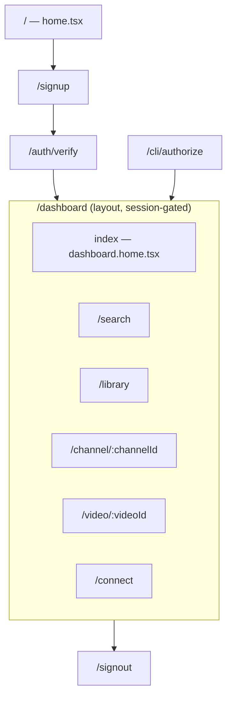
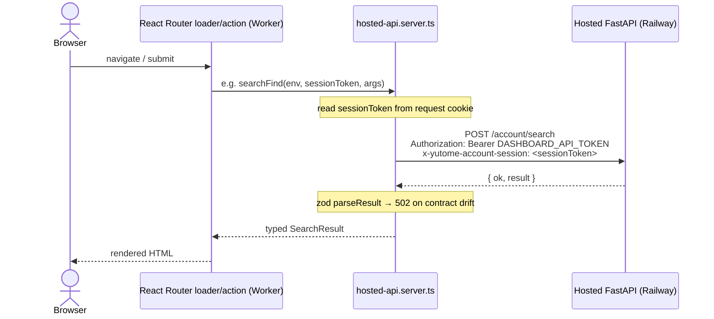

# Web frontend

The hosted dashboard: a React Router v7 SSR app running on Cloudflare Workers, talking to the hosted
FastAPI through a single server-only client. This is codex-built; anchors are under `web/app/`.

## 1. Stack

| Concern | Choice |
|---|---|
| Framework | React Router v7 (SSR; `routes.ts` explicit route config) |
| Runtime | Cloudflare Workers (Wrangler) |
| UI | React 19, Tailwind CSS v4, shadcn/ui over Radix primitives, lucide icons |
| Contracts | `zod` validation on every hosted-API response |
| State on submit | React Router loaders/actions + `useFetcher` (no client data layer) |

## 2. Routes

`web/app/routes.ts` declares routes explicitly (`routes.ts:3-17`). `/dashboard` is a **layout route**
whose `dashboard.tsx` requires a session and renders an `<Outlet/>` for the children.



| Route | File | Loader/action data |
|---|---|---|
| `/` | `home.tsx` | landing; link to signup |
| `/signup` | `signup.tsx` | action → `startLogin` (send magic link) |
| `/auth/verify` | `auth.verify.tsx` | loader → `verifyLogin`; sets session cookie, redirects |
| `/signout` | `signout.tsx` | clears cookie → `/` |
| `/cli/authorize` | `cli.authorize.tsx` | action → `authorizeCli` (PKCE) |
| `/dashboard` | `dashboard.tsx` | layout; `requireSessionToken` gate |
| `/dashboard` (index) | `dashboard.home.tsx` | `getSummary`, `getLibrary`, `getSourceJobs`; add-source via `createSources` |
| `/dashboard/search` | `dashboard.search.tsx` | `searchFind(text, mode)` |
| `/dashboard/library` | `dashboard.library.tsx` | `listVideos` + `listChannels` (paginated) |
| `/dashboard/channel/:channelId` | `dashboard.channel.$channelId.tsx` | `showChannel` (+ `listChannels` fallback) + `listVideos` |
| `/dashboard/video/:videoId` | `dashboard.video.$videoId.tsx` | `showVideo` + `showTranscript` (paged) |
| `/dashboard/connect` | `dashboard.connect.tsx` | `getAssistants`; MCP connect guides |

## 3. The BFF seam

[`web/app/lib/hosted-api.server.ts`](../../web/app/lib/hosted-api.server.ts) is the only place the
frontend talks to the backend. It is **server-only** (loaders/actions, never client components). Its
own header comment states the contract: it holds the dashboard service token and forwards the
session token; the Python API derives the workspace from the session, so this client never trusts a
client-supplied workspace id (`hosted-api.server.ts:1-4`).



Every authenticated call carries **dual headers** — the service token authenticates the *deployment*,
the session token identifies the *user/workspace* (`authedGet`/`authedPost`, `:161-193`). The
function→endpoint map:

| Client function | Hosted endpoint | Notes |
|---|---|---|
| `startLogin` (`:71`) | `POST /account/login/start` | `verify_link` only in dev |
| `verifyLogin` (`:100`) | `POST /account/login/verify` | returns session to set as cookie |
| `authorizeCli` (`:126`) | `POST /account/cli/authorize` | PKCE, S256 |
| `getSummary` (`:288`) | `GET /account/summary` | plan, period, units |
| `getLibrary` (`:292`) | `GET /account/library` | counts + recent videos |
| `getAssistants` (`:296`) | `GET /account/assistants` | connected grants |
| `createSources` (`:301`) | `POST /account/sources` | add channel/video/playlist |
| `getSourceJobs` (`:314`) | `GET /account/source-jobs?limit=` | ingest job status |
| `searchFind` (`:433`) | `POST /account/search` | `find` over chunks |
| `showVideo` (`:455`) | `POST /account/show` `{kind:video}` | metadata + transcript id |
| `showTranscript` (`:460`) | `POST /account/show` `{kind:transcript}` | `transcript_offset/limit` |
| `listVideos` (`:478`) | `POST /account/list` `{entity:videos}` | |
| `listChannels` (`:493`) | `POST /account/list` `{entity:channels}` | |
| `showChannel` (`:508`) | `POST /account/show` `{kind:channel}` | |

These dashboard endpoints hit the **same hosted query adapter** as the MCP endpoint, scoped to the
session's workspace — so dashboard search is metered identically to assistant search (see
[`hosted.md`](hosted.md) §3, §7).

## 4. Session auth in the UI

```mermaid
sequenceDiagram
    actor U as User
    participant UI as Web app
    participant API as Hosted API
    U->>UI: /signup (email)
    UI->>API: startLogin
    API-->>U: email link → /auth/verify?token=…
    U->>UI: open link
    UI->>API: verifyLogin(token)
    API-->>UI: session JWT + max_age
    UI-->>U: Set-Cookie yutome_account_session; → /dashboard
    U->>UI: /dashboard/*
    UI->>UI: requireSessionToken(cookie)
    alt missing
        UI-->>U: redirect /signup
    else 401 from API
        UI-->>U: clear cookie + redirect /signup
    end
```

The cookie helpers live in `web/app/lib/cookies.server.ts`; the gate in
`web/app/lib/session.server.ts`; env validation in `web/app/lib/env.server.ts`.

| Cookie attribute | Value | Why |
|---|---|---|
| name | `yutome_account_session` | shared with `mcp.getyutome.com` OAuth worker |
| `HttpOnly` | yes | no JS access (XSS) |
| `SameSite` | `Lax` | CSRF protection |
| `Secure` + `Domain` | prod only (`getyutome.com`) | same-site with the MCP subdomain; host-only in dev |
| `Max-Age` | from `session.max_age_seconds` | server-controlled lifetime |

## 5. What the pages show & citation surfacing

- **Home** — workspace summary (plan, period, per-unit included/used/remaining), add-source form,
  recent indexing jobs (revalidated every 5s while jobs are active), recent videos.
- **Search** — `?q=` + `?mode=` (`hybrid`/`semantic`/`lexical`); each hit renders title, channel,
  timestamp badge, snippet, and two links: "Read & play" → `/dashboard/video/:id?t=<startSeconds>`
  (derived from `start_ms`) and "Open on YouTube" (the hit's `youtube_url`). Citations come straight
  off the contract row shape (`searchHitSchema`, `:344-362`).
- **Library / Channel** — paginated channel cards and video tables.
- **Video** — privacy `youtube-nocookie.com` embed seekable to `?t`, plus a paged transcript reader
  (`?offset=`).
- **Connect** — the MCP URL to paste into assistants, per-client guides, and the list of connected
  grants.

## 6. Non-obvious details (each anchored)

- **Sequential list calls.** `dashboard.library.tsx` fetches videos then channels **sequentially**,
  not in parallel — the hosted API uses a single psycopg connection per request and concurrent calls
  collide on transaction nesting. A frontend workaround for a backend constraint.
- **Pagination without totals.** `list` returns no total; callers fetch `limit+1` to detect a next
  page, and the hosted adapter caps `limit` at 200 (`hosted-api.server.ts:476-477`).
- **Transcript paging.** The video reader loads the transcript in pages (`showTranscript` with
  `offset`/`limit`); `next_offset` is `null` at the end (`transcriptResourceSchema`, `:388-400`).
- **zod is the contract guard.** `parseResult` runs each response through a schema and throws a
  `502 invalid_hosted_api_response` on drift, so a renamed/missing hosted field fails loudly here
  instead of as `undefined` deep in a component (`:332-342`).
- **Deterministic UTC formatting.** Dates render in UTC explicitly to avoid SSR/client hydration
  mismatches (`web/app/lib/utils.ts`).
