# Hosted Yutome

Multi-tenant Yutome: a Postgres-backed control/ingest/query system with per-call metering, fronted
by a FastAPI that serves assistants (MCP), the dashboard (session), and the CLI (PKCE token). This
is the codex-built surface; everything below is anchored to `src/yutome/hosted/`.

Canonical vocabulary lives in [`docs/hosted-glossary.md`](../hosted-glossary.md) and is used verbatim
here — `workspace`, `subject`, `credential_mode`, `EntitlementPolicy` / `WorkspaceBalance` / `UsageGate`,
`reservation`, `search store`, `bridge`/`relay`/`replica`.

---

## 1. Three planes

Postgres is the system of record across all three. Cloudflare Workers never run ingest; Railway
workers never serve edge queries.

| Plane | Owns | Backed by |
|---|---|---|
| **Control** | identity, auth, billing, entitlements, balances, the usage ledger | Postgres |
| **Ingest** | discover → fetch → clean → chunk → embed → index, as durable jobs | Postgres queue + Railway workers |
| **Query** | serving `find`/`list`/`show`/`q` to assistants and the dashboard | Cloudflare edge (relay/replica) + the hosted adapter |

---

## 2. Postgres data model

The schema is defined in [`schema.py`](../../src/yutome/hosted/schema.py) as SQLAlchemy `Table`s on
one `MetaData` (`schema.py:8`). Every tenant-scoped row carries `workspace_id`; almost everything
fans out from `workspaces`.

### 2.1 Cluster map

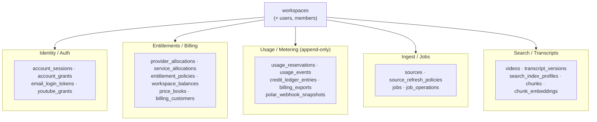

### 2.2 Identity / Auth

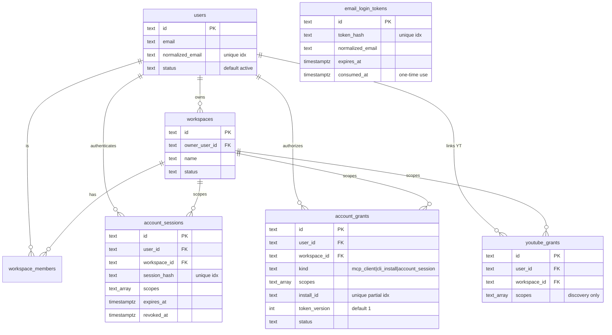

- `account_grants.kind` discriminates `mcp_client` (a connected assistant), `cli_install` (a CLI
  device), and `account_session`. `token_version` is the revocation lever; `install_id` is unique
  when present (`schema.py:185-211`).
- `youtube_grants` are for **discovery only** (subscriptions/uploads) and must not authorize provider
  spend — kept separate from `account_grants` (`schema.py:213-227`).
- `email_login_tokens` is the magic-link store: a hashed, single-use token with an expiry
  (`schema.py:88-104`).

### 2.3 Entitlements / Billing

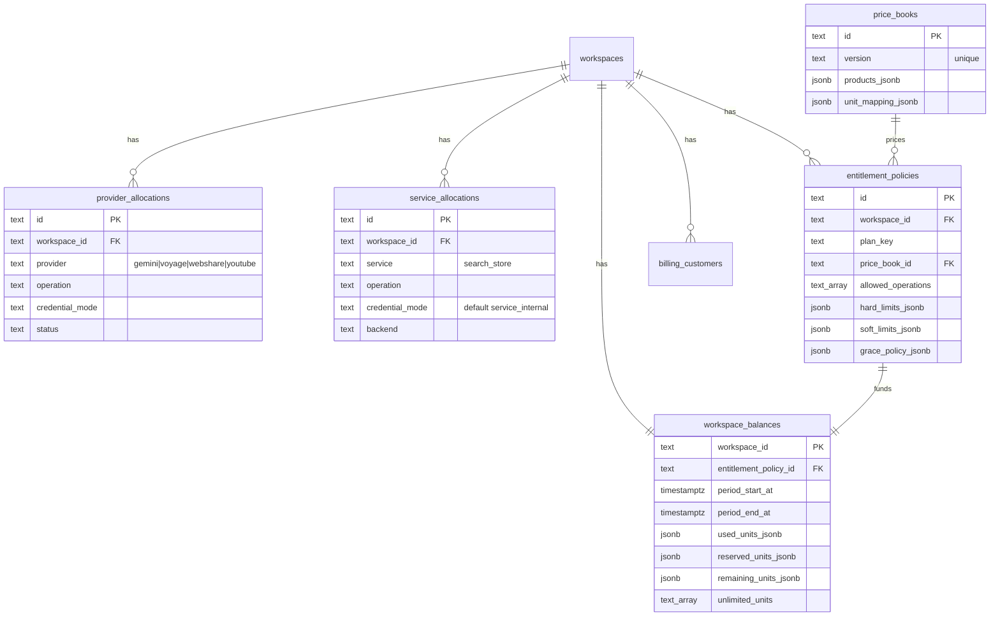

The four roles here are distinct and easy to confuse — keep them straight:

| Role | Table | Question it answers |
|---|---|---|
| **allocation** | `provider_allocations` / `service_allocations` | *Is this operation authorized, and where do its credentials come from?* (`credential_mode`) |
| **EntitlementPolicy** | `entitlement_policies` | *Which operations are allowed, and what are the hard/soft per-operation ceilings?* |
| **WorkspaceBalance** | `workspace_balances` | *How many prepaid units remain this period (and which units are unlimited)?* |
| **price_book** | `price_books` | *What does a unit cost / how do product units map?* |

### 2.4 Usage / Metering (append-only)

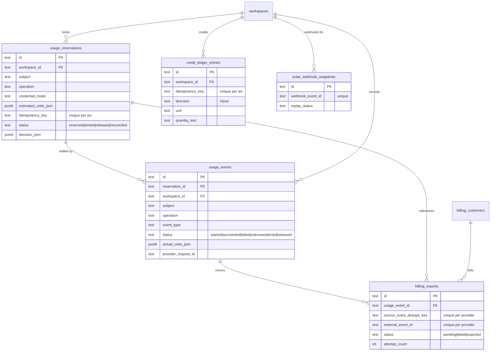

The **usage ledger** (`usage_reservations` + `usage_events`) is the source of truth for pre-call
authorization. `billing_exports` is a *mirror* of settled events shipped to Polar — Polar webhooks
(`polar_webhook_snapshots` → `credit_ledger_entries`) are the source of truth for credits. Billing
is therefore decoupled from authorization. Idempotency is enforced by unique constraints:
`(workspace_id, idempotency_key)` on reservations and credits, and `(provider, source_event_dedupe_key)`
+ `(provider, external_event_id)` on exports (`schema.py:151, 313, 342-343`).

### 2.5 Search / Transcripts

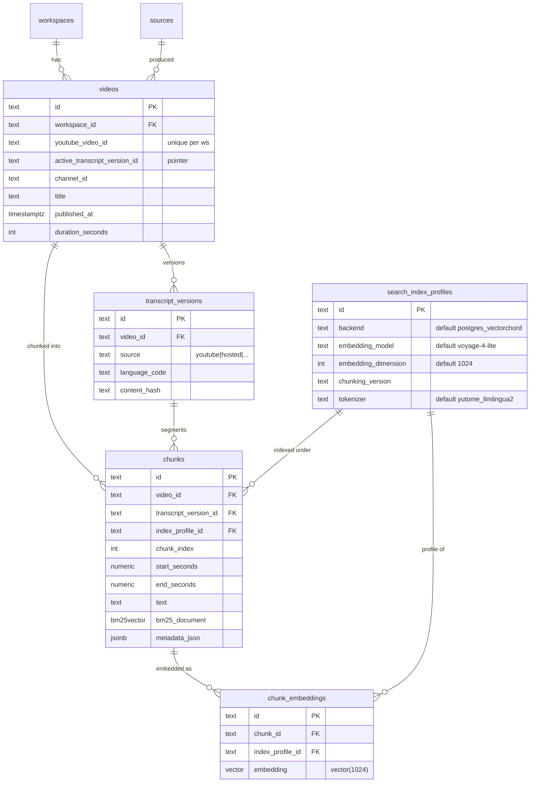

Three subtleties worth holding onto:
- **Active transcript is a pointer.** `videos.active_transcript_version_id` selects which immutable
  `transcript_versions` row is live; swapping it atomically switches what gets retrieved
  (`schema.py:504`).
- **Lexical and dense are separate columns/tables.** `chunks.bm25_document` (VectorChord `bm25vector`)
  lives on the chunk row; the dense `vector(1024)` lives in the **separate `chunk_embeddings` table**
  (`schema.py:566-567, 577-589`). Local mode uses this same schema.
- **A search index profile is immutable identity.** Changing backend, model, dimension, chunking
  version, *or* tokenizer yields a new `search_index_profiles` row (unique across all of them,
  `schema.py:551`) and a backfill — never a silent in-place change.

---

## 3. Metering: reserve → settle → release

This is the heart of hosted mode. Every paid or scarce call (provider spend *and* search-store
recall) passes a **pre-call gate** that reserves units, then settles to actual afterward.

### 3.1 Reservation lifecycle

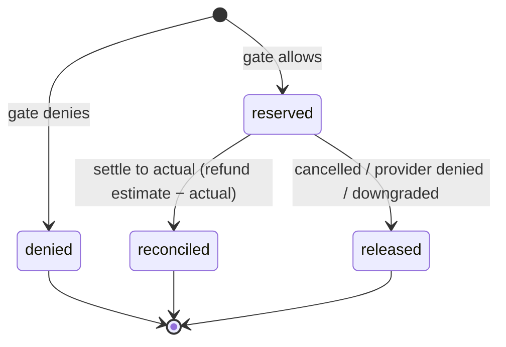

`ReservationStatus = reserved | denied | released | reconciled` (`models.py:14`).

### 3.2 The gate decision (pure function)

`UsageGate.reserve` builds a `UsageReservation`; the decision logic in `_decide` is a fixed ladder
(`gate.py:56-104`). It is a pure function of `(allocation, policy, balance, estimate)` — it does not
touch the database. The Postgres path (`ledger.py` `PostgresUsageGate`/`PostgresUsageLedger`) wraps
it in a transaction that `SELECT … FOR UPDATE`s the balance and reservation rows and persists the
unit movements.

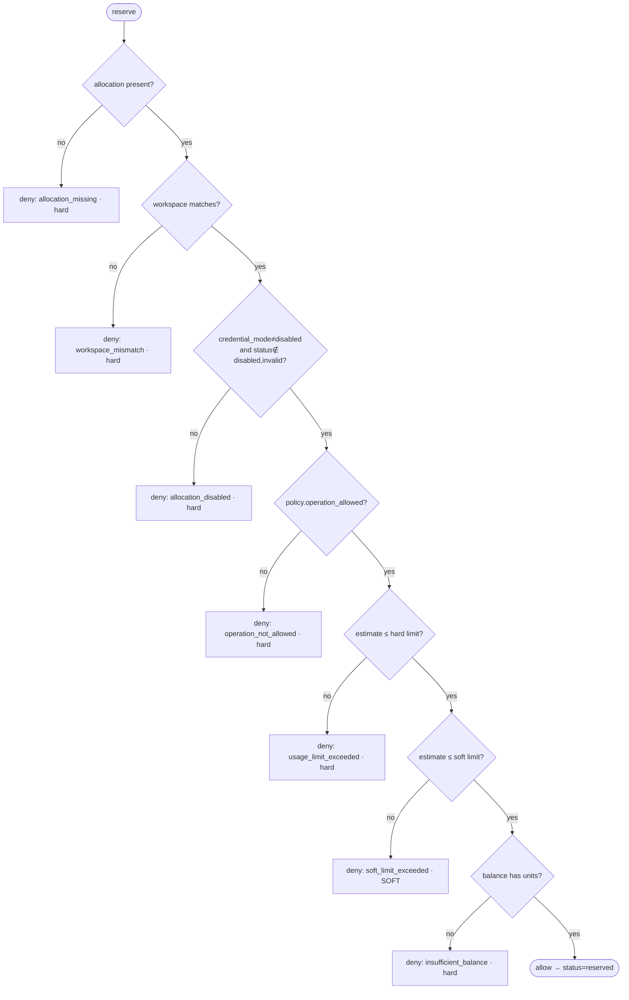

The same ladder as a truth table (first failing row wins):

| # | Condition checked | On failure → `reason` | `denial_effect` |
|---|---|---|---|
| 1 | allocation is not `None` | `allocation_missing` | hard |
| 2 | `allocation.workspace_id == workspace_id` | `workspace_mismatch` | hard |
| 3 | `credential_mode ≠ disabled` and `status ∉ {disabled, invalid}` | `allocation_disabled` | hard |
| 4 | `policy.operation_allowed("{subject}.{operation}")` | `operation_not_allowed` | hard |
| 5 | estimate ≤ `hard_limits_by_operation[op]` | `usage_limit_exceeded` | hard |
| 6 | estimate ≤ `soft_limits_by_operation[op]` | `soft_limit_exceeded` | **soft** |
| 7 | `balance.has_units(estimate)` | `insufficient_balance` | hard |
| 8 | — all passed — | `allowed` | — |

`operation_allowed` matches `allow_all_operations`, `"*"`, the exact `"{subject}.{operation}"`, or
the `"{subject}.*"` wildcard (`models.py:154-161`). The hard/soft distinction matters downstream:
only a **soft** denial on a **hybrid** query lets the hosted adapter fall back to lexical (see §7).

> **Fail-closed default.** If the adapter is built without an injected Postgres usage-context
> provider, the defaults return `allocation=None` (`mcp_query.py:1317-1344`) → the gate denies at
> row 1. An unconfigured workspace serves nothing rather than serving unlimited.

### 3.3 The full reserve→settle round trip

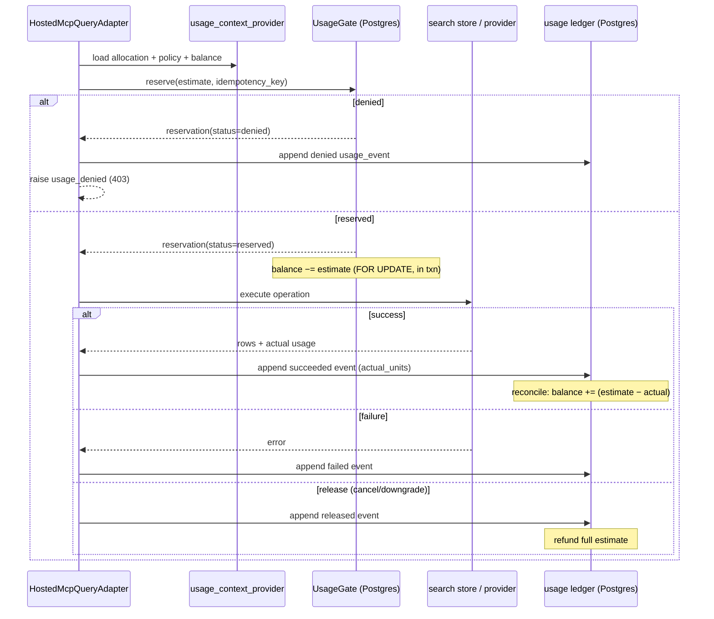

### 3.4 Subjects, operations, credential modes

A `subject` is the metered provider or internal service; an `operation` is the action within it; the
`operation_key` is `"{subject}.{operation}"`.

| `subject` (`UsageSubject`, `models.py:11`) | Kind | Representative operations |
|---|---|---|
| `gemini` | external provider | `cleanup_transcript`, `transcribe_media`, `metadata_fetch` |
| `voyage` | external provider | `embed_documents`, `embed_query` |
| `webshare` | external provider | `proxy_fetch` |
| `youtube` | external provider | `transcript_fetch`, `metadata_fetch` |
| `search_store` | internal service | `lexical_query`, `semantic_query`, `hybrid_query`, `list_read`, `resource_read`, `index_write`, `replace_active_transcript` |

`CredentialMode` (`models.py:12`) decides where credentials come from:

| `credential_mode` | Meaning |
|---|---|
| `hosted` | Yutome's own provider keys fund the call (default for `ProviderAllocation`) |
| `byo_hosted` | user-supplied keys on hosted infra (**deferred**) |
| `service_internal` | no external credential (default for `ServiceAllocation`, e.g. `search_store`) |
| `disabled` | deny immediately (gate row 3) |

### 3.5 Idempotency keys & stable hashing

Retries must not double-charge. The idempotency key is built from canonicalized inputs
(`ids.py:37-55`):

```python
# ids.py:37
idempotency_key(
    workspace_id=...,            # tenant
    subject_id=auth.client_id,   # who/what the call is for (client id, or video id for ingest)
    operation="search_store.hybrid_query",
    input_hash_value=input_hash({...}),  # sha256 of canonical JSON (ids.py:21-34)
    extras=[grant_id, client_id, session_id],
)
# components escape ":" and "%" so the joined key is unambiguous (ids.py:54)
```

`input_hash` sorts keys and uses compact separators so harmless key-order differences don't produce
duplicate billable IDs (`ids.py:21-29`). The `(workspace_id, idempotency_key)` unique constraint then
makes a retried reserve return the existing reservation instead of creating a second one.

---

## 4. Authentication

Three distinct credential types, three dependencies in `http_api.py`. Token/secret env vars are
defined at `http_api.py:82-92`.

| Caller | Dependency (`http_api.py`) | Credential | Required headers | Context type |
|---|---|---|---|---|
| Assistant (MCP) | `default_auth_dependency` (`:364`) | `YUTOME_HOSTED_API_TOKEN` bearer | `Authorization`, `X-Yutome-Workspace-Id` (+ optional grant/client/user/session) | `HostedMcpAuthContext` |
| Dashboard | `account_auth_dependency` (`:753`) | `YUTOME_DASHBOARD_API_TOKEN` bearer + session JWT | `Authorization`, `X-Yutome-Account-Session` | `AccountApiContext` |
| CLI | `cli_auth_dependency` (`:813`) | CLI JWT bearer (verified vs `account_grants`) | `Authorization` | `AccountCliApiContext` |

Session/CLI JWTs are signed with `YUTOME_ACCOUNT_SESSION_HMAC_SECRET` and audience-scoped
(`YUTOME_ACCOUNT_SESSION_AUDIENCE`).

### 4.1 Magic-link login (dashboard)

```mermaid
sequenceDiagram
    actor U as User
    participant W as Web app
    participant API as Hosted API
    participant DB as Postgres
    U->>W: enter email (/signup)
    W->>API: POST /account/login/start
    API->>DB: insert email_login_tokens (hashed, TTL)
    API-->>U: email with /auth/verify?token=…
    U->>W: click link (/auth/verify)
    W->>API: POST /account/login/verify {token}
    API->>DB: consume token (one-time), upsert user+workspace+session
    API-->>W: signed session JWT + max_age
    W-->>U: Set-Cookie yutome_account_session; redirect /dashboard
```

Anchors: `/account/login/start` (`http_api.py:542`), `/account/login/verify` (`:616`),
`/account/bootstrap` legacy pairing (`:467`).

### 4.2 CLI authorization (PKCE)

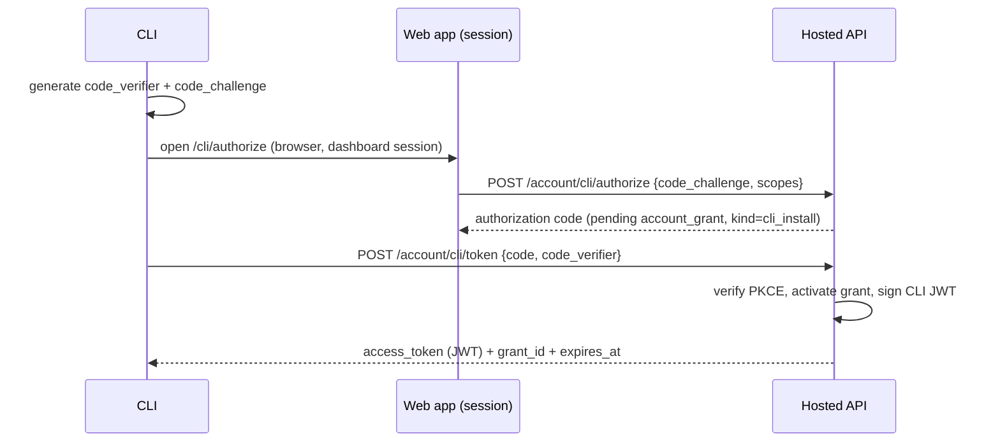

Anchors: `/account/cli/authorize` (`http_api.py:871`, dashboard session), `/account/cli/token`
(`:921`, public PKCE exchange).

### 4.3 MCP auth

The assistant call carries the symmetric `YUTOME_HOSTED_API_TOKEN` plus `X-Yutome-Workspace-Id`;
`HostedMcpAuthContext.validated()` requires a non-empty workspace and the `yutome.search.read` scope
(`mcp_query.py:101-130`). Hosted source writes additionally require `yutome.source.write` and
`yutome.job.write`. Tenant scope, connector grant, assistant client, session, and user identity come
only from this context — never from tool arguments (see §7).

---

## 5. Jobs & sources (ingest plane)

### 5.1 Source import → job enqueue

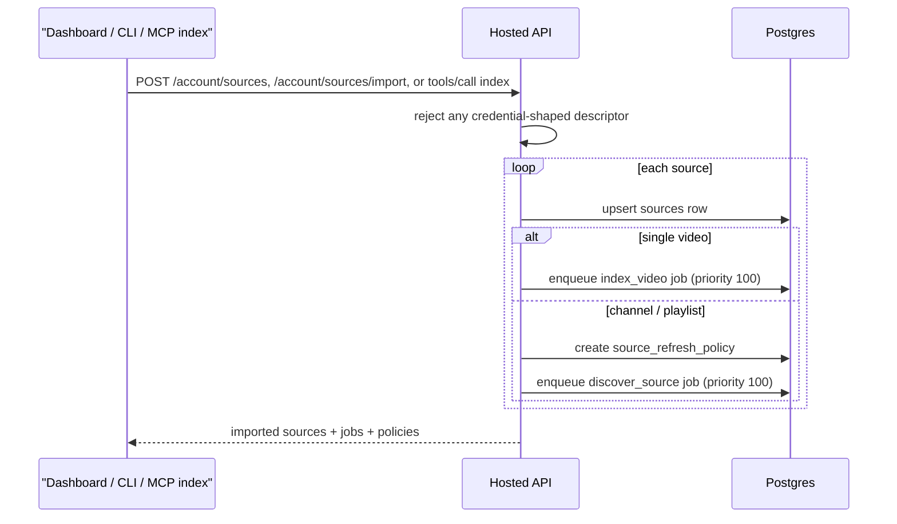

Anchors: dashboard import `/account/sources` (`http_api.py:1048`), CLI import
`/account/sources/import` (`:1062`), hosted MCP `index` (`mcp_query.py`).

### 5.2 Job lifecycle

A `jobs` row is leased by a worker (`lease_owner` / `leased_at` / `lease_expires_at`), runs its
`job_operations` sub-steps (each with its own `usage_reservation_id`), and ends terminal.

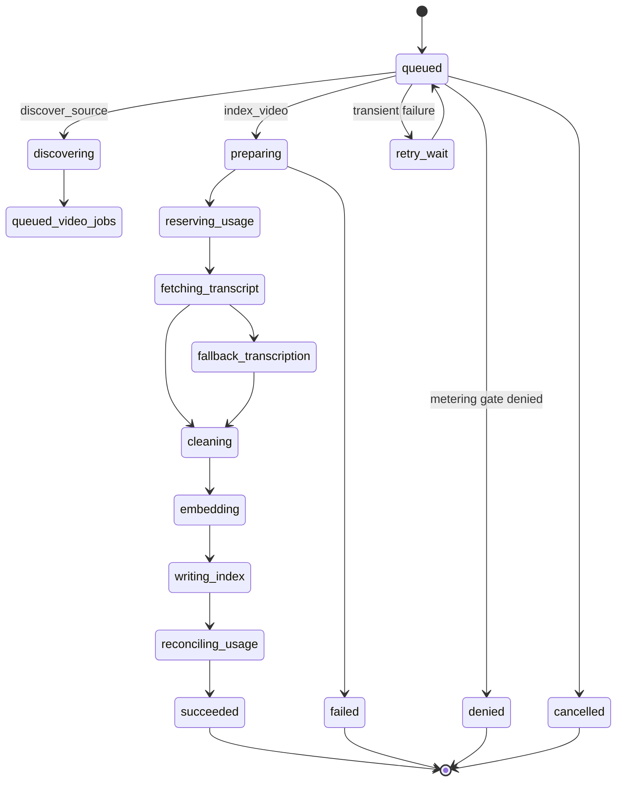

The **scheduler** (one shared loop, not per-workspace) reads `source_refresh_policies` where
`enabled` and `next_run_at ≤ now()` (index `idx_source_refresh_due`, `schema.py:431-436`), locks the
row (`locked_by`/`locked_until`), enqueues a `discover_source` job, and advances `next_run_at`.
**Workers** claim jobs via the claimable index ordered by `(priority, run_after, created_at)` over
`status ∈ {queued, retry_wait}` (`schema.py:465-471`).

---

## 6. HTTP API catalog

Grouped by auth dependency. Method/path anchored to `http_api.py`.

**No auth**
| Method | Path | Purpose |
|---|---|---|
| GET | `/healthz` (`:405`) | contract metadata |
| GET | `/readyz` (`:417`) | readiness checks |

**MCP token** (`default_auth_dependency`)
| Method | Path | Purpose |
|---|---|---|
| POST | `/tools/call`, `/mcp/tools/call` (`:439`) | invoke `find`/`list`/`show`/`index`/`jobs`/`q` |
| POST | `/resources/read`, `/mcp/resources/read` (`:455`) | read a `yutome://` resource |

**MCP or dashboard token**
| Method | Path | Purpose |
|---|---|---|
| POST | `/account/bootstrap` (`:467`) | legacy edge OAuth pairing |
| POST | `/account/login/start` (`:542`) | send magic link |
| POST | `/account/login/verify` (`:616`) | redeem magic link → session |

**Dashboard session** (`account_auth_dependency`)
| Method | Path | Purpose |
|---|---|---|
| POST | `/account/cli/authorize` (`:871`) | begin CLI PKCE |
| POST | `/account/sources` (`:1048`) | import sources |
| GET | `/account/source-jobs` (`:1079`) | recent ingest jobs |
| GET | `/account/summary` (`:1101`) | workspace summary |
| GET | `/account/library` (`:1106`) | library overview |
| GET | `/account/assistants` (`:1111`) | connected grants |
| POST | `/account/search` (`:1116`) | dashboard `find` (Phase-1 search slice) |
| POST | `/account/show` (`:1134`) | dashboard `show` |
| POST | `/account/list` (`:1149`) | dashboard `list` |

**CLI token** (`cli_auth_dependency`)
| Method | Path | Purpose |
|---|---|---|
| POST | `/account/sources/import` (`:1062`) | CLI source import |
| GET | `/account/jobs` (`:1089`) | CLI job list |

**Public / signed**
| Method | Path | Purpose |
|---|---|---|
| POST | `/account/cli/token` (`:921`) | PKCE token exchange (no auth) |
| POST | `/billing/polar/webhook`, `/webhooks/polar` (`:697`) | Polar webhook (signature-verified) |

The dashboard `/account/{search,show,list}` endpoints derive the workspace from the session and call
`adapter.call_tool(...)` — the **tenant scope is never read from the request body**.

---

## 7. The hosted query path

`HostedMcpQueryAdapter.call_tool` validates auth, strips forbidden tenant-identifying arguments, and
dispatches by tool name (`mcp_query.py:197-215`). `find` is the interesting one.

- **Default mode is `lexical`** (`HostedFindRequest`, `mcp_query.py:1105, 1128-1135`) — note the contrast
  with the local engine's hybrid default.
- `lexical` → `_find_lexical`; `semantic`/`hybrid` → `_find_vector`.
- **Forbidden arguments**: any `workspace_id`/`tenant`/`grant_id`/`client_id`/`session`/… in the args
  (even nested) is rejected (`FORBIDDEN_TOOL_ARGUMENT_KEYS`, `mcp_query.py:37-63`).
- `show` supports `chunk`, `context`, `video`, `channel`, `transcript`, and `source`
  (`mcp_query.py:794-867`).
- `find` passes offsets and supported filters through to lexical, semantic, and hybrid searches
  (`mcp_query.py:314-323, 443-469`).
- `list attention` is still outside the hosted query contract; hosted lists support `status`, `videos`,
  and `channels` (`mcp_query.py:1238-1271`).

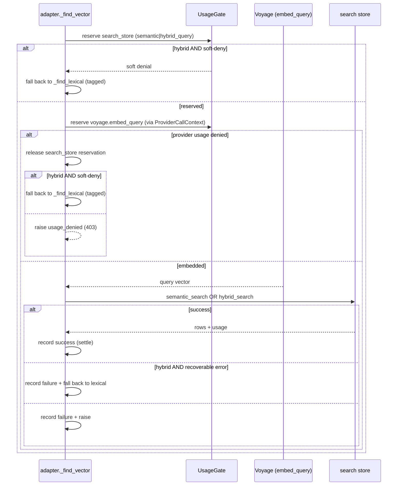

**The fallback rule, stated precisely** (`_find_lexical_fallback`, `mcp_query.py:420-446`): only a
**hybrid** query degrades to lexical, and only on a soft denial or a recoverable vector-path failure;
the response carries a `hosted_find_fallback_to_lexical` note so the downgrade is visible. A
**semantic** query never silently falls back — it raises instead.

---

## 8. Domain models

The Pydantic models in [`models.py`](../../src/yutome/hosted/models.py) are what the gate and adapter
operate on. Note they are *shaped for the decision*, not 1:1 with the DB columns — e.g.
`EntitlementPolicy` exposes `hard_limits_by_operation` (a `dict[op, UnitMap]`) where the table stores
`hard_limits_jsonb`; `WorkspaceBalance` exposes `remaining_units` + `unlimited_units` where the table
also tracks `used`/`reserved` jsonb.

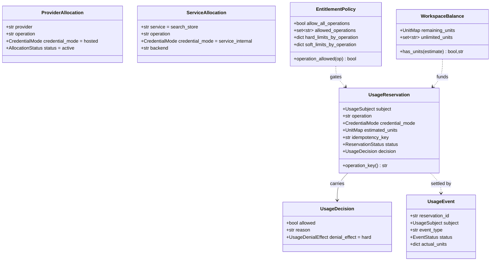

---

## 9. Deferred (documented, not built)

- `byo_hosted` credential mode (user-supplied provider keys on hosted infra).
- **cloud / offline replica** — read-only Cloudflare mirror that answers when the laptop bridge is
  offline. Call it "cloud replica" or "offline replica", never "always-on".
- multi-region Postgres failover / geo-distributed workers.
- entitlement **grace policies** (`grace_policy_jsonb` exists; enforcement deferred).
- hosted `list attention` (not part of the current hosted adapter contract).
