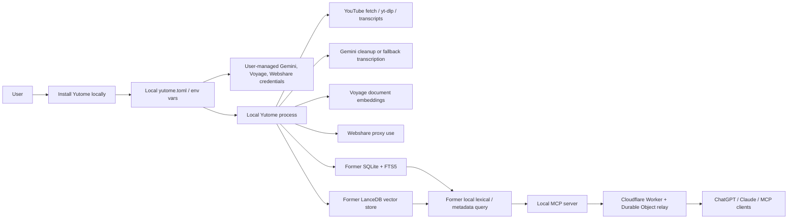
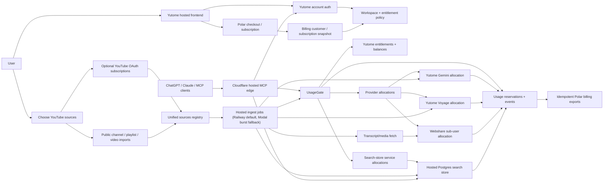
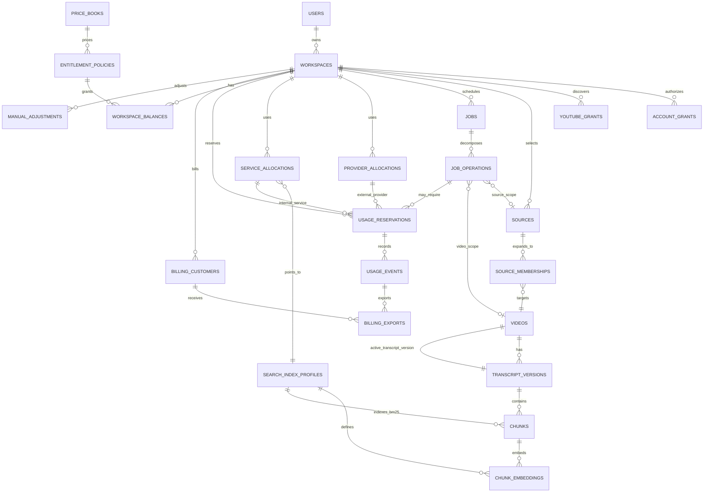
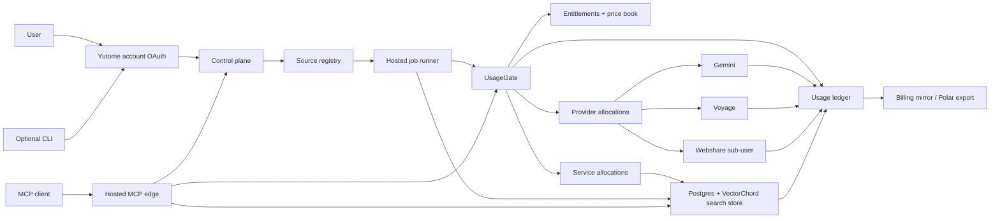
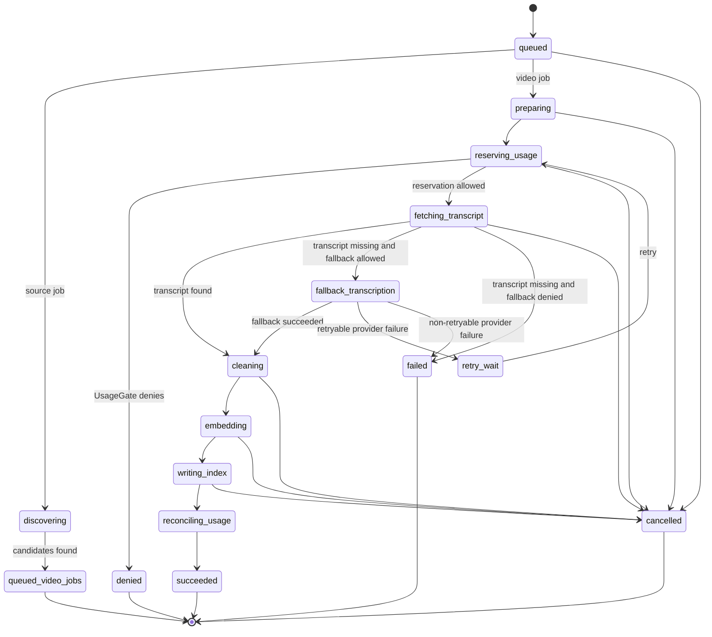
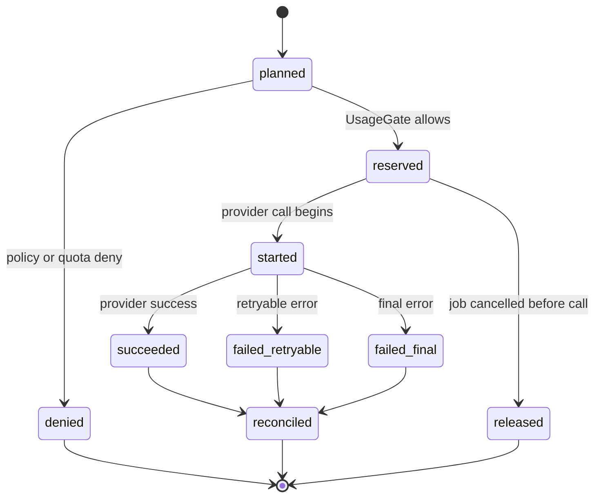

# Hosted Provider Broker Implementation Plan

Last updated: 2026-05-27

Status: implementation plan and historical decision record. This complements
`docs/hosted-yutome-plan.md`; the storage cutover to a single Postgres +
VectorChord search store is complete. VectorChord Suite remains the default
search/storage substrate, including on Railway via a custom Postgres
service/image unless a managed VectorChord-capable host is selected. Railway
Postgres/pgvector + Postgres FTS is the fallback if VectorChord database
operations are not ready for paid production. Billing implementation target is
Polar for V1. Runtime placement is now explicit for Phase 4: Railway is the
default hosted deployment for API, workers, cron, and initial Postgres; durable
jobs and schedules live in Postgres; Modal is an optional burst/backfill
executor; Fly Machines are an alternate worker substrate.

## Executive Summary

Hosted Yutome should let a user connect once, import YouTube sources, and run indexing or query workflows without managing local provider credentials for Gemini, Voyage, Webshare, or remote MCP hosting. The first thing to build is a hosted provider broker that:

- who the user is,
- which workspace or install is acting,
- which source content is authorized,
- which provider request is being attempted,
- whether the request is allowed,
- which provider credential or sub-account should be used,
- and what usage was actually recorded after the request finishes.

This plan treats billing as an output of the usage ledger, not as the first system to build. Polar is the V1 billing mirror target, but Yutome owns entitlement decisions, reservations, and usage normalization. The first implementation should add provider wrappers, service wrappers, and an append-only usage ledger around the new product runtime. The plan should stop treating storage as an unspecified future choice: the simplest noob-friendly product is one Postgres substrate that stores catalog metadata, transcript chunks, dense Voyage vectors, lexical indexes, jobs, and usage records together.

## Implementation Shape At A Glance

The implementation should move Yutome from a user-operated local stack to a hosted account model. The main product win is setup: the user signs into Yutome once, chooses sources, and connects ChatGPT or Claude to hosted MCP. Yutome owns provider credentials, job execution, search storage, usage gating, and billing export.

### Pre-Cutover State

Before the Postgres cutover, setup and ingest were mostly user-operated. A user needed a local machine, local config, split local databases, provider credentials, and the Cloudflare relay path to expose the local MCP server to hosted clients. This section is retained as requirement evidence, not as a mode to preserve.



Pre-cutover friction:

- The user has to configure several provider accounts or keys before the product feels useful.
- Ingest depends on the local machine staying online.
- Search state was split across SQLite and LanceDB.
- Cloudflare is mostly a relay to the user machine, not the owner of hosted product state.
- Usage and spending are hard to enforce before provider calls because credentials and execution live locally.

### Next State

The hosted path should make Yutome account auth the primary setup step. Cloudflare serves the frontend and hosted MCP edge; Railway-hosted jobs run ingest; hosted Postgres stores source, transcript, lexical, semantic, usage, and job state; Polar mirrors billing from Yutome ledger events.



Next-state setup and ingest loop:

1. User signs into Yutome, completes Polar checkout if needed, and gets a workspace entitlement policy.
2. User adds sources through YouTube OAuth or public imports; both become unified `sources` rows.
3. Hosted jobs discover videos, fetch transcripts/media, and call Gemini, Voyage, and Webshare only through `UsageGate`.
4. `UsageGate` checks Yutome entitlements before provider calls or expensive search-store work.
5. Ingest writes canonical source/video/transcript/chunk rows, lexical index rows, dense Voyage embeddings, jobs, and usage rows into hosted Postgres.
6. ChatGPT or Claude queries hosted MCP, which reads the same hosted search store and records search-store usage.
7. Polar receives idempotent billing exports from the ledger; it does not decide whether work may start.

### Database Model At A Glance

The next-state database is one Postgres product substrate with VectorChord extensions. These are conceptual table groups, not final DDL. The important shape is that auth, source selection, ingest jobs, search indexes, usage enforcement, and billing exports all reference the same workspace and ledger state.



Table responsibilities:

- Identity and access: `users`, `workspaces`, `account_grants`, and `youtube_grants` separate Yutome auth from YouTube source auth.
- Source setup: unified `sources` plus `source_memberships` model subscriptions, channels, playlists, and direct videos without separate source classes.
- Ingest and search: `videos`, immutable `transcript_versions`, canonical `chunks`, model-specific `chunk_embeddings`, and `search_index_profiles` replace the SQLite/LanceDB split.
- Execution: `jobs` and `job_operations` provide durable hosted ingest with idempotency and Postgres worker claiming.
- Allocation: `provider_allocations` cover Gemini, Voyage, and Webshare; `service_allocations` cover Postgres/VectorChord search-store work.
- Enforcement and billing: `usage_reservations`, `usage_events`, `price_books`, `entitlement_policies`, and `workspace_balances` drive `UsageGate`; `billing_exports` and `billing_customers` mirror usage to Polar.

## Product Goals

The hosted provider broker lets Yutome run hosted workflows without users managing provider credentials locally.

1. Users can sign in with a Yutome account and connect standard clients to `https://mcp.yutome.com/mcp`.
2. Users can choose what YouTube sources Yutome may index, using both YouTube OAuth subscriptions and non-OAuth public/channel imports.
3. Hosted ingestion can run without requiring the user's laptop to stay online.
4. Gemini, Voyage, and Webshare usage can be metered consistently across hosted credentials and bring-your-own credentials.
5. The product can enforce limits before expensive work starts and reconcile final provider usage after the call completes.
6. Search can query indexed content without depending on a per-user local database or local vector directory.
7. The CLI, if retained, should become a thin account/job/debug client over the same hosted Postgres product state.
8. Provider-specific failures should be classified in one place so product behavior is consistent across CLI, hosted jobs, and MCP calls.

## Constraints

These constraints should shape the implementation:

- Hosted V1 should assume one hosted Postgres substrate for searchable hosted state. VectorChord Suite is the first implementation path, including on Railway through a custom Postgres service/image. Railway Postgres/pgvector + Postgres FTS is the fallback if VectorChord database operations are not ready for paid production.
- Billing implementation target is Polar for V1, but pricing, packaging, and future billing-provider optionality remain open. Usage records should stay billing-neutral and exportable.
- Yutome code already has working provider integrations. The first move should wrap those call sites, but the storage/search target is a replacement of SQLite + LanceDB, not compatibility with them.
- Do not design for backwards compatibility with SQLite FTS5 or LanceDB. Use the current codebase to extract requirements and tests; the product path is hosted Postgres with VectorChord Suite by default and pgvector/FTS as the fallback behind the same search-store contract.
- Hosted provider credentials must never be shipped to local clients or MCP clients.
- YouTube OAuth grants are for source discovery and should not be confused with Gemini, Voyage, or Webshare credentials.
- Webshare traffic is bandwidth-sensitive and should support per-user or per-workspace allocation from the start.
- Store raw provider payloads for audit; normalize into common units for product logic.
- MCP clients should see stable Yutome auth, not a mix of Google, Voyage, and proxy credentials.
- The system must support idempotency because indexing jobs will retry.
- Subscription auto-indexing must be modeled as database-backed source refresh policy, not one platform cron per user or source.

## Non-Goals

This plan intentionally does not choose:

- final pricing,
- the final subscription plan matrix,
- or the final commercial managed Postgres or VectorChord host.

Those decisions can be made later if the provider broker, search-store, entitlement, and Polar export contracts are kept stable. The search substrate assumption for this plan is one hosted Postgres database with VectorChord Suite by default, starting on Railway through a custom Postgres service/image unless a managed VectorChord-capable host is selected. The hosted runtime assumption for Phase 4 is Railway by default: Railway services run the API, worker, global cron tick, and initial Postgres deployment, with Modal kept as a later burst/backfill executor if Railway workers become inefficient for large media jobs.

## Source Materials

This plan is grounded in the current codebase and current official provider documentation.

Codebase sources:

- `src/yutome/gemini.py`: direct Gemini fallback transcription.
- `src/yutome/quality_llm.py`: direct Gemini transcript cleanup.
- `src/yutome/embeddings.py`: direct Voyage embedding calls.
- `src/yutome/youtube.py`: YouTube transcript fetching, yt-dlp integration, Webshare proxy support, and 402-style payment classification.
- `src/yutome/youtube_oauth.py`: desktop YouTube OAuth subscription import.
- `src/yutome/youtube_import.py`: public channel import and browser-cookie based import.
- `src/yutome/store.py`: transcript attempt tracking.
- `src/yutome/db.py`: former SQLite schema used only as requirement evidence for the new Postgres schema, including the formerly underused `jobs` table.
- `src/yutome/query.py`: lexical, semantic, hybrid, filter, fallback, and grouping behavior.
- `src/yutome/embeddings.py`: former Voyage embedding and LanceDB write path to replace with VectorChord writes.
- `src/yutome/config.py`: vector backend configuration to simplify around Postgres + VectorChord.
- `src/yutome/remote_connection.py`: local remote connection state.
- `cloudflare/yutome-capsule/src/index.ts`: current Cloudflare Worker OAuth, pairing, MCP, relay, and health endpoints.
- `cloudflare/yutome-capsule/src/yutome-mcp-agent.ts`: MCP tools/resources generated from the local contract.
- `cloudflare/yutome-capsule/src/yutome-relay.ts`: current Durable Object relay implementation to supersede for hosted mode.
- `cloudflare/yutome-capsule/src/pairing.ts`: current printed-code owner pairing to replace with account-backed OAuth for hosted mode.

Provider and platform sources:

- Gemini text generation: https://ai.google.dev/gemini-api/docs/text-generation
- Gemini structured output: https://ai.google.dev/gemini-api/docs/structured-output
- Gemini token counting: https://ai.google.dev/gemini-api/docs/tokens
- Gemini audio understanding: https://ai.google.dev/gemini-api/docs/audio
- Gemini video understanding: https://ai.google.dev/gemini-api/docs/video-understanding
- Gemini media resolution: https://ai.google.dev/gemini-api/docs/media-resolution
- Gemini File API: https://ai.google.dev/gemini-api/docs/files
- Gemini context caching: https://ai.google.dev/gemini-api/docs/caching
- Gemini rate limits: https://ai.google.dev/gemini-api/docs/rate-limits
- Gemini pricing: https://ai.google.dev/gemini-api/docs/pricing
- Gemini billing: https://ai.google.dev/gemini-api/docs/billing/
- Gemini API keys: https://ai.google.dev/gemini-api/docs/api-key
- Gemini OAuth quickstart: https://ai.google.dev/gemini-api/docs/oauth
- Vertex AI quickstart: https://cloud.google.com/vertex-ai/generative-ai/docs/start/quickstarts/quickstart-multimodal
- Voyage embeddings: https://docs.voyageai.com/docs/embeddings
- Voyage embeddings API: https://docs.voyageai.com/reference/embeddings-api
- Voyage contextualized chunk embeddings: https://docs.voyageai.com/docs/contextualized-chunk-embeddings
- Voyage tokenization: https://docs.voyageai.com/docs/tokenization
- Voyage pricing: https://docs.voyageai.com/docs/pricing
- Voyage rate limits: https://docs.voyageai.com/docs/rate-limits
- Voyage API keys: https://docs.voyageai.com/docs/api-key-and-installation
- Voyage organizations and projects: https://docs.voyageai.com/docs/organizations-and-projects
- Webshare API overview: https://apidocs.webshare.io/
- Webshare user profile: https://apidocs.webshare.io/userprofile
- Webshare proxy list: https://apidocs.webshare.io/proxy-list
- Webshare list proxies: https://apidocs.webshare.io/proxy-list/list
- Webshare sub-users: https://apidocs.webshare.io/subuser
- Webshare create sub-user: https://apidocs.webshare.io/subuser/create
- Webshare list sub-users: https://apidocs.webshare.io/subuser/list
- Webshare masquerade: https://apidocs.webshare.io/subuser/masquerade
- Webshare proxy stats: https://apidocs.webshare.io/proxystats
- Webshare aggregate stats: https://apidocs.webshare.io/proxystats/aggregate
- Webshare activity records: https://apidocs.webshare.io/proxystats/activity_object
- MCP authorization: https://modelcontextprotocol.io/specification/2025-06-18/basic/authorization
- MCP Streamable HTTP transport: https://modelcontextprotocol.io/specification/2025-06-18/basic/transports
- Cloudflare remote MCP servers: https://developers.cloudflare.com/agents/guides/remote-mcp-server/
- Cloudflare MCP auth: https://developers.cloudflare.com/agents/guides/securing-mcp-server/
- Cloudflare MCP Agent API: https://developers.cloudflare.com/agents/api-reference/mcp-agent-api/
- Cloudflare Durable Object WebSockets: https://developers.cloudflare.com/durable-objects/best-practices/websockets/
- Cloudflare Worker secrets: https://developers.cloudflare.com/workers/configuration/secrets/
- Fly Managed Postgres: https://fly.io/docs/mpg/
- Fly Managed Postgres extensions: https://fly.io/docs/mpg/extensions/
- Fly pricing: https://fly.io/docs/about/pricing/
- Fly Postgres unmanaged: https://fly.io/docs/postgres/
- Fly Postgres "not managed" responsibilities: https://fly.io/docs/postgres/getting-started/what-you-should-know/
- Fly Postgres backup and restore: https://fly.io/docs/postgres/managing/backup-and-restore/
- Fly Postgres HA and replication: https://fly.io/docs/postgres/advanced-guides/high-availability-and-global-replication/
- Fly Machines overview: https://fly.io/docs/machines/overview/
- Fly Machines API: https://fly.io/docs/machines/api/
- Fly Machine run and schedules: https://fly.io/docs/machines/flyctl/fly-machine-run/
- Fly Machine restart policy: https://fly.io/docs/machines/guides-examples/machine-restart-policy/
- Fly suspend and resume: https://fly.io/docs/reference/suspend-resume/
- Fly task scheduling: https://fly.io/docs/blueprints/task-scheduling/
- Fly volume snapshots: https://fly.io/docs/volumes/snapshots/
- Fly private networking: https://fly.io/docs/networking/private-networking/
- Fly static egress IPs: https://fly.io/docs/networking/egress-ips/
- Railway PostgreSQL: https://docs.railway.com/databases/postgresql
- Railway databases: https://docs.railway.com/databases
- Railway database view and extensions: https://docs.railway.com/databases/database-view
- Railway pgvector guide: https://docs.railway.com/guides/rag-pipeline-pgvector
- Railway custom database service: https://docs.railway.com/databases/build-a-database-service
- Railway PostgreSQL HA: https://docs.railway.com/databases/postgresql-ha
- Railway environments: https://docs.railway.com/reference/environments
- Railway public networking: https://docs.railway.com/public-networking
- Railway healthchecks: https://docs.railway.com/reference/healthchecks
- Railway config as code: https://docs.railway.com/config-as-code/reference
- Railway variables: https://docs.railway.com/variables/reference
- Railway cron jobs: https://docs.railway.com/cron-jobs
- Railway cron/workers/queues guide: https://docs.railway.com/guides/cron-workers-queues
- Railway deployments: https://docs.railway.com/deployments/reference
- Railway restart policy: https://docs.railway.com/deployments/restart-policy
- Railway serverless: https://docs.railway.com/deployments/serverless
- Railway scaling: https://docs.railway.com/deployments/scaling
- Railway deployment teardown: https://docs.railway.com/deployments/deployment-teardown
- Railway services: https://docs.railway.com/services
- Railway volumes: https://docs.railway.com/volumes
- Railway volume reference: https://docs.railway.com/volumes/reference
- Railway volume backups: https://docs.railway.com/volumes/backups
- Railway Postgres PITR: https://docs.railway.com/volumes/point-in-time-recovery
- Railway private networking: https://docs.railway.com/private-networking
- Railway static outbound IPs: https://docs.railway.com/networking/static-outbound-ips
- Railway pricing plans: https://docs.railway.com/pricing/plans
- Railway CLI deploy: https://docs.railway.com/cli/deploying
- Railway CLI variables: https://docs.railway.com/cli/variable
- Railway CLI domain: https://docs.railway.com/cli/domain
- Railway CLI scale: https://docs.railway.com/cli/scale
- Modal scheduling and cron: https://modal.com/docs/guide/cron
- Modal job processing: https://modal.com/docs/guide/job-queue
- Modal timeouts: https://modal.com/docs/guide/timeouts
- Modal resources and ephemeral disk: https://modal.com/docs/guide/resources
- Modal autoscaling: https://modal.com/docs/guide/scale
- Modal cold starts: https://modal.com/docs/guide/cold-start
- Modal retries: https://modal.com/docs/guide/retries
- Modal preemption: https://modal.com/docs/guide/preemption
- Modal region selection: https://modal.com/docs/guide/region-selection
- Modal static IP proxies: https://modal.com/docs/guide/proxy-ips
- Modal volumes: https://modal.com/docs/guide/volumes
- Modal pricing: https://modal.com/pricing
- VectorChord overview: https://docs.vectorchord.ai/vectorchord/getting-started/overview.html
- VectorChord Suite: https://docs.vectorchord.ai/vectorchord/getting-started/vectorchord-suite.html
- VectorChord indexing: https://docs.vectorchord.ai/vectorchord/usage/indexing.html
- VectorChord hybrid search: https://docs.vectorchord.ai/vectorchord/use-case/hybrid-search.html
- VectorChord prefilter: https://docs.vectorchord.ai/vectorchord/usage/prefilter.html
- VectorChord monitoring: https://docs.vectorchord.ai/vectorchord/usage/monitoring.html
- VectorChord Cloud limits: https://docs.vectorchord.ai/cloud/limit/cloud-limit.html
- VectorChord-BM25 README: https://github.com/tensorchord/VectorChord-bm25
- pg_tokenizer README: https://github.com/tensorchord/pg_tokenizer.rs
- PostgreSQL full-text search controls: https://www.postgresql.org/docs/current/textsearch-controls.html
- PostgreSQL full-text search indexes: https://www.postgresql.org/docs/current/textsearch-indexes.html
- PostgreSQL generated columns: https://www.postgresql.org/docs/current/ddl-generated-columns.html
- PostgreSQL JSON/JSONB: https://www.postgresql.org/docs/current/datatype-json.html
- PostgreSQL row security: https://www.postgresql.org/docs/current/ddl-rowsecurity.html
- PostgreSQL declarative partitioning: https://www.postgresql.org/docs/current/ddl-partitioning.html
- PostgreSQL SELECT locking and `SKIP LOCKED`: https://www.postgresql.org/docs/current/sql-select.html
- PostgreSQL `pg_stat_statements`: https://www.postgresql.org/docs/current/pgstatstatements.html
- PostgreSQL `EXPLAIN`: https://www.postgresql.org/docs/current/using-explain.html
- Polar usage billing: https://polar.sh/features/usage-billing
- Polar usage credits: https://polar.sh/docs/features/usage-based-billing/credits
- Polar credit grants: https://polar.sh/docs/guides/grant-meter-credits-after-purchase

## Locked Planning Decisions

Current product direction:

1. Hosted ingest jobs should be first-class.
   Hosted product features should not depend on a local bridge or local process being online.

2. Authentication should use Yutome OAuth.
   MCP clients and the CLI should authenticate to Yutome, not directly to Gemini, Voyage, or Webshare.

3. Webshare should start with a sub-user allocation model.
   This gives cleaner quota boundaries, easier debugging, and better abuse isolation than only aggregating one shared proxy pool.

4. BYO provider keys should not drive V1.
   V1 should start with Yutome-managed provider credentials. If BYO returns, it should be `byo_hosted` with encrypted server-side secrets and explicit support policy, not local environment keys.

5. YouTube source import should support both OAuth and public sources from the start.
   OAuth subscriptions are useful, but public channel URLs, handles, playlists, and existing import paths remain important.

6. Product search should use one hosted Postgres substrate with VectorChord Suite by default.
   The former product split canonical rows across SQLite/FTS5 and a derived LanceDB vector table. The new product should not reproduce that split. Use Postgres for relational metadata, transcript chunks, jobs, usage ledger rows, dense embeddings, VectorChord BM25 lexical indexes, vector indexes, and hybrid query plans. Start with VectorChord Suite; use Railway Postgres/pgvector + Postgres FTS only as the fallback if VectorChord operations are not ready for paid production.

7. Hosted ingest should use Railway first, with Modal kept for burst/backfill execution.
   Railway gives the simplest one-project hoster experience for app/API, always-on workers, cron tick, Postgres, private networking, variables, and logs. Modal fits bursty `yt-dlp`, provider, and media work if Railway workers become too idle-heavy or need stronger burst scaling. Fly Machines remain useful as an alternate self-operated worker pool. None of these runtimes remove the need for Postgres-backed job leasing and stuck-job recovery.

8. Railway custom VectorChord Postgres is the initial hosted database path.
   Railway's built-in Postgres/pgvector path is the fallback, not the target. A Railway custom Postgres image should host `vchord-suite` for the first hosted implementation, while production requires an explicit DBA/SRE decision: WAL archiving or PITR, tested restores, failover practice, replica monitoring, extension upgrades, vacuum/storage management, and alerting. If no managed VectorChord-capable Postgres passes those gates, paid V1 can temporarily use the managed Postgres + `pgvector`/FTS fallback described in `docs/hosted-yutome-plan.md` until VectorChord hosting is production-ready.

9. There is no backwards-compatibility or corpus-migration requirement.
   Existing SQLite databases and LanceDB directories do not need to migrate. They are current-code context, not a compatibility contract. If local mode exists, it should run the same Postgres schema and selected search substrate locally, probably via Docker/Compose, with the same schema and query behavior as hosted.

## V1 Implementation Posture

The first implementation should be smaller than the full target architecture. Build an append-only usage ledger first; future billing, limits, jobs, and MCP behavior depend on it.

V1 principles:

- Wrap the existing Gemini, Voyage, and Webshare call sites before replacing pipeline structure.
- Emit provider-grounded usage rows before building a complete entitlement system.
- Use Postgres migrations first. Do not add a SQLite-compatible usage ledger.
- Treat one hosted Postgres database as the search substrate. The open decision is whether the first paid path launches on Railway custom VectorChord Postgres or temporarily falls back to managed Postgres + pgvector/FTS while VectorChord operations mature, not whether the product uses D1+Vectorize, SQLite+LanceDB, or a split database pair.
- Make hosted enforcement the default runtime behavior.
- Start product provider mode as `hosted` only unless `byo_hosted` becomes a launch requirement.
- Do not model `byo_local` as a product allocation mode.
- Treat `ProviderCatalog`, `UsageGate`, `SearchStore`, and allocation policy as concepts first; implement only the functions needed for V1.
- Keep diagrams, decision tables, and scenarios as verification artifacts, not Phase 1 prerequisites.

Phase 1 should therefore be: provider wrappers, append-only Postgres usage events, provider-specific usage parsing, input hashing, a preflight check, a usage inspection command, and a narrow search-store contract implemented against hosted Postgres without preserving SQLite/LanceDB semantics.

Billing enforcement note:

Yutome must own pre-call enforcement. Billing systems (Polar included) record usage but do not block calls when limits are exceeded — that has to happen in the Yutome ledger.

Polar credit note:

Polar can still mirror credits for customer-facing billing state. Its documented negative-event pattern on a Sum-aggregated meter can grant credits, which is useful for promos, refunds-as-credit, dispute remediation, and manual comp credits. Yutome still needs idempotency around those events and should treat Polar as the customer-facing billing mirror, not the source that decides whether a provider call is allowed.

## Target System Model

The system should be modeled as three planes: control, ingest, and query.

### Control Plane

The control plane owns identity, OAuth, workspace/install registration, source authorization, provider allocation, entitlement checks, and usage records.

Responsibilities:

- Create and manage Yutome user accounts.
- Create and manage workspaces.
- Register hosted MCP clients and optional CLI installs.
- Store YouTube OAuth grants and public source selections.
- Store provider credential allocations.
- Decide whether an operation is allowed before it starts.
- Issue short-lived job and CLI tokens.
- Store normalized usage events.
- Expose account and usage status to product UI and CLI.

Near-term implementation:

- Define interfaces and data models in code first.
- Define one Postgres schema that can run hosted or locally with the selected search substrate.
- Keep business logic in service modules rather than in HTTP handlers or provider wrappers.
- Keep every hosted table tenant-scoped by `workspace_id`; enforce with application checks first and Postgres RLS once the hosted service boundary stabilizes.

### Ingest Plane

The ingest plane fetches transcripts, falls back to Gemini when needed, cleans transcripts, chunks content, embeds chunks with Voyage, and writes the searchable hosted index.

Responsibilities:

- Accept indexing jobs from the control plane.
- Resolve source lists from YouTube OAuth and public source imports.
- Fetch transcript candidates.
- Use Webshare only when the fetch path needs proxy support.
- Call Gemini for fallback transcription or cleanup.
- Call Voyage for embeddings.
- Write transcript rows, versioned chunk rows, lexical index rows, and dense embedding rows into the hosted Postgres store.
- Track active transcript state through `videos.active_transcript_version_id`, not chunk deletion.
- Track index build state through `search_index_profiles`.
- Schedule lexical/vector index maintenance and backfills when schema, tokenizer, model, dimension, or chunking versions change.
- Persist job state and usage events.
- Retry idempotently.

Near-term implementation:

- Add a provider broker adapter around Gemini, Voyage, and Webshare.
- Add a job runner that can run the same logical job against the hosted Postgres substrate. Hosted Railway workers are the product default; local execution, if retained, uses local Postgres with the selected search substrate.
- Do not assume Cloudflare Workers are the ingest runtime. MCP/auth can live at the edge, but yt-dlp, media handling, proxy traffic, and Gemini File API work need a container or long-running job substrate.
- Do assume indexed state lands in hosted Postgres. Cloudflare can remain the MCP/auth edge, but search itself should be a Postgres service reachable from the query plane.

Hosted ingest substrate note:

The Phase 4 default is Postgres-backed jobs dispatched to Modal Functions. Modal is the execution substrate, not the system of record: job state, leases, idempotency keys, source refresh policy, provider usage, and final outputs remain in Postgres. Fly Machines are the fallback executor if Modal is rejected for cost, proxy, data-governance, or operational reasons. Cloudflare Workers remain the MCP/auth edge and can trigger dispatch, but they are not the ingest runtime.

### Query Plane

The query plane serves MCP tools and resources to clients directly from hosted Yutome state.

Responsibilities:

- Provide a stable MCP endpoint at `https://mcp.yutome.com/mcp`.
- Authenticate via Yutome OAuth.
- Route tools to hosted workspace data.
- For lexical chunk queries, read BM25 results without a paid embedding provider call.
- For video title/description and advanced phrase/headline support, use PostgreSQL FTS sidecars where they fit better than BM25-only queries.
- For semantic and hybrid queries, request a Voyage query embedding through `UsageGate` before vector recall.
- For hybrid queries, fuse BM25 and vector candidates with SQL RRF before applying grouping/context behavior.
- Replace raw FTS5 syntax with explicit query syntax modes: `literal`, `websearch`, and `tsquery`.
- Record query-side usage for `voyage.embed_query`, internal search-store query units, candidate counts, and latency.

Near-term implementation:

- Keep Cloudflare's MCP Worker shape.
- Replace one-owner pairing with account-backed Yutome OAuth.
- Treat the current relay/pairing path as legacy developer infrastructure, not as a hosted product dependency.

Search substrate note:

This plan owns the search substrate direction for V1: one hosted Postgres database. The Railway-first implementation should start with VectorChord Suite, meaning `vchord`, `vchord_bm25`, `pg_tokenizer`, and `vector`, via a custom Postgres service/image unless a managed VectorChord-capable host is chosen. Managed Postgres + pgvector + Postgres FTS is the production fallback if the VectorChord hosting story misses the DB operations gate. The adapter boundary exists to keep provider/query code organized, not to preserve SQLite/LanceDB or migrate existing corpora.

## Hosted Runtime Placement

This section answers two Phase 4 placement questions directly: where ingest jobs run, and where Postgres/VectorChord runs.

### Napkin Math

The scheduler is cheap; ingest and search storage dominate.

- A source refresh tick should only scan due policy rows, enqueue discovery jobs, and exit. Even 10,000 enabled sources at a 15-minute scan cadence is mostly indexed Postgres reads and row locks, not media work.
- Direct transcript indexing is usually short lived: metadata resolution, transcript fetch, chunking, BM25 vector creation, embedding, and writes. It can still fan out quickly when subscriptions discover many new videos.
- Fallback media jobs are the cost spike. A single long video can download hundreds of MB, hold temp media, call Gemini File API, and run for many minutes. Retrying those jobs on a fixed always-on worker pool either underutilizes idle capacity or queues bursts too long.
- Vector storage is large enough to require real database operations. At 30-80 chunks per indexed video-hour and 1024-dimension float32 embeddings, raw vectors are roughly 120-320 KB per indexed hour before Postgres tuple, BM25, text, and index overhead. At 100,000 indexed hours, expect tens of GB of raw vectors and a materially larger Postgres/index footprint. That rules out casual single-volume hosting as the production answer.

Implication: durable state belongs in Postgres, but ingest compute should be elastic and capped by workspace policy. The database needs backups, PITR or WAL archiving, monitoring, restore drills, and a scaling path before paid production.

### Railway-Default Deployment Shape

Use Railway as the default hosted deployment until real ingest distributions prove a separate burst executor is needed. The first hosted implementation should be one Railway project per environment, with services connected through Railway private networking:

| Service | Railway shape | Notes |
| --- | --- | --- |
| `api` | Public HTTP service | Binds to `0.0.0.0:$PORT`; exposes account UI/API and internal job-control endpoints; configure `/health` as Railway healthcheck. |
| `worker` | Always-on background service | Polls/claims Postgres jobs with `FOR UPDATE SKIP LOCKED`; runs ordinary indexing jobs; restart policy `Always` or `On Failure` depending on plan/support policy. |
| `cron-source-refresh` | Railway Cron service | Runs every 5+ minutes, scans `source_refresh_policies`, enqueues due `discover_source` jobs, exits cleanly. |
| `cron-maintenance` | Railway Cron service | Handles cleanup, reconciliation, stale lease repair, usage export retry, and low-priority index maintenance. |
| `postgres` | Railway custom VectorChord Postgres by default; Railway Postgres/pgvector template only as fallback | Prefer private networking for service-to-DB traffic. Use public TCP proxy only for admin/debug access when needed. |
| `redis` or `rabbitmq` | Optional | Do not add until Postgres-backed jobs prove insufficient. |
| `modal-ingest` | Optional later, not a Railway service | Only for burst backfills, large media fallback, or cost/performance bottlenecks in Railway workers. |

Railway implementation details:

- Use separate Railway environments for production, staging, and preview/test stacks where useful.
- Use Railway service variables and reference variables for secrets/config. Shared values belong in the `shared` namespace; service-specific database URLs and provider secrets stay on the consuming service.
- Use private URLs such as `SERVICE_NAME.railway.internal` for in-project service calls. Use `http`, not `https`, for private HTTP service URLs.
- Prefer always-on API and worker services. Avoid Railway Serverless for API/workers unless cold starts and sleep behavior are acceptable; Railway Serverless sleeps after roughly 10 minutes without outbound packets and can cold-start on the next request.
- Use `railway.toml` or `railway.json` for per-service deploy config where it helps: start command, healthcheck path/timeout, restart policy, cron schedule, overlap/draining seconds, pre-deploy command, Dockerfile path, and environment-specific overrides. Do not assume config-as-code creates the whole multi-service project graph; project/service creation may still need dashboard, template, CLI, or API setup.
- Railway healthchecks gate deploy activation, but they are not full production monitoring. Add application-level health and background-job observability separately.
- Use deployment overlap/draining settings for graceful API/worker shutdown. For services with mounted volumes, expect small deployment downtime because Railway prevents multiple active deployments from mounting the same volume.
- For custom Postgres images, mount a volume at `/var/lib/postgresql/data`. Do not rely on volumes during build or pre-deploy commands; Railway mounts volumes at container start.
- Keep Postgres connection strings private for in-project services. Public Postgres TCP proxy access is useful for admin/debugging but creates public network exposure and egress billing.
- Static outbound IPs require Railway Pro, apply after a redeploy, are outbound-only, may be shared, and change if the service region changes. They help allowlisting but do not replace Webshare/proxy policy for YouTube.

### Provider Comparison: Fly vs Modal vs Railway

Current as of 2026-05-25. Pricing and platform limits change often, so re-check the linked docs before locking a production deployment.

#### Database Hosting

| Surface | Fly | Modal | Railway | Yutome implication |
| --- | --- | --- | --- | --- |
| Managed Postgres | Fly Managed Postgres documents HA, automatic failover, backups/recovery, monitoring, scaling, support, encryption, connection pooling, and max storage of 1 TB. It supports default Postgres 16 trusted extensions plus `pgvector` and PostGIS, not arbitrary third-party extensions such as VectorChord today. Pricing tiers: Basic `$38/mo`, Starter `$72/mo`, Launch `$282/mo`, Scale `$962/mo`, Performance `$1,922/mo`, plus storage at `$0.28/provisioned GB-month`. | No managed Postgres product. Official examples connect Modal Functions to external Postgres. | Railway has Postgres templates and a Postgres HA flow, but the default image intentionally keeps extensions minimal. The standard image does not include `pgvector`; Railway points users to a `pgvector` template. | If `pgvector` + Postgres FTS is acceptable, Fly Managed Postgres is the strongest managed option among these three. If VectorChord is required, neither Fly Managed Postgres nor default Railway Postgres is enough as documented. |
| Custom Postgres / VectorChord | Feasible through custom Docker Postgres on Machines + Volumes. This is self-managed: Fly labels unmanaged Postgres unsupported and says users own operations, management, and disaster recovery. | Technically possible to run arbitrary containers, but Modal Volumes are not database block storage and Modal does not provide DB lifecycle semantics. | Feasible through custom Docker/database service with a volume. Railway docs show bringing database Docker images; no official VectorChord mention. | Railway custom VectorChord Postgres is the default target, but paid production still needs extension packaging, upgrade, backups, PITR, and failover proof. Fly custom Postgres remains a beta/eval fallback. Modal should not host the DB. |
| Backups / PITR / HA | Managed Postgres handles HA/backups. Unmanaged Fly Postgres uses volume snapshots by default; snapshots are daily with default 5-day retention, and Fly Volumes are local with no built-in replication. HA/replication exists through Postgres tooling such as `repmgr`, but Fly does not support unmanaged ops. | No Postgres backup/PITR. Modal Volumes are distributed file storage, but v2 is beta and Modal says not to use it for mission-critical data. | Railway backups can be manual or daily/weekly/monthly; daily backups are kept 6 days, weekly 1 month, monthly 3 months. PITR archives WAL to Railway Buckets and restores into a sibling service. Railway HA converts supported Postgres to Patroni + etcd + HAProxy, but the HA conversion supports official Railway Postgres images, not arbitrary custom DB images. | Railway has the best documented PITR story for simple Postgres/custom-hosted experiments, but custom VectorChord likely falls outside its official HA conversion. Production still needs a restore/failover drill. |
| Volume limits | Fly volumes are local NVMe, one volume mounted by one Machine; app/database replication is required for availability. | Modal Volume v1 works best under 50,000 files and has a 500,000 inode hard limit; v2 is beta, has `<1 TiB` file max and 262,144 files per directory. | Railway volume defaults: Free/Trial 0.5 GB, Hobby 5 GB, Pro 50 GB; Pro+ self-serve up to 1 TB, beyond 1 TB requires Enterprise. Generic service replicas cannot be used with volumes, and each service can have one volume. | Volume constraints matter more for DB than raw GB price. VectorChord production should not run on a single unreplicated volume without an explicit ops plan. |

#### Cron And Scheduling

| Surface | Fly | Modal | Railway | Yutome implication |
| --- | --- | --- | --- | --- |
| Native schedule primitive | Scheduled Machines support fuzzy `hourly`, `daily`, `weekly`, `monthly`; they are not fine-grained. Fly also documents Cron Manager and Supercronic as scheduling patterns. | `modal.Period` and `modal.Cron`; `modal.Cron` supports cron syntax and timezone. | Five-field crontab expression, UTC only, minimum interval 5 minutes. | Platform cron should wake a dispatcher only. Store per-source schedules in Postgres `source_refresh_policies`. |
| Operational caveats | Scheduled Machines are coarse. Fly Cron Manager can start one temporary Machine per job and supports manual trigger; Supercronic should be scaled to exactly one process to avoid duplicate schedulers. | `Period` resets on redeploy; schedules currently cannot be paused except by removing schedule and redeploying. Starter plan has 5 deployed crons; Team/Enterprise unlimited. | Railway does not guarantee execution to the exact minute; runs can drift by a few minutes. If the prior cron run is still active, the next run is skipped. Railway does not automatically terminate cron deployments. | Scheduler ticks must be idempotent, lock rows in Postgres, and tolerate missed/late/overlapping runs. Do not create one platform cron per workspace/source. |
| Best Yutome use | Fly Supercronic/Cron Manager as a fallback global tick if the control plane runs on Fly. | Preferred global scheduler tick if Modal is already the ingest executor. | Good global scheduler tick for an all-in-one Railway deployment. | All three can run the tick; none should own durable user schedule state. |

#### Ingest Workers And Queue Semantics

| Surface | Fly | Modal | Railway | Yutome implication |
| --- | --- | --- | --- | --- |
| Long-running ingest | Normal Machines/process groups fit always-on workers. Restart policy `always` works for no-service workers; `on-fail` retries crashes up to 10 times. `fly machine run --rm` can run one-shot workers. | Functions default timeout 300s and can be configured from 1s to 24h. Dataset-ingestion docs show 12h timeout and 1 TiB ephemeral disk. | Always-on background worker services are first-class in the cron/workers/queues guide. Restart policy defaults to `On Failure` with max 10 restarts; paid plans can configure policies. | Modal is best for bursty `yt-dlp`/fallback/embedding jobs; Fly/Railway are fine for steady worker pools. |
| Queue source of truth | Machines are compute only; use Postgres jobs, Redis, or another queue. | `.spawn()`/FunctionCall is executor metadata. Results are retained up to 7 days; not the durable product queue. Modal Queues are not the product source of truth. | Railway guide points to Redis, RabbitMQ, or Postgres queues; Railway services are compute, not the queue. | Use Postgres `jobs` with leases, `run_after`, `lease_expires_at`, and `FOR UPDATE SKIP LOCKED` everywhere. |
| Autoscaling and concurrency | Fly Proxy autostop/autostart can stop/suspend and start existing Machines, but it does not create/destroy Machines. Max running workers is the pre-created Machine count unless Yutome adds Machines API orchestration. | Strongest job scaling: functions scale to zero by default; controls include `max_containers`, `min_containers`, `buffer_containers`, `scaledown_window`; limits include 2,000 pending inputs, 25,000 total inputs, `.spawn()` up to 1,000,000 pending inputs, `.map()` max 1,000 concurrent inputs. | Vertical scaling up to plan CPU/RAM; horizontal replicas are manual. Public traffic is randomly distributed, no sticky sessions. Services with volumes cannot use generic replicas. | Modal wins burst scaling and cost caps. Fly/Railway need more explicit capacity management but are simpler to reason about for steady pools. |
| Temp media storage | Machine disk/volume if configured; cleanup is app-owned. | Default ephemeral disk is 512 GiB per container; max request 3 TiB. Good for per-attempt media. | Ephemeral disk plan limits apply; persistent volume only if needed. | Use ephemeral storage for temp media. Store final artifacts in object storage and final state in Postgres. |

#### Startup, Latency, Networking, And Scaling

| Surface | Fly | Modal | Railway | Yutome implication |
| --- | --- | --- | --- | --- |
| Startup / cold start | Fly documents Machines as fast-launching VMs. Suspend resume is a few hundred ms; common cold start is around 2+ seconds. Suspend requires <=2 GB memory and excludes swap/schedule/GPU. | Cold starts happen when no warm container exists. Mitigate with `min_containers`, `buffer_containers`, and `scaledown_window`; first web hit may take a few seconds. | Always-on services avoid cold start. Optional serverless sleeps after 10+ idle minutes; first request can have cold boot delay or return 502. | Keep API/query paths warm. Ingest can tolerate seconds of startup because jobs are durable. |
| Private networking | Automatic org-level IPv6 6PN with `.internal` DNS. Stopped/autostopped Machines are not returned by `.internal`; direct 6PN bypasses Fly Proxy unless Flycast is used. | No general VPC-style private service network in the docs used here. Connect to external DB via secrets/network. Region selection can place compute near DB, with broad regions at 1.5x and narrow regions at 1.75x. | Private networking is enabled by default via `*.railway.internal` using encrypted WireGuard. New environments support internal IPv4 and IPv6; not available during build and not cross-environment. | DB-to-worker latency is easiest when app and DB share a provider network. Modal needs firewall/static proxy/private access design for external Postgres. |
| Static egress | App-scoped static egress IPs are per-region, cost `$3.60/mo`, support up to 64 Machines per IP and 1024 concurrent connections per destination IP. | Static outbound IP requires Modal Proxies, currently beta and Team/Enterprise only. Team gets 1 Proxy; Enterprise 3; each Proxy supports up to 5 static IPs and uses WireGuard with extra latency. | Static outbound IPs require Pro, are outbound-only, may be shared, and change if service region changes. HA static IP uses 3 IPs. | Static egress helps DB allowlists and provider allowlists, but it is not a replacement for Webshare/proxy rotation against YouTube blocking. |
| Region placement | Explicit Machine regions; good if workers and DB are co-located. | Region controls exist; default routing through `us-east`; selected regions add pricing multipliers. | Region/project placement exists; private networking helps same-project services. | Put DB, scheduler, and steady workers close together. YouTube/proxy path latency is less predictable. |

#### Pricing And Cost Shape

| Cost item | Fly | Modal | Railway | Yutome implication |
| --- | --- | --- | --- | --- |
| Compute | Example prices vary by region: `shared-cpu-1x 256MB` around `$2.02/mo`, 1 GB around `$5.92/mo`; `shared-cpu-2x 1GB` around `$6.64/mo`; `performance-1x 2GB` around `$32.19/mo`; `performance-2x 8GB` around `$85.17/mo`. Stopped/suspended Machines charge only rootfs storage. | CPU `$0.0000131/core-second` (`~$0.047/core-hour`), memory `$0.00000222/GiB-second` (`~$0.008/GiB-hour`). Non-preemptible CPU/memory costs 3x. Broad region selection 1.5x, narrow 1.75x. | RAM `$10/GB-month`, CPU `$20/vCPU-month`, billed by minute. Hobby `$5/mo`, Pro `$20/mo`, each includes the subscription amount in resource usage. | For pure 1 vCPU + 2 GiB run time, Modal is about `$0.063/hour`; Railway is about `$0.055/hour`; Fly depends on chosen Machine and utilization. Modal wins when idle gaps are large. |
| Plans / limits | Fly is usage-based plus optional Managed Postgres tiers. Unmanaged Postgres examples: roughly `$2/mo` single-node dev and `$82-$164/mo` three-node production if always running. | Starter `$0 + compute` with `$30/mo` free credits, 100 containers, 10 GPU concurrency, 5 deployed crons. Team `$250/mo + compute`, `$100/mo` free credits, 1000 containers, 50 GPU concurrency, unlimited scheduled/web functions, static IP proxy. | Free `$0` with `$1` resources; Hobby `$5`; Pro `$20`; Enterprise custom. Per-service maximums include Hobby 6 replicas / 48 GB RAM / 48 vCPU / 5 GB volume; Pro 42 replicas / 1 TB RAM / 1000 vCPU / 1 TB volume aggregate. | Modal's Team base fee only makes sense once static IP/unlimited scheduled functions/team controls matter. Railway/Fly are cheaper for simple steady always-on stacks. |
| Database | Fly Managed Postgres tiers: Basic `$38/mo`, Starter `$72/mo`, Launch `$282/mo`, Scale `$962/mo`, Performance `$1,922/mo`, storage `$0.28/GB-month`. Custom DB is Machine + volume + ops. | No database product. | DB is service resources + volume. Volume storage `$0.15/GB-month`; backups follow volume pricing; PITR uses Buckets at `$0.015/GB-month`. | DB pricing is secondary to extension and restore/failover correctness. |
| Volumes / backups | Volumes `$0.15/GB-month`; snapshots `$0.08/GB-month`, first 10 GB free, automatic daily snapshots with default 5-day retention. | Volumes `$0.09/GiB-month` with 1 TiB/month free; not DB storage. | Volumes `$0.15/GB-month`; backups are incremental Copy-on-Write and charged by incremental size. Manual backups limited to 50% of volume size. | Use DB-grade backups and PITR, not just low-cost file volume storage. |
| Network / egress | Public egress: `$0.02/GB` NA/EU, `$0.04/GB` APAC/Oceania/South America, `$0.12/GB` Africa/India. Same-region private transfer is free; private cross-region varies. Dedicated IPv4 `$2/mo`; static egress `$3.60/mo`. | Pricing page does not present a simple general egress line in the docs used here. Static IP proxy is Team/Enterprise only. | Public egress `$0.05/GB`. Static outbound IP requires Pro. Public DB URLs count as egress; private networking avoids it. | Keep app-to-DB traffic private where possible; expect proxy/media/provider egress to dominate large ingest. |

#### Recommended Ownership By Component

| Component | Preferred owner | Acceptable fallback | Not recommended |
| --- | --- | --- | --- |
| Authoritative Postgres + VectorChord | Railway custom VectorChord Postgres for the first implementation, or managed VectorChord-capable Postgres if one passes production gates. | Managed Postgres + `pgvector`/FTS as a temporary paid fallback if VectorChord operations are not ready. Fly unmanaged Postgres only for evals or explicit self-managed ops. | Modal Volumes; Cloudflare D1 for VectorChord; any single-volume custom DB with no restore/failover drill. |
| Global scheduler tick | Modal Cron if Modal is already the executor. | Railway Cron, Fly Supercronic/Cron Manager, or Cloudflare Cron calling the API. | One cron object per source/workspace; Fly scheduled Machines as the canonical dynamic scheduler. |
| Durable per-user schedules | Postgres `source_refresh_policies`. | None. | Platform cron state. |
| Durable job queue | Postgres `jobs` + leases + `FOR UPDATE SKIP LOCKED`. | Redis/RabbitMQ only if a later throughput problem proves Postgres is insufficient. | Modal invocation state, Fly Machines, Railway services, or Cloudflare queues as the only source of truth. |
| Ingest execution | Railway workers for the first hosted implementation. | Modal Functions for burst/backfill jobs; Fly Machines as a self-operated fallback. | Cloudflare Workers for `yt-dlp`, media temp files, Gemini File API loops, or long embedding/index jobs. |

### Ingest Executor Decision

Use Railway workers as the preferred hosted executor for the first implementation:

- The control plane writes `jobs`, `job_operations`, and `usage_reservations` rows before work starts.
- A Railway `worker` service claims runnable jobs from Postgres with `FOR UPDATE SKIP LOCKED`.
- Railway workers run `yt-dlp`, transcript fetch, Gemini fallback/cleanup, Voyage embedding, and final Postgres writes for normal jobs.
- Railway `cron-*` services only enqueue or repair jobs, then exit. They do not run long media jobs directly.
- Railway private networking keeps app/worker/Postgres traffic inside the project.
- Worker concurrency should be controlled in application policy first: max jobs per workspace, max media fallback seconds, max proxy GB, max embedding tokens, and global worker parallelism.
- Final artifacts belong in object storage and final state belongs in Postgres. Railway volumes should not become the artifact store unless there is a narrow operational reason.

Modal remains the burst executor escape hatch:

- Use Modal when Railway workers become inefficient for large backfills, media-heavy fallback, or temporary parallel indexing bursts.
- A dispatcher can claim or reserve work in Postgres, start Modal work with `Function.spawn()`, and store the Modal invocation ID as executor metadata.
- Modal's `max_containers`, retries, per-function timeouts, and large ephemeral disk are useful for bounded burst execution.
- Modal result retention and queues are not the durable job store. The Postgres job row remains canonical.

Fly Machines remain a viable alternate executor:

- A Fly worker pool can poll Postgres directly, claim jobs, and run the same container image.
- `fly machine run --rm` can launch isolated one-shot workers with explicit CPU/memory/region settings.
- Static egress IPs and Fly private networking can be useful if Postgres also lives on Fly.
- Fly scheduled Machines are too coarse and too platform-specific for dynamic per-workspace subscription refresh. If Fly is used for scheduling, prefer Cron Manager, Supercronic, or a small always-on scheduler that writes due jobs to Postgres.

### Postgres And VectorChord Hosting Decision

Do not put the authoritative hosted database in Cloudflare D1 or a Worker-local store. The VectorChord path needs a Postgres service that can run the required extensions, hold large vector/index data, and support ordinary SQL transactions for jobs and billing.

Fly Postgres (unmanaged) evaluation:

- Technically viable for a prototype or beta `vchord-suite` deployment because it is a normal Fly app with volumes, private networking, and configurable images.
- Operationally risky for paid production. Fly documents unmanaged Postgres as not managed by Fly; Yutome would own backup strategy, restoration, scaling, version/security updates, monitoring, alerting, outage recovery, tuning, and advanced extension customization.
- Forking or customizing the Fly Postgres image for VectorChord means accepting that the normal `fly postgres` command surface may no longer administer the app cleanly.
- Fly volume snapshots are useful but not enough for a write-heavy product database. They do not replace WAL archiving, PITR, off-site backups, restore tests, or replica/failover runbooks.

Railway Postgres evaluation:

- Use Railway custom VectorChord Postgres as the default hosted database path while the product proves the hosted schema, jobs, and retrieval evals.
- Railway's standard Postgres image intentionally does not include extensions like pgvector; use a custom image for VectorChord Suite, or the pgvector template/marketplace option only for the fallback.
- A custom Postgres image is technically viable for `vchord-suite` because Railway services can be deployed from Docker images with a volume mounted at `/var/lib/postgresql/data`.
- Railway has documented volume backups and PITR. PITR archives WAL to Railway Buckets through pgBackRest and restores into a new sibling Postgres service.
- Railway can convert supported official Railway Postgres images to HA using Patroni, etcd, and HAProxy. Custom images such as PostGIS/TimescaleDB are not compatible with HA conversion, which likely means a custom VectorChord image cannot use Railway's built-in HA path without separate proof.
- VectorChord on Railway still needs the same production gate as Fly: extension upgrade path, HA/failover proof, restore drill, monitoring/alerts, connection management, and clarity on who owns incidents.

Production acceptance gate:

- Because VectorChord is the default for paid V1, confirm HA/failover, encrypted backups, PITR or equivalent, restore workflow, extension upgrade path, connection pooling, metrics/alerts, support ownership, and license posture before launch.
- If no managed VectorChord host passes that gate, Railway custom VectorChord Postgres remains the target but requires explicit self-managed DB operations ownership. Railway Postgres/pgvector + Postgres FTS is the temporary paid fallback if that work is not ready.
- If Yutome chooses Fly unmanaged Postgres or Railway custom VectorChord Postgres for production, budget the work as database operations, not application feature work: WAL/PITR, replica promotion drills, slow-query monitoring, vacuum/storage alarms, extension upgrade tests, backup restore drills, and incident playbooks become launch blockers.

### Subscription Auto-Index Scheduling

Subscription auto-indexing should be a database policy, not a cron object per user.

Recommended model:

1. `sources` records whether the source is selected and whether auto-indexing is allowed for that source.
2. `source_refresh_policies` stores `enabled`, `cadence_seconds`, `jitter_seconds`, `next_run_at`, `last_started_at`, `last_succeeded_at`, `cursor_jsonb`, `max_new_videos_per_run`, and plan-limit snapshots.
3. A single scheduler tick runs every few minutes using Railway Cron by default, with Modal Cron, Fly Supercronic/Cron Manager, or Cloudflare Cron as compatible alternatives.
4. The scheduler claims due refresh rows with row locks, enqueues `discover_source` jobs, advances `next_run_at` with jitter, and exits.
5. Discovery jobs expand YouTube subscriptions, channels, and playlists into `source_memberships` and candidate videos.
6. Candidate videos create idempotent `index_video` jobs keyed by `workspace_id:source_id:video_id:index_policy_version`.
7. Plan caps bound `new videos per run`, `media fallback seconds`, `proxy GB`, `embedding tokens`, and `concurrent jobs`.

Railway Cron is acceptable as the default global scheduler tick because the enabled/disabled state lives in Postgres. Do not create one Railway schedule per workspace. Modal Cron is a compatible alternative if Modal is later introduced for burst execution. Fly scheduled Machines should not be used as the canonical source refresh mechanism because their timing is intentionally coarse, they cannot be manually started while scheduled, and host capacity failures need a separate redundancy story.

## Core Runtime Contract

The provider broker should be introduced as a runtime contract shared by CLI, hosted workers, and MCP server code.

Implementation note:

This section describes the contract. Phase 1 should not create a large interface hierarchy. It should implement the smallest usable version: provider wrappers that emit usage events, a `usage_store`, and a simple hosted preflight function.

### UsageGate

`UsageGate` answers "may this actor perform this operation now?" before a paid or scarce provider call starts.

V1 implementation:

Use a function on top of `usage_store` and workspace/account state. Do not add a standalone interface until there is a second implementation or a hosted service boundary that needs it.

Inputs:

- actor type: user, workspace, install, service job, or MCP client session,
- operation type: transcript fetch, Gemini cleanup, Gemini fallback transcription, Voyage document embedding, Voyage query embedding, proxy fetch, search index write, lexical query, semantic query, hybrid query, MCP query,
- source item: video ID, channel ID, playlist ID, or URL,
- estimated units: tokens, seconds, bytes, requests, or chunks,
- credential mode: `hosted`, `byo_hosted`, `service_internal`, or `dry_run`,
- allocation kind: external provider allocation or internal service allocation,
- price-book version and entitlement policy reference,
- idempotency key.

Outputs:

- allow, soft deny, or hard deny,
- reservation ID,
- provider allocation hint,
- service allocation hint,
- user-facing reason when denied,
- retry-after information when rate-limited.

The broker should block obviously unaffordable or disallowed work before spending Gemini tokens, Voyage tokens, proxy bandwidth, or high-cost search/index resources. This is also where later billing plans attach.

### UsageLedger

`UsageLedger` records what was estimated, reserved, attempted, and actually consumed.

V1 implementation:

Use one append-only `usage_events` table plus provider-specific detail JSON or side tables. Reservations can be row states in the same usage model until hosted concurrency requires a separate reservation table.

Minimum event types:

- `reservation_created`
- `provider_attempt_started`
- `provider_attempt_succeeded`
- `provider_attempt_failed`
- `service_operation_started`
- `service_operation_succeeded`
- `service_operation_failed`
- `reservation_reconciled`
- `reservation_released`

Minimum normalized fields:

- `event_id`
- `idempotency_key`
- `workspace_id`
- `user_id`
- `install_id`
- `job_id`
- `source_type`
- `source_id`
- `operation`
- `provider`
- `service`
- `model_or_plan`
- `credential_mode`
- `allocation_kind`
- `allocation_id`
- `price_book_version`
- `entitlement_policy_ref`
- `estimated_units`
- `actual_units`
- `raw_provider_usage`
- `request_id`
- `status`
- `error_code`
- `created_at`

Billing, plan limits, customer support, abuse detection, and retry correctness all depend on this record. The ledger should be append-first. Derived account balances can be computed from it later. Search-store operations should use the same ledger, but with `service = search_store` and `credential_mode = service_internal` so product usage can be reconciled without pretending VectorChord is a credentialed API provider.

### ProviderCatalog

`ProviderCatalog` describes available provider capabilities without exposing secrets.

V1 implementation:

Keep this as code branches and constants. Introduce a catalog when Yutome has multiple interchangeable models, regions, or provider accounts per operation.

Examples:

- Gemini model supports text cleanup.
- Gemini model supports audio/video fallback transcription.
- Voyage model supports embedding dimension selection.
- Webshare allocation supports a country list and bandwidth quota.
- Search store supports a vector dimension, distance metric, BM25 tokenizer, hybrid strategy, prefilter policy, index-build profile, tenant placement, and quota policy.

The product can make decisions from capabilities instead of hard-coded provider names scattered through the app.

### ProviderAllocation

`ProviderAllocation` maps a workspace or user to the credential and quota source used for a provider call.

Allocation modes:

- `hosted`: Yutome-owned provider credentials.
- `byo_hosted`: user-owned key encrypted and used by hosted jobs; deferred unless pulled into launch scope.
- `disabled`: provider is unavailable for this actor.

V1 hosted product:

Start with `hosted` and `disabled`. Defer `byo_hosted` unless launch explicitly needs it. Do not represent local environment keys as a product allocation mode.

This is the main abstraction that keeps Polar export and future pricing logic decoupled from runtime authorization. Billing can charge usage differently by allocation mode without changing provider execution.

### ServiceAllocation

VectorChord/Postgres is not a third-party paid API in the same sense as Gemini, Voyage, or Webshare. There is no per-user VectorChord credential to hand out. Hosted search still needs allocation records because storage, index maintenance, query CPU, and query latency are real shared costs.

V1 implementation:

Use a dedicated `service_allocations` shape. Do not model Postgres/VectorChord as a `provider_allocations.provider = search_store` shortcut; the allocation maps a workspace to an internal substrate, not to an external credential.

Fields to model:

- `workspace_id`
- `service`: `search_store`
- `backend`: `postgres_vectorchord`
- `cluster_ref`
- `database_ref`
- `schema_ref`
- `index_profile_ref`
- `embedding_model`
- `embedding_dim`
- `distance_metric`
- `bm25_tokenizer`
- `vectorchord_schema_version`
- `quota_policy_ref`
- `status`

This lets Yutome meter search costs, move heavy tenants to another cluster later, and expose support/debug state without pretending VectorChord has external API keys.

### Entitlements And Billing Mirror

Entitlements are Yutome-owned. Billing systems can mirror charges, credits, invoices, and customer state, but they should not be the source of truth for whether an expensive operation may start.

Core concepts:

- `price_books`: versioned mapping from normalized units to internal cost, customer-facing credits, and billing export units.
- `entitlement_policies`: plan limits and included allowances by operation family.
- `workspace_balances`: derived or cached balances for fast `UsageGate` checks.
- `billing_customers`: customer identity in Polar or a future billing system.
- `billing_exports`: idempotent export rows linking ledger events to external billing/meter events.
- `manual_adjustments`: credits, refunds-as-credit, comped usage, and support adjustments.

V1 posture:

- Usage ledger first.
- Internal entitlement checks second.
- Billing export/mirror third.
- Product UI should show normalized units and plan state even before external billing is fully connected.

Polar posture:

For Polar V1, treat it as the checkout, subscription, invoice, and customer-facing usage mirror. Yutome still owns pre-call reservations, ledger idempotency, quota math, provider retries, and support/audit source rows.

Polar should receive idempotent meter or usage events from `billing_exports`. Yutome should store `external_event_id`, replay status, subscription status snapshots, and the local entitlement decision that allowed or denied the underlying operation. Polar webhook state can pause or change future entitlement grants through Yutome policy updates, but it must not replace `UsageGate` for pre-call authorization.

## Auth Model

### Yutome Account OAuth

Yutome OAuth becomes the authorization layer for MCP clients, hosted account UI, CLI account actions, and hosted job authorization. It is not Google OAuth, YouTube OAuth, Gemini auth, Voyage auth, or Webshare auth.

Product behavior:

- A user signs into Yutome.
- The user connects an MCP client to `https://mcp.yutome.com/mcp`.
- The MCP authorization flow grants the client access to the user's Yutome workspace.
- Provider calls happen server-side under Yutome policy.

Implementation direction:

- Keep Cloudflare Worker as the public MCP edge.
- Replace printed local pairing as the primary hosted flow.
- Keep any local pairing behavior outside the hosted product flow and document it only as developer/legacy infrastructure.
- Store client grants by Yutome user, workspace, and MCP client identity.

Hosted OAuth endpoints:

- `GET /.well-known/oauth-protected-resource` or equivalent protected-resource metadata for MCP discovery.
- `GET /.well-known/oauth-authorization-server` or equivalent authorization-server metadata.
- `POST /register` for MCP dynamic client registration.
- `GET /authorize` for browser-based user consent.
- `POST /token` for authorization-code exchange and refresh-token rotation if refresh tokens are used.
- `POST /revoke` for token or grant revocation.
- `GET /mcp` and `POST /mcp` as the protected Streamable HTTP MCP resource.

Hosted authorization flow:

1. MCP client calls `https://mcp.yutome.com/mcp`.
2. The MCP edge returns OAuth metadata or a 401 challenge when the request has no valid token.
3. MCP client dynamically registers with Yutome.
4. MCP client starts authorization-code + PKCE flow.
5. `/authorize` checks for a Yutome account session.
6. If no account session exists, user signs into Yutome.
7. User selects or confirms the workspace being granted.
8. Yutome shows the MCP client name, redirect URI, requested scopes, and workspace.
9. User approves.
10. Yutome creates an OAuth grant linked to user, workspace, MCP client, scopes, and redirect URI.
11. Yutome returns an authorization code to the MCP client redirect URI.
12. MCP client exchanges the code at `/token`.
13. MCP client calls `/mcp` with `Authorization: Bearer <access_token>`.
14. The MCP edge resolves token props to `user_id`, `workspace_id`, `grant_id`, `client_id`, and scopes.
15. MCP tools operate only against that workspace.

Access token props:

- `user_id`
- `workspace_id`
- `workspace_role`
- `grant_id`
- `client_id`
- `scopes`
- `audience` (`https://mcp.yutome.com/mcp`)
- `token_version`
- `expires_at`

Do not put provider credentials, YouTube OAuth tokens, Webshare usernames, Gemini API keys, or Voyage API keys in MCP access-token props.

Initial scopes:

- `yutome.search.read`: read indexed search results and citation resources for the granted workspace.

Likely later scopes:

- `yutome.sources.read`
- `yutome.sources.write`
- `yutome.jobs.read`
- `yutome.jobs.write`
- `yutome.usage.read`

Security requirements:

- Require PKCE for authorization-code flow.
- Do not allow plain PKCE in hosted production.
- Validate exact redirect URIs for registered clients.
- Bind tokens to the MCP resource audience.
- Use short-lived access tokens.
- Store refresh tokens hashed, rotate them on use, and revoke token families on reuse detection if refresh tokens are implemented.
- Keep OAuth grant revocation user-visible in account settings.
- Never pass MCP client tokens through to provider APIs.
- Enforce workspace membership and scope checks on every MCP request.

Current-code replacement:

The current Cloudflare capsule already has the right edge shape: `OAuthProvider`, `/mcp`, `/authorize`, `/token`, `/register`, and metadata. The hosted implementation replaces `pairing.ts` approval with account-backed session lookup, workspace selection, and grant creation. The current `userId: "yutome-owner"` and `capsule: "owner"` props become real user/workspace/grant props.

### MCP Client Auth

MCP client auth controls which client can call which Yutome tools and resources.

Implementation direction:

- Follow the MCP authorization model for OAuth-based clients.
- Use Streamable HTTP for hosted MCP.
- Keep Cloudflare's OAuthProvider pattern, but delegate identity and grants to the Yutome account system.
- Do not expose provider credentials or legacy relay credentials through MCP client auth.

MCP clients should not become implicit provider credential holders. They should only hold a Yutome authorization grant.

### CLI Install Auth

CLI install auth identifies a local machine or CLI process when it needs to connect to Yutome for account management, job control, debugging, or optional local Postgres + VectorChord development.

Implementation direction:

- Extend local `connection.json` with hosted account fields:
  - `provider`
  - `workspace_id`
  - `install_id`
  - `cli_token_expires_at`
  - `hosted_account_url`
- Issue short-lived CLI tokens.
- Keep CLI tokens scoped to one install and workspace.
- Do not require CLI install auth for hosted indexing jobs once sources are authorized.
- If local execution is supported, require the same Postgres + VectorChord schema locally and treat the CLI as an operator of that substrate, not as a SQLite/LanceDB compatibility mode.

Hosted Yutome needs durable account identity and revocable install identity for the CLI, but hosted indexing and hosted MCP should run without depending on a local process.

### YouTube OAuth

YouTube OAuth lets Yutome discover private-to-the-user source lists such as subscriptions.

Implementation direction:

- Keep YouTube OAuth logically separate from Yutome account OAuth.
- Store scopes and token status as source authorization metadata.
- Use OAuth import for subscriptions.
- Use public import for channels, handles, playlists, and URLs.

YouTube OAuth authorizes source discovery, not paid provider usage. Keeping this boundary clear reduces security and product confusion.

### Provider Credential Auth

Provider credential auth controls calls to Gemini, Voyage, and Webshare.

Implementation direction:

- Hosted credentials live only in hosted secret storage.
- BYO hosted credentials, if supported, are encrypted and scoped to workspace/user.
- Provider wrappers receive credential handles, not raw product account objects.

This keeps provider secrets away from MCP clients and makes audits simpler.

## Provider Modeling

### Gemini

Gemini is used today for fallback transcription and transcript cleanup. In hosted Yutome, it should be represented as a metered LLM/media provider.

Current code locations:

- `src/yutome/gemini.py` for fallback transcription.
- `src/yutome/quality_llm.py` for transcript cleanup.

Broker operations:

- `gemini.transcribe_media`
- `gemini.cleanup_transcript`
- `gemini.count_tokens`
- `gemini.create_cache`
- `gemini.delete_cache`

Usage model:

- Estimate with `countTokens` when practical.
- Reconcile with post-call `usage_metadata`.
- Store prompt tokens, candidate tokens, total tokens, thoughts tokens, cached content tokens, model, and cache ID when present.
- For audio and video, store media seconds and media resolution choices in addition to token counts.

Official behavior to model:

- Text generation uses `generateContent`.
- Structured output can use `responseMimeType: application/json` and a JSON schema.
- `usage_metadata` is the authoritative post-call usage signal.
- Audio is billed or counted by duration-derived media tokens; Gemini documentation currently describes 32 tokens per second for audio.
- Video token usage depends on model family and `media_resolution`. Current token-counting docs expose fixed media conversion guidance, while current media-resolution docs expose model-family-specific per-frame budgets. Treat media formulas as estimates and reconcile from `usage_metadata`.
- The File API has persistence and size limits, so hosted jobs need cleanup and expiration handling.
- Context caching introduces separate cache storage and cache-hit accounting.
- Rate limits are per Google Cloud project and include RPM, TPM, and RPD dimensions.

Implementation steps:

1. Create a `GeminiProvider` interface with methods for cleanup, fallback transcription, token counting, and cache lifecycle.
2. Move direct `genai.Client()` construction behind a provider factory.
3. Add a `GeminiUsage` parser that extracts `usage_metadata` into normalized ledger units.
4. Add a request wrapper that records estimates and, in hosted mode, runs the simple usage preflight before Gemini calls.
5. Reconcile reservations with actual `usage_metadata`.
6. Add model and media metadata to transcript attempt records or a new usage table.
7. Remove local environment variable credentials from the product allocation model. A developer-only harness can exist, but product behavior should use hosted credential handles or encrypted `byo_hosted` handles.

Product constraints:

- Fallback transcription can be expensive for long videos.
- Cleanup calls are smaller but high-volume.
- Hosted jobs need a maximum media duration policy before billing is finalized.
- File API cleanup runs as part of job finalization.

### Voyage

Voyage creates embeddings for transcript chunks and future semantic search content.

Current code location:

- `src/yutome/embeddings.py`

Broker operations:

- `voyage.embed_documents`
- `voyage.embed_query`
- `voyage.count_tokens`

Usage model:

- Estimate with Voyage token counting.
- Reconcile with embedding response `usage.total_tokens`.
- Store model, dimensions, input type, input count, total tokens, and batch size.

Official behavior to model:

- REST auth uses `Authorization: Bearer $VOYAGE_API_KEY`.
- Embeddings are created through `/v1/embeddings`.
- `voyage-4-lite` is a strong default for cost-sensitive hosted indexing.
- `voyage-4-lite` supports configurable output dimensions.
- Voyage response usage includes total token count.
- Text embedding requests have input-count and token-count limits.
- Rate limits include TPM and RPM dimensions.

Implementation steps:

1. Create a `VoyageProvider` interface with document and query embedding methods.
2. Move direct `voyageai.Client()` construction behind a provider factory.
3. Add model/dimension selection to provider allocation policy.
4. Add a token estimate phase before large batches.
5. Split large batches before provider limits are reached.
6. Reconcile final usage from response metadata.
7. Replace SQLite/LanceDB embedding writes with SearchStore writes to Postgres + VectorChord.
8. If local mode is supported, write Voyage document embeddings to a local Postgres + VectorChord instance, not to LanceDB.

Product constraints:

- Embedding costs scale with chunking choices.
- Changing dimensions changes compatibility with existing vector tables.
- No existing local vector index migration is required.

### Search Store: Postgres + VectorChord Suite

Search is an internal Yutome service allocation, not a credentialed external provider. It is still part of the broker plan because it consumes infrastructure and determines how MCP search becomes useful without per-user setup. The same schema should run hosted and, if supported, locally through a local Postgres + VectorChord environment.

Official behavior to model:

- VectorChord is a Postgres extension that uses pgvector-compatible vector types and query syntax.
- VectorChord Suite packages `vchord`, `pg_tokenizer`, `vchord_bm25`, and `vector` in one Postgres image.
- `vchordrq` indexes support vector search with operators such as cosine distance on `vector(n)` columns.
- VectorChord-BM25 stores tokenized text as `bm25vector`, uses the `<&>` operator against `bm25query`, and intentionally returns negative scores so `ORDER BY score ASC` returns the most relevant rows first.
- Hybrid search is not one magic API call; it combines dense VectorChord recall, BM25 lexical recall, and fusion such as RRF or a slower reranker.
- `vchordrq.prefilter` can help only when filters are selective and cheap; it should not be enabled blindly for every query.
- VectorChord index builds are observable through `pg_stat_progress_create_index`.
- PostgreSQL FTS is still useful alongside BM25 for `tsvector` title/description indexes, phrase checks, `ts_headline`, `websearch_to_tsquery`, and explicit advanced `to_tsquery` modes.
- PostgreSQL can own durable job dispatch with `FOR UPDATE SKIP LOCKED`; `LISTEN/NOTIFY` can be a wakeup optimization but should not be the durable queue.
- VectorChord Cloud currently documents no HA support, so production hosted Yutome should evaluate self-managed Postgres, a Postgres host that supports these extensions, or a non-HA early-access posture before relying on VectorChord Cloud itself.

Former Yutome behavior that defines replacement requirements:

- SQLite was the canonical store for channels, videos, transcript versions, chunks, transcript attempts, and jobs. Replace this with Postgres tables; do not migrate existing corpora.
- SQLite FTS5 backed lexical chunk and video title/description search through `chunks_fts` and `videos_fts`. Replace this with BM25 columns and indexes.
- LanceDB was a derived vector index for active transcript chunks. Replace this with VectorChord vector columns/indexes.
- Hybrid search used LanceDB hybrid recall when available and fell back to SQLite lexical search when vector setup or Voyage credentials were missing. Reimplement the behavior over BM25 + VectorChord, but do not promise identical ranking or raw syntax.
- Pure semantic search failed loudly when vector setup or Voyage credentials were missing.
- Group-by-video was post-processed in application code.
- Raw FTS5 query syntax should not carry forward. Define a new advanced query syntax if users need power-user lexical controls.
- Current source modeling splits library channels and library sources. New Postgres modeling should collapse this into one `sources` table with typed targets and selection state.
- Current transcript replacement deletes active chunks. New Postgres modeling should use immutable transcript versions plus `videos.active_transcript_version_id` and atomic pointer swaps.

Feature-parity targets:

| Current capability | Postgres + VectorChord implementation | Native improvement |
| --- | --- | --- |
| Catalog/source rows | Relational Postgres with `workspace_id`, FKs, and `jsonb` provider payloads | One `sources` table replaces separate library-channel/library-source concepts. |
| Active transcript replacement | Immutable transcript versions plus `videos.active_transcript_version_id` | Build the replacement fully, then atomically swap the active pointer. |
| Chunk lexical search | VectorChord-BM25 `bm25vector`, `<&>`, and `bm25query` | BM25 is the ranked lexical recall path; `tsvector` is only a sidecar for phrase/headline/advanced syntax. |
| Video title/description search | Weighted Postgres `tsvector` and GIN, optionally BM25 video docs later | Keep video search separate from chunk search while exposing one product search surface. |
| Raw FTS5 syntax | `literal`, `websearch`, and `tsquery` modes | Default is safe/literal; advanced syntax is explicit and testable. |
| Semantic chunk search | `chunk_embeddings.embedding` with a `vchordrq` index | Dense vectors are model-specific rows, not a duplicate chunk table. |
| Metadata-filtered vector search | One SQL plan joining chunks, videos, channels, sources, and embeddings | Strict cheap filters can use `vchordrq.prefilter`; expensive filters stay outside vector prefilter. |
| Hybrid search | BM25 CTE + vector CTE + RRF fusion in SQL | No external reranker in V1 unless evals justify another paid/scarce call. |
| Group by video | SQL window functions over candidates | Deterministic `per_group_limit`, `limit`, and `offset` behavior. |
| Context neighbors | Btree lookup on `(workspace_id, transcript_version_id, sequence)` | Context expansion does not touch search indexes. |
| Jobs | Postgres queue with `FOR UPDATE SKIP LOCKED` leases | Durable jobs stay in the same substrate; `LISTEN/NOTIFY` is only a wakeup optimization. |
| Attempts and usage | Append-only `usage_events` and provider detail rows | Usage ledger is the canonical accounting surface for billing and support. |

Search-store operations:

- `search_store.ensure_schema`
- `search_store.upsert_channel`
- `search_store.upsert_video_metadata`
- `search_store.replace_active_transcript`
- `search_store.index_chunks_text`
- `search_store.upsert_chunk_embeddings`
- `search_store.rebuild_bm25_vectors`
- `search_store.rebuild_vector_indexes`
- `search_store.lexical_search_chunks`
- `search_store.lexical_search_videos`
- `search_store.semantic_search_chunks`
- `search_store.hybrid_search_chunks`
- `search_store.context_neighbors`
- `search_store.delete_video`
- `search_store.claim_job`
- `search_store.record_usage_event`
- `search_store.health`

Table direction:

- Use the former SQLite logical tables as requirement input, not as a table-by-table port.
- Collapse `library_channels` and `library_sources` into one `sources` table with `source_type`, `source_url`, canonical YouTube refs, `selected`, `import_source`, `auth_grant_id`, and `metadata jsonb`.
- Put `workspace_id` on every product data table and every indexable row.
- Add `videos.active_transcript_version_id`; search joins should require `chunks.transcript_version_id = videos.active_transcript_version_id`.
- Keep `transcript_versions` immutable with provenance fields such as source, language, generation flag, text hash, segment count, artifact refs, created time, and superseded time.
- Keep `chunks` versioned and canonical: `workspace_id`, `video_id`, `transcript_version_id`, sequence, timestamps, text, token count, text hash, chunker version, `bm25 bm25vector`, and optional `tsv tsvector`.
- Store dense vectors in `chunk_embeddings` keyed by chunk, provider, model, dimension, metric, and status. Do not duplicate chunk metadata into a vector side store.
- Replace SQLite FTS5 virtual tables with BM25 columns and indexes.
- Store active chunk text, source metadata, and search fields together enough that queries do not need a second database round trip for normal filtering.
- Use `search_index_profiles` to track tokenizer config hash, BM25 index name, embedding model/dim/metric, VectorChord options, schema version, build status, and prewarm/analyze timestamps.
- Use `jobs` as a Postgres queue with idempotency key, lease owner, lease expiry, retry-after, and `FOR UPDATE SKIP LOCKED` claiming.
- Use append-only `usage_events`, likely time-partitioned, with raw provider payloads in `jsonb`.
- Add btree indexes for filters that current LanceDB cannot fully satisfy alone: `workspace_id`, `video_id`, `channel_id`, `source`, `language`, `is_generated`, `sequence`, `start_ms`, `token_count`, `published_at`, `duration_seconds`, `ingest_status`, `live_status`, and library/source selection fields.

Hybrid query plan:

1. For `mode=lexical`, tokenize the query and run BM25 against chunk text. Use a Postgres `tsvector` sidecar for phrase checks, `ts_headline`, and video title/description search where Postgres FTS is better than BM25-only modeling.
2. For `mode=semantic`, run `voyage.embed_query` through `UsageGate`, then run dense vector recall in Postgres.
3. For `mode=hybrid`, run lexical BM25 and dense vector CTEs, combine by `chunk_id`, and fuse with RRF in SQL for V1.
4. Keep model-based rerank optional. It can improve quality, but it adds another paid/scarce provider call and should not be in the V1 critical path unless evals justify it.
5. Use SQL window functions for group-by-video: `row_number() over (partition by video_id order by score)` plus video-level max score when needed.
6. Use `(workspace_id, transcript_version_id, sequence)` btree indexes for context neighbors; context expansion should not depend on search indexes.
7. Preserve current fallback semantics unless product intentionally changes them: hybrid may fall back to lexical if query embedding/vector search is unavailable, while semantic should fail or return a clear soft-denial.
8. Replace `raw=True` FTS5 with explicit query syntax modes: `literal` default, `websearch`, and admin/power-user `tsquery`. Do not use `websearch_to_tsquery` as the default because hyphenated text can become a NOT expression instead of a literal phrase.

Tenant and cost controls:

- Shared cluster + per-row `workspace_id` is the likely V1 default because it is cheapest and simplest to operate.
- Add RLS once the hosted service boundary is stable; do not rely only on UI-level filtering.
- Include `workspace_id` in every query predicate and every idempotency key.
- For large tenants, add partitioning or cluster-level allocation as a later `service_allocation` move, not a first-launch requirement.
- Meter internal search-store usage in the same ledger as provider calls, but use `service = search_store` and `allocation_kind = service_internal` to distinguish it from external provider invoices.
- Enable `pg_stat_statements` for query-level cost visibility and use `EXPLAIN (ANALYZE, BUFFERS)` in slow-query runbooks.
- For BM25-heavy filtered/grouped queries, set `bm25_catalog.bm25_limit` deliberately so the index returns enough candidates for downstream filters and grouping.
- Choose one default tokenizer for V1. Custom tokenizers/analyzers are powerful, but preloading models can add meaningful memory per connection or server process.
- Use `tensorchord/vchord-suite` in local Docker/Compose if local support ships; no separate local database/vector stack.

Usage model:

- chunks inserted or replaced,
- active chunks indexed,
- dense vectors stored,
- vector dimension and dtype,
- BM25 vectors created,
- vector index build jobs,
- BM25 index maintenance jobs,
- lexical query count,
- semantic query count,
- hybrid query count,
- query embedding tokens from Voyage,
- candidate count requested and returned,
- filter selectivity when known,
- query latency,
- estimated storage bytes,
- index build duration and progress.

Implementation steps:

1. Add a `SearchStore` interface that is deliberately Postgres-shaped: it can accept SQL-like filters, window/grouping semantics, and index maintenance commands.
2. Add Postgres migrations for the new product schema and VectorChord/BM25 search columns.
3. Add a write path from transcript replacement to chunk rows and BM25 vectors.
4. Add an embedding write path from Voyage document embeddings to `vector(1024)` or `chunk_embeddings`.
5. Add lexical, semantic, and hybrid query implementations that cover the product capabilities users expect from `find`: lexical recall, semantic recall, hybrid recall, filters, grouping, and context retrieval.
6. Add parity tests for lexical, semantic, hybrid fallback, filtering, grouping, context neighbors, and stale-index cleanup behavior.
7. Add a new advanced query parser for BM25 instead of exposing raw SQLite FTS5 syntax.
8. Add index-health and rebuild jobs that track VectorChord index progress and BM25 limit/tuning state.

Product constraints:

- `voyage-4-lite` should remain the default embedding model unless evals show a clear quality, speed, or cost reason to choose otherwise.
- VectorChord makes setup easier because users no longer install LanceDB, manage a separate vector directory, or provide Voyage keys just to get started. If local mode exists, it is one local Postgres + VectorChord stack.
- Hosters still need guardrails because vector storage, index builds, and hybrid query CPU can become real costs even without per-call VectorChord billing.
- VectorChord and VectorChord-BM25 are dual AGPLv3/Elastic License v2. The likely no-permission path is to run unmodified AGPLv3 components and publish any modifications to those components if Yutome changes them. Do not build private forks or modified extensions into the hosted service without legal review.

### Webshare

Webshare provides proxy bandwidth for transcript fetches and yt-dlp fallback paths where direct access is unreliable.

Current code location:

- `src/yutome/youtube.py`

Broker operations:

- `webshare.allocate_proxy`
- `webshare.proxy_url_for_fetch`
- `webshare.record_proxy_attempt`
- `webshare.sync_usage`
- `webshare.rotate_or_disable_allocation`

Usage model:

- Estimate bandwidth from request type where possible.
- Reconcile from Webshare sub-user aggregate stats and activity records.
- Store bytes, hostname/domain, destination, protocol, status, error reason, country, and sub-user ID.

Official behavior to model:

- API auth uses `Authorization: Token <TOKEN>`.
- Sub-users can have labels, country restrictions, bandwidth limits, and thread limits.
- `X-Subuser: <User ID>` scopes proxy configuration/list/stats calls to a sub-user.
- Aggregate stats expose total bytes, projected usage, requests, failures, unique proxies, concurrency, and request rate.
- Activity records expose per-request bytes and destination metadata.
- API rate limits vary by endpoint family.

Implementation steps:

1. Create a `ProxyProvider` interface around proxy URL creation and usage sync.
2. Add Webshare sub-user provisioning for hosted workspaces.
3. Store sub-user ID as the allocation ID.
4. Add background usage sync from aggregate stats.
5. Add detailed activity sync for debugging, abuse cases, and high-value account audits.
6. Keep proxy credential redaction in all logs.

Product constraints:

- Webshare bandwidth can be abused faster than token providers.
- Per-user or per-workspace sub-users are the cleanest starting guardrail.
- Activity logs contain destination metadata; treat as sensitive.

### YouTube Sources

YouTube sources define what the user wants indexed. They are distinct from transcript fetching and provider usage.

Current code locations:

- `src/yutome/youtube_oauth.py`
- `src/yutome/youtube_import.py`
- `src/yutome/youtube.py`

Source model:

Use one `sources` table with typed targets instead of carrying forward separate channel-library and generic-library concepts.

Core fields:

- `source_type`: `subscriptions`, `channel`, `handle`, `playlist`, `video`, or `url`,
- `source_url`,
- `canonical_channel_id`,
- `canonical_playlist_id`,
- `canonical_video_id`,
- `selected`,
- `import_source`: `youtube_oauth`, `public_api`, `public_scrape`, `yt_dlp`, or `manual_url`,
- `auth_grant_id`,
- `metadata_jsonb`,
- `status`,
- `last_discovered_at`,
- `last_indexed_at`.

This keeps the product model simple while preserving the operational details needed for retries, source auth, source selection, and debugging.

Implementation steps:

1. Introduce the unified `sources` model above.
2. Keep OAuth tokens separate from source rows.
3. Run discovery jobs that expand sources into video candidates.
4. Store candidate video IDs before transcript fetching starts.
5. Attach each provider usage event to the source and video where possible.

Product constraints:

- Users need to understand what they authorized and what Yutome is indexing.
- Public source import should work without YouTube OAuth.
- YouTube OAuth failure should not disable public sources.

### BYO Credentials

BYO credentials, if supported, should mean encrypted provider credentials attached to a Yutome workspace and used by the same broker path as hosted credentials.

Modes:

- `hosted`: Yutome-owned credentials are used.
- `byo_hosted`: credentials are stored by Yutome and used by jobs. This is a future mode, not required for V1 launch.

Implementation steps:

1. Add credential mode to every provider allocation.
2. Add CLI/account UI status that shows which provider mode is active.
3. For `byo_hosted`, store encrypted credentials only after the secrets design is chosen.
4. Track BYO usage in the ledger even when Yutome does not bill for it.

Product constraints:

- BYO usage should still count toward product safety limits where relevant.
- BYO failures should be distinguishable from Yutome provider failures.
- Hosted V1 should not silently fall back from failed BYO credentials to Yutome-hosted credentials unless the user has explicitly selected that behavior.

## Hosted Job Flow

Hosted jobs let Yutome perform indexing work in the cloud. The user can authorize sources and come back later to a completed searchable index.

Recommended job lifecycle:

1. User signs into Yutome.
2. User authorizes YouTube sources or adds public sources.
3. Control plane creates a discovery job, either from an explicit user action or from an enabled source refresh policy.
4. Discovery job expands sources into candidate videos.
5. Control plane creates indexing jobs for selected candidates.
6. Each indexing job requests a usage reservation before provider calls.
7. Fetch step attempts direct transcript retrieval.
8. Proxy step uses Webshare only when policy says proxying is allowed.
9. Gemini fallback transcription runs only when transcript fetch fails and policy allows it.
10. Gemini cleanup runs when transcript quality policy requires it.
11. Transcript replacement writes canonical hosted rows in Postgres.
12. Chunking writes active chunks and BM25 token vectors.
13. Voyage document embedding runs through `UsageGate`.
14. Dense vectors are written to the VectorChord-backed search store.
15. Vector/BM25 index maintenance runs inline for small jobs or schedules a background maintenance job for larger batches.
16. Usage reservations reconcile to actual provider and search-store usage.
17. Job status and user-visible progress update.

Execution model:

- Postgres is the durable job and schedule store.
- Railway workers are the preferred executor for the first hosted ingest implementation. The Railway service/deployment/replica refs are stored on job attempts or operations as executor metadata.
- Modal Functions can implement the same `claim_job -> run -> reconcile` contract later for burst/backfill jobs if Railway workers become inefficient.
- Fly Machines can implement the same contract as a lower-priority fallback.
- Cloudflare may initiate or wake dispatch, but Cloudflare Workers must not run `yt-dlp`, media fallback, or embedding/index build loops directly.

Scheduled source refresh:

- User-enabled auto-indexing creates or updates a `source_refresh_policies` row, not a platform cron per source.
- A global scheduler tick scans due rows, locks them, creates `discover_source` jobs, and advances `next_run_at` with jitter.
- Discovery jobs use source-specific cursors and last-seen timestamps to find new videos without re-indexing the whole subscription set.
- Indexing jobs inherit the source policy snapshot that allowed them, so later user changes do not make already-running work ambiguous.
- Disabling auto-indexing stops new refresh jobs immediately but does not delete previously indexed content.

Idempotency model:

- Use a deterministic idempotency key for each expensive operation.
- Recommended shape: `workspace_id:video_id:operation:model_or_provider:input_hash`.
- Store operation state before starting provider calls.
- On retry, reuse existing successful outputs where input hash matches.

`input_hash` definition:

The hash must be computed from canonical inputs, not from incidental runtime state. It should include:

- provider operation name,
- provider and model,
- prompt/template version for Gemini operations,
- normalized transcript or media reference,
- source video ID and relevant metadata version,
- chunking version for embeddings,
- Voyage dimensions, dtype, input type, and truncation setting,
- VectorChord schema version, BM25 tokenizer version, and search index profile,
- Gemini media resolution, cache reference, and file reference when applicable,
- Webshare proxy policy version for proxy operations,
- and code/config version when the transformation changes output semantics.

Retry cost attribution:

- If Yutome retries after a retryable provider/server failure, product policy should decide whether the retry is customer-billable before launch.
- If the user cancels after a provider call already succeeded, provider usage should remain recorded and attributable.
- If Yutome retries after receiving a successful provider response but before final job write, idempotency should reuse the existing result and must not call the provider again.
- If the provider timeout leaves success unknown, record `unknown` and reconcile later if the provider exposes enough request or stats data.

Failure model:

- `source_auth_failed`: YouTube grant expired or missing.
- `source_not_found`: public source no longer resolves.
- `transcript_unavailable`: transcript fetch failed and no fallback allowed.
- `proxy_denied`: proxy usage disallowed or quota exhausted.
- `provider_rate_limited`: provider rejected due to RPM/TPM/RPD or equivalent.
- `provider_payment_required`: provider account or proxy plan has a payment issue.
- `provider_invalid_credentials`: hosted or BYO credential is invalid.
- `search_store_unavailable`: hosted Postgres/VectorChord store is unavailable.
- `search_index_stale`: hosted search index is behind canonical transcript state and needs rebuild.
- `usage_limit_exceeded`: Yutome policy denied the reservation.
- `job_cancelled`: user or system cancelled the job.

## Product Experience

### Account Setup

Account setup should turn a user from "new account" to "first source indexing" with minimal decisions.

User-visible steps:

1. Sign in to Yutome.
2. Connect an MCP client.
3. Choose source import:
   - YouTube subscriptions,
   - public channel or playlist,
   - direct video URL.
4. Choose provider mode:
   - Yutome managed,
   - BYO hosted when available.
5. Start indexing.
6. View progress and usage.

### Usage Display

Usage display helps users understand cost, limits, and why work may be paused.

Recommended first metrics:

- videos discovered,
- videos indexed,
- transcript fetch attempts,
- Gemini fallback minutes or tokens,
- Gemini cleanup tokens,
- Voyage embedding tokens,
- Voyage query embedding tokens,
- proxy bandwidth,
- active chunks indexed,
- dense vector storage estimate,
- BM25/vector index maintenance jobs,
- lexical/semantic/hybrid query counts,
- search p50/p95 latency,
- estimated provider cost,
- internal search-store cost units,
- remaining included credits or plan allowance,
- billing export status when billing is enabled,
- failed provider attempts,
- current plan or usage limit status.

Important product rule:

Show normalized usage first, but retain provider-specific detail for support and advanced views.

### Admin And Support View

Support needs to answer "what happened to this job?" without looking through raw logs.

Recommended fields:

- workspace,
- user,
- source,
- video,
- job ID,
- operation,
- provider,
- credential mode,
- allocation ID,
- request ID,
- status,
- normalized usage,
- raw provider usage,
- search-store units,
- search index version,
- vector model and dimension,
- BM25 tokenizer version,
- query mode and candidate counts,
- search latency,
- entitlement decision and policy reference,
- price-book version,
- billing export ID,
- customer-facing credit impact,
- retry count,
- failure classification.

## Implementation Plan

### Phase 1: Provider Usage Spine

Goal:

Wrap paid provider calls and record provider-grounded usage in the new Postgres-backed product runtime.

Steps:

1. Add provider wrapper modules for Gemini, Voyage, and Webshare/proxy behavior.
2. Keep wrappers close to existing call sites; do not introduce a broad interface hierarchy yet.
3. Add an append-only `usage_events` Postgres table.
4. Store provider-neutral fields plus provider-specific raw usage JSON.
5. Add provider-specific usage parsers for Gemini `usage_metadata`, Voyage embedding token usage, and Webshare stats/activity fields.
6. Add search-store usage parsers/events for index writes, vector storage, query counts, candidate counts, latency, and index maintenance.
7. Define `input_hash` and `idempotency_key` helpers for expensive operations.
8. Add initial `price_books` and `entitlement_policies` rows for internal gating, even if external billing is not connected.
9. Run a simple preflight check before paid/scarce provider or search-store work.
10. Wrap current Gemini cleanup and fallback calls.
11. Wrap current Voyage embedding calls.
12. Wrap current Webshare proxy URL creation and proxy error classification.
13. Add internal `search_store.*` usage event names.
14. Add a narrow `SearchStore` contract and Postgres/VectorChord migrations.
15. Add a `yutome hosted usage` or equivalent debug command that prints recent provider and search-store usage.
16. Add tests around usage normalization, input hashing, idempotency, entitlement decisions, and provider failure classification.

Acceptance criteria:

- Gemini, Voyage, and Webshare calls produce usage events.
- Search-store operations produce usage events.
- The new Postgres-backed indexing path can deny a paid call before the provider request starts.
- UsageGate can deny search/index work before expensive infrastructure work starts.
- `yutome hosted usage` can show recent provider events, search-store events, and raw provider usage references.
- No billing vendor is required.

### Phase 2: Source Registry And Hosted Account Auth Shape

Goal:

Separate Yutome account auth, YouTube source auth, and provider credentials.

Steps:

1. Add unified `sources` rows with `source_type`, canonical YouTube refs, selection state, import source, status, metadata, and auth grant linkage.
2. Map existing YouTube OAuth subscription import into source registry entries.
3. Map public imports into source registry entries.
4. Add account session primitives for hosted Yutome sign-in.
5. Define hosted OAuth metadata, dynamic client registration, `/authorize`, `/token`, and grant records.
6. Define access-token props: `user_id`, `workspace_id`, `grant_id`, `client_id`, scopes, audience, and token version.
7. Extend local connection state for hosted Yutome account fields.
8. Document current pairing/relay code as legacy developer infrastructure outside the hosted path.

Acceptance criteria:

- A workspace can have OAuth and public sources at the same time.
- YouTube OAuth failure does not block public sources.
- Provider credentials are not mixed into source auth records.
- An MCP client can complete authorization-code + PKCE against a real Yutome account and workspace.
- MCP token props contain workspace identity and scopes, not provider credentials.

### Phase 3: Provider Allocation Policy

Goal:

Decide which credential mode and provider allocation each operation uses.

Steps:

1. Add provider allocation records.
2. Support `hosted` and `disabled` for hosted jobs.
3. Add service allocation records for `search_store`.
4. Add policy selection by workspace, operation, provider/service, model, source, and search index profile.
5. Add Webshare sub-user allocation model.
6. Add usage reservation estimates for Gemini, Voyage, Webshare, and search-store operations.
7. Add limit-denial behavior with user-facing reasons.
8. Defer `byo_hosted` until secrets storage, support flows, and fallback policy are explicit.

Acceptance criteria:

- Hosted provider mode and future `byo_hosted` boundaries are represented consistently.
- Search-store service allocation is represented separately from credentialed provider allocations.
- Webshare allocation can be mapped to a sub-user ID.
- Provider calls can be denied before execution.

### Phase 4: Hosted Job Runner And VectorChord Write Path

Goal:

Run indexing in hosted infrastructure using the same provider broker contract and write searchable state into Postgres + VectorChord. The default execution path is Railway workers claiming Postgres job rows, with Railway Cron waking schedule/maintenance flows. Modal Functions remain an optional burst executor, Fly Machines remain a fallback executor, and Railway custom VectorChord Postgres is the default database path gated by explicit production DB operations readiness.

Steps:

1. Add a durable job state model for hosted execution.
2. Define the Railway project/service layout: `api`, `worker`, `cron-source-refresh`, `cron-maintenance`, `postgres`, and optional `redis`/`rabbitmq` only if Postgres jobs prove insufficient.
3. Add Railway deploy config for the API, worker, and cron services: start commands, healthcheck path, restart policy, cron schedule, graceful shutdown/draining, and service-specific variables.
4. Use Railway service variables/reference variables for provider secrets, database URLs, and shared config.
5. Implement the Railway worker executor: claim loop, lease renewal, concurrency caps, graceful shutdown, retries, executor refs, and final reconciliation back to Postgres.
6. Implement Railway Cron ticks for source refresh and maintenance; each cron service must exit cleanly and tolerate skipped runs.
7. Add `source_refresh_policies` and a global scheduler tick for user-enabled subscription auto-indexing.
8. Add discovery jobs for sources.
9. Add indexing jobs for candidate videos.
10. Add idempotency keys for expensive operations.
11. Add retry policies by failure class.
12. Add retry cost-attribution rules.
13. Add progress reporting and job cancellation.
14. Add hosted secret access for provider credentials.
15. Add usage reconciliation at job finalization.
16. Add Postgres schema migrations for catalog, transcript, chunk, embedding, BM25/FTS, job, source-refresh, and usage tables.
17. Add `replace_active_transcript` as a transaction that inserts a new immutable transcript version and chunks, stores lexical vectors, then atomically updates `videos.active_transcript_version_id`.
18. Add Voyage document embedding writes to `chunk_embeddings` with model, dimension, metric, status, and usage-event refs.
19. Add BM25/FTS and vector index build/maintenance jobs with progress monitoring according to the selected Postgres search substrate.
20. Add `search_index_profiles` for tokenizer config, embedding model/dim/metric, index options, schema version, build status, and prewarm/analyze state.
21. Add search-store usage events for index writes, vector storage, lexical maintenance, and index build duration.
22. Gate production VectorChord hosting on a DB operations checklist: WAL/PITR or equivalent, tested restore, HA/failover path, metrics/alerts, extension upgrade plan, and incident playbooks. Use Railway custom VectorChord Postgres as the default implementation path, with managed Postgres + pgvector/FTS as the temporary fallback only if this gate is not ready.
23. Keep a Modal executor interface behind the same job contract for future burst/backfill jobs, but do not implement it before Railway worker data shows it is needed.
24. Keep a Fly Machines executor interface as a lower-priority fallback only if hoster demand appears.

Acceptance criteria:

- A hosted job can index a public source without a user machine being online.
- An enabled subscription source is refreshed automatically on its policy cadence without creating one platform cron per user.
- Disabling subscription auto-indexing stops future discovery jobs while preserving existing indexed content.
- Railway worker failures leave enough Postgres state to retry, cancel, or reconcile after restart.
- Railway Cron skipped/late runs do not lose subscription refresh work because due state remains in Postgres.
- Modal can be introduced later without changing durable job semantics.
- Usage events link to workspace, source, video, job, provider, and operation.
- Retried jobs do not double-charge successful provider operations.
- Indexed rows are queryable from hosted Postgres without SQLite or LanceDB.
- Rebuilding BM25/vector indexes is observable and resumable.

### Phase 5: Hosted MCP Endpoint

Goal:

Move from one-owner capsule pairing to a multi-user hosted MCP endpoint backed by hosted workspace data.

Steps:

1. Keep Cloudflare Worker as the MCP edge.
2. Replace pairing-code consent with Yutome account session lookup, workspace selection, and grant creation.
3. Add dynamic client registration and exact redirect URI validation.
4. Issue short-lived access tokens bound to `https://mcp.yutome.com/mcp`.
5. Route MCP requests by authenticated workspace.
6. Serve hosted resources/tools from Postgres + VectorChord hosted data.
7. Implement lexical, semantic, and hybrid search through `SearchStore`.
8. Gate `voyage.embed_query` for semantic and hybrid search before running dense recall.
9. Gate high-cost search-store query shapes by entitlement policy before running broad candidate retrieval.
10. Record search-store query events, candidate counts, latency, and entitlement decisions.
11. Retire relay dependency from the hosted MCP path.
12. Add MCP session audit records.

Acceptance criteria:

- MCP clients connect to `https://mcp.yutome.com/mcp`.
- Authenticated users see only their workspace data.
- Hosted data can be queried without a user machine being online.
- Lexical search works without query embedding usage.
- Hybrid search falls back to lexical when query embedding/vector recall is unavailable, unless product policy chooses a hard denial.
- Query usage is visible in the same ledger as indexing usage.
- Revoking an OAuth grant stops the MCP client without affecting YouTube source grants or provider credentials.

### Phase 6: Product Usage, Limits, And Billing Integration

Goal:

Connect the ledger to product limits and billing after billing decisions are made.

Steps:

1. Add versioned `price_books` for normalized provider and search-store units.
2. Add `entitlement_policies` for plan limits, included allowances, fallback-transcription caps, proxy caps, and search/index caps.
3. Add derived or cached `workspace_balances` for fast `UsageGate` checks.
4. Map normalized usage units to product entitlements and internal cost.
5. Add plan limit checks to `UsageGate`.
6. Add idempotent `billing_exports` for Polar or a future billing system.
7. Add user-facing usage dashboard.
8. Add support/admin usage inspection.
9. Add account suspension, grace period, retry, and manual adjustment behavior.

Acceptance criteria:

- Usage limits are enforced before provider calls.
- Users can understand why work is paused or denied.
- Billing records can be traced back to provider and search-store usage events.
- External billing can be replayed idempotently from `billing_exports`.

## Data Model Sketch

This is intentionally logical, but V1 should be implemented as Postgres tables with VectorChord Suite extensions for search.

Phase 1 should not implement every table in this section. Phase 1 needs concrete Postgres migrations for `usage_events` and any minimal provider-detail storage required by the wrappers. Account, workspace, source registry, MCP client, job, and search tables become concrete as the control plane starts.

### Account And Workspace

`users`

- `id`
- `email`
- `name`
- `created_at`
- `status`

`workspaces`

- `id`
- `owner_user_id`
- `name`
- `created_at`
- `status`

`workspace_members`

- `workspace_id`
- `user_id`
- `role`
- `created_at`

### Installs And Clients

`installs`

- `id`
- `workspace_id`
- `display_name`
- `platform`
- `created_at`
- `last_seen_at`
- `status`

`mcp_clients`

- `id`
- `client_id`
- `client_secret_hash` (nullable for public clients)
- `workspace_id`
- `client_name`
- `client_type`
- `redirect_uris_json`
- `client_uri`
- `logo_uri`
- `created_at`
- `last_seen_at`
- `status`

`oauth_grants`

- `id`
- `user_id`
- `workspace_id`
- `mcp_client_id`
- `scopes_json`
- `redirect_uri`
- `audience`
- `token_version`
- `created_at`
- `last_used_at`
- `revoked_at`
- `status`

`oauth_authorization_codes`

- `code_hash`
- `grant_id`
- `mcp_client_id`
- `redirect_uri`
- `code_challenge`
- `code_challenge_method`
- `expires_at`
- `consumed_at`

`oauth_refresh_tokens`

- `id`
- `token_hash`
- `grant_id`
- `mcp_client_id`
- `family_id`
- `previous_token_id`
- `issued_at`
- `expires_at`
- `rotated_at`
- `revoked_at`
- `reuse_detected_at`

`user_sessions`

- `id`
- `user_id`
- `session_hash`
- `created_at`
- `expires_at`
- `last_seen_at`
- `revoked_at`

### Sources

`sources`

- `id`
- `workspace_id`
- `source_type` (`subscriptions`, `channel`, `handle`, `playlist`, `video`, or `url`)
- `source_url`
- `canonical_channel_id`
- `canonical_playlist_id`
- `canonical_video_id`
- `display_name`
- `selected`
- `auto_index_allowed`
- `import_source` (`youtube_oauth`, `public_api`, `public_scrape`, `yt_dlp`, or `manual_url`)
- `auth_grant_id`
- `metadata_jsonb`
- `status`
- `last_discovered_at`
- `last_indexed_at`

Use this single `sources` table instead of carrying forward separate library-channel and library-source tables.

`source_refresh_policies`

- `id`
- `workspace_id`
- `source_id`
- `enabled`
- `cadence_seconds`
- `jitter_seconds`
- `next_run_at`
- `last_started_at`
- `last_succeeded_at`
- `cursor_jsonb`
- `max_new_videos_per_run`
- `max_index_jobs_per_day`
- `policy_snapshot_jsonb`
- `failure_code`
- `failure_message`
- `locked_by`
- `locked_until`

This table is the source of truth for subscription auto-indexing. Platform schedulers only wake a global dispatcher; they do not own per-user schedule state.

`source_memberships`

- `id`
- `workspace_id`
- `source_id`
- `video_id`
- `discovered_at`
- `last_seen_at`
- `discovery_cursor`
- `selection_state`
- `index_policy_snapshot_jsonb`

This table records which source produced a video candidate and gives discovery jobs an idempotent place to attach retries, policy state, and source-specific debug data.

`source_auth_grants`

- `id`
- `workspace_id`
- `provider`
- `scope`
- `status`
- `expires_at`
- `created_at`
- `updated_at`

### Provider Allocations

`provider_allocations`

- `id`
- `workspace_id`
- `provider`
- `operation`
- `mode`
- `model_or_plan`
- `credential_ref`
- `external_allocation_id`
- `quota_policy_ref`
- `status`
- `created_at`

Examples:

- Gemini hosted cleanup allocation.
- Gemini hosted fallback allocation.
- Voyage hosted embedding allocation.
- Webshare hosted sub-user allocation.

### Search Store

`service_allocations`

- `id`
- `workspace_id`
- `service` (`search_store`)
- `backend` (`postgres_vectorchord`)
- `cluster_ref`
- `database_ref`
- `schema_ref`
- `index_profile_ref`
- `embedding_model`
- `embedding_dim`
- `distance_metric`
- `bm25_tokenizer`
- `vectorchord_schema_version`
- `quota_policy_ref`
- `status`
- `created_at`

`videos`

- `workspace_id`
- logical video fields required by query/indexing behavior
- `ingest_status`
- `active_transcript_version_id`
- `metadata_hash`
- `raw_metadata_jsonb`
- `title_tsv tsvector`
- `description_tsv tsvector`
- btree indexes for filters used by the current query planner

`transcript_versions`

- `workspace_id`
- logical transcript-version fields required by query/indexing behavior
- `source`
- `language`
- `is_generated`
- `text_hash`
- `segment_count`
- `raw_artifact_ref`
- `normalized_artifact_ref`
- `created_at`
- `superseded_at`

Do not use an `active` boolean as the primary active-transcript gate. Use `videos.active_transcript_version_id` so replacement can insert the new transcript version and chunks first, then atomically swap the active pointer.

`chunks`

- `workspace_id`
- `video_id`
- `transcript_version_id`
- `sequence`
- `start_ms`
- `end_ms`
- `text`
- `token_count`
- `text_hash`
- `chunker_version`
- `bm25 bm25vector`
- `tsv tsvector` (optional sidecar for phrase checks, headlines, and advanced query parsing)
- `bm25_status`
- `bm25_tokenizer_version`
- `vectorchord_schema_version`
- `indexed_at`

`chunk_embeddings`

- `workspace_id`
- `chunk_id`
- `provider`
- `model`
- `dimension`
- `dtype`
- `distance_metric`
- `embedding vector(1024)` for `voyage-4-lite:1024` V1, or a profile-specific vector table if multiple dimensions ship early
- `status`
- `usage_event_id`
- `embedded_at`

Use `chunk_embeddings` rather than placing dense vectors directly on `chunks`. This keeps canonical chunk text separate from model-specific embedding state and avoids a future table rewrite if dimensions or models change.

`search_index_profiles`

- `id`
- `workspace_id`
- `backend`
- `embedding_model`
- `embedding_dim`
- `distance_metric`
- `tokenizer_name`
- `tokenizer_config_hash`
- `bm25_tokenizer`
- `vector_index_name`
- `bm25_index_name`
- `vchord_options_jsonb`
- `vectorchord_schema_version`
- `status`
- `created_at`
- `last_rebuilt_at`
- `last_analyzed_at`
- `last_prewarmed_at`

`search_index_jobs`

- `id`
- `workspace_id`
- `job_id`
- `index_version_id`
- `operation` (`build_vector_index`, `rebuild_bm25`, `backfill_embeddings`, `reindex_workspace`)
- `status`
- `progress_json`
- `started_at`
- `finished_at`
- `error_code`

### Jobs

`jobs`

- `id`
- `workspace_id`
- `source_id`
- `job_type`
- `status`
- `priority`
- `idempotency_key`
- `run_after`
- `executor_kind`
- `executor_ref`
- `lease_owner`
- `leased_at`
- `lease_expires_at`
- `retry_after`
- `created_at`
- `started_at`
- `finished_at`
- `cancelled_at`
- `error_code`
- `error_message`

Workers or dispatchers should claim runnable jobs with `FOR UPDATE SKIP LOCKED`. `LISTEN/NOTIFY`, Cloudflare Cron, Modal Cron, Railway Cron, or Fly scheduler processes can wake dispatch, but jobs remain durable Postgres rows.

`job_operations`

- `id`
- `job_id`
- `operation`
- `source_id`
- `video_id`
- `input_hash`
- `idempotency_key`
- `status`
- `attempt_count`
- `created_at`
- `updated_at`

### Usage

`usage_reservations`

- `id`
- `workspace_id`
- `job_id`
- `operation_id`
- `provider`
- `service`
- `operation`
- `allocation_kind`
- `estimated_units_json`
- `allocation_id`
- `price_book_version`
- `entitlement_policy_ref`
- `status`
- `created_at`
- `expires_at`
- `reconciled_at`

`usage_events`

- `id`
- `reservation_id`
- `workspace_id`
- `user_id`
- `install_id`
- `job_id`
- `operation_id`
- `source_id`
- `video_id`
- `provider`
- `service`
- `operation`
- `model_or_plan`
- `credential_mode`
- `allocation_id`
- `allocation_kind`
- `price_book_version`
- `entitlement_policy_ref`
- `event_type`
- `status`
- `actual_units_json`
- `raw_provider_usage_json`
- `raw_service_usage_json`
- `request_id`
- `error_code`
- `created_at`

Partition `usage_events` by time once volume justifies it. Keep provider and service payloads in `jsonb`; product limits and billing consume normalized units.

### Entitlements And Billing Mirror

`price_books`

- `id`
- `version`
- `effective_at`
- `currency`
- `unit_mapping_jsonb`
- `status`
- `created_at`

`entitlement_policies`

- `id`
- `plan_key`
- `price_book_id`
- `included_units_jsonb`
- `hard_limits_jsonb`
- `soft_limits_jsonb`
- `grace_policy_jsonb`
- `status`
- `created_at`

`workspace_balances`

- `workspace_id`
- `entitlement_policy_id`
- `period_start_at`
- `period_end_at`
- `used_units_jsonb`
- `reserved_units_jsonb`
- `remaining_units_jsonb`
- `updated_at`

`billing_customers`

- `id`
- `workspace_id`
- `provider` (`polar` or future billing provider)
- `external_customer_id`
- `external_subscription_id`
- `subscription_status_snapshot`
- `last_webhook_at`
- `status`
- `created_at`
- `updated_at`

`billing_exports`

- `id`
- `workspace_id`
- `usage_event_id`
- `billing_customer_id`
- `price_book_id`
- `external_meter_key`
- `external_event_id`
- `export_units_jsonb`
- `source_event_dedupe_key`
- `status`
- `attempt_count`
- `last_error`
- `created_at`
- `exported_at`

`manual_adjustments`

- `id`
- `workspace_id`
- `user_id`
- `reason`
- `units_jsonb`
- `created_by`
- `created_at`

Yutome should compute entitlement decisions from the ledger and balances. Polar mirrors customer-facing usage, credits, checkout, subscriptions, and invoices; it does not decide whether Gemini, Voyage, Webshare, or search-store work is allowed to start. Polar webhook state can update future Yutome entitlement grants, but the decision used by a concrete operation must be stored locally with the reservation or event.

## Provider-Grounded Usage Shapes

The neutral `usage_reservations` and `usage_events` tables are the cross-provider schema. Each provider also needs its own detail schema for exact API fields, because each paid provider exposes different estimate tools, actual usage fields, quota scopes, and edge cases. The implementation uses:

- one neutral ledger row for cross-provider product behavior,
- one provider-specific detail row for exact API fields,
- raw provider JSON for audit and future parser fixes,
- and versioned price-book rows for cost calculation.

### Neutral Usage Envelope

The neutral envelope lets product limits, support views, retries, and future billing work across providers.

Required neutral fields:

```text
provider
service
operation
workspace_id
job_id
operation_id
source_id
video_id
allocation_id
allocation_kind
credential_mode
price_book_version
entitlement_policy_ref
estimate_method
estimated_units_json
actual_units_json
raw_usage_json
status
http_status
provider_error_code
service_error_code
attempt_number
idempotency_key
started_at
completed_at
```

The neutral envelope should store normalized units like tokens, bytes, requests, media seconds, vectors, indexed chunks, query candidates, query latency, storage estimates, and estimated cost. Provider-specific and service-specific tables store exact source fields.

### Search Store Grounded Shape

Official grounding:

- VectorChord/BM25 work is internal infrastructure usage, not an external per-call provider invoice.
- Query work still needs ledger events because it can consume Voyage query embeddings, Postgres CPU, VectorChord index scans, BM25 candidate windows, and storage/index maintenance.
- BM25 scores are negative and `bm25_catalog.bm25_limit` can cap candidates before downstream filters/grouping.
- VectorChord index build progress is visible through Postgres index progress views.

Search-store operation row:

```text
search_store_operations
  id
  workspace_id
  job_id
  operation_id
  service_allocation_id
  search_index_profile_id
  operation                    -- index_chunks | upsert_embeddings | lexical_query | semantic_query | hybrid_query | rebuild_bm25 | build_vector_index
  query_mode
  tokenizer_name
  embedding_model
  embedding_dim
  distance_metric
  candidate_limit_requested
  candidate_count_returned
  final_rows_returned
  bm25_limit
  vector_probe_profile
  latency_ms
  status
  service_error_code
  started_at
  completed_at
  raw_plan_json
```

Search-store normalized units:

```text
search_store_usage
  operation_id
  chunks_inserted
  chunks_indexed
  bm25_vectors_written
  dense_vectors_written
  vector_storage_bytes_estimate
  bm25_storage_bytes_estimate
  lexical_queries
  semantic_queries
  hybrid_queries
  candidates_requested
  candidates_returned
  latency_ms
  index_build_seconds
  raw_usage_json
```

Search-store edge cases to test:

- Hybrid query uses Voyage query embedding once, then records separate `voyage.embed_query` and `search_store.hybrid_query` usage rows.
- Lexical query does not require Voyage usage.
- BM25 candidate caps must be high enough for filters and group-by-video.
- Vector prefilter is used only for strict cheap filters.
- Search index stale state blocks or degrades queries with a user-visible reason.

### Gemini Grounded Shape

Official grounding:

- `models.countTokens` is the preflight estimate tool.
- `GenerateContentResponse.usageMetadata` is the authoritative post-call usage source.
- Gemini API keys map to Google Cloud projects; rate limits are project-scoped, not API-key-scoped.
- Gemini rate-limit dimensions include RPM, input TPM, and RPD.
- File API uploads are temporary media storage, not generation usage until a model request uses the file.
- Context cache usage appears in cache metadata and response `usage_metadata`.

Provider-specific request row:

```text
gemini_provider_requests
  id
  workspace_id
  job_id
  operation_id
  backend                      -- developer_api | vertex_ai
  operation                    -- count_tokens | generate_content | file_upload | cache_create | cache_get | cache_delete
  model
  model_version
  response_id
  google_project_ref
  location
  requested_service_tier
  actual_service_tier
  credential_mode
  request_shape_hash
  status
  http_status
  provider_error_code
  started_at
  completed_at
  raw_request_metadata_json
  raw_response_metadata_json
```

Estimate fields:

```text
gemini_token_estimates
  request_id
  estimator                    -- models.countTokens | duration_formula | fallback_estimate
  total_tokens_estimate         -- CountTokensResponse.totalTokens
  cached_content_token_count_estimate
  prompt_tokens_details_json
  cache_tokens_details_json
  vertex_total_billable_characters_estimate
  estimated_at
```

Actual usage fields:

```text
gemini_token_actuals
  request_id
  prompt_token_count
  cached_content_token_count
  prompt_non_cached_token_count -- derived: prompt_token_count - cached_content_token_count
  candidates_token_count
  thoughts_token_count
  tool_use_prompt_token_count
  total_token_count
  prompt_tokens_details_json
  cache_tokens_details_json
  candidates_tokens_details_json
  tool_use_prompt_tokens_details_json
  raw_usage_metadata_json
```

Media input fields:

```text
gemini_media_inputs
  request_id
  part_index
  source_type                  -- inline_data | file_api | gcs_uri | external_url | youtube_url
  mime_type
  bytes
  duration_seconds
  media_resolution_requested
  media_resolution_part_override
  file_api_name
  file_uri_hash
  file_state
  uploaded_at
  expires_at
```

Cache fields:

```text
gemini_caches
  id
  workspace_id
  cache_name
  model
  display_name_hash
  create_time
  update_time
  expire_time
  ttl_seconds
  cached_token_count
  usage_metadata_json
  status
```

Gemini edge cases to test:

- `countTokens` estimates input only; it does not know future output tokens.
- `prompt_token_count` can include cached content, so derive non-cached prompt tokens separately.
- `thoughts_token_count` can exist for thinking models and is included in total usage.
- `candidates_token_count` can represent multiple candidates.
- Streaming must aggregate final usage once, not per chunk.
- Blocked prompts can have no candidate text but still need request/error/usage tracking.
- Explicit caches need TTL and token-hour accounting outside normal request tokens.
- File API objects need lifecycle tracking because files persist temporarily and should be cleaned up.
- Audio/media usage estimates must reconcile with `usage_metadata` post-call.

Sample Gemini rows:

```text
request_id: gem_req_001
provider: gemini
operation: generate_content
model: gemini-3.5-flash
estimate_method: models.countTokens
total_tokens_estimate: 12040
prompt_token_count: 11840
cached_content_token_count: 0
candidates_token_count: 622
thoughts_token_count: 0
total_token_count: 12462
actual_usage_source: response.usage_metadata
status: succeeded
```

```text
request_id: gem_req_002
provider: gemini
operation: generate_content
model: gemini-3.5-flash
source_type: file_api
mime_type: video/mp4
duration_seconds: 14400
media_resolution_requested: MEDIA_RESOLUTION_LOW
status: denied
provider_call_started: false
edge_case: media_duration_exceeds_workspace_policy
```

### Voyage Grounded Shape

Official grounding:

- Text embeddings are created with `POST /v1/embeddings` or `voyageai.Client.embed`.
- Python SDK embedding results expose `total_tokens`.
- REST responses expose usage for the request; store the raw REST usage object and normalize total tokens.
- Preflight estimates should use Voyage's own `count_tokens(texts, model)`.
- The model must be passed to `count_tokens` because newer models use model-specific tokenizers.
- Text embedding requests are limited by input count and model-specific token caps.
- Voyage rate limits are RPM and TPM, with organization-level and project-level considerations.

Provider-specific request row:

```text
voyage_provider_requests
  id
  workspace_id
  job_id
  operation_id
  endpoint                     -- /v1/embeddings
  model
  credential_mode
  voyage_org_ref
  voyage_project_ref
  input_count
  input_type                   -- null | query | document
  truncation_requested
  output_dimension_requested
  output_dimension_effective
  output_dtype                 -- float | int8 | uint8 | binary | ubinary
  encoding_format              -- null | base64
  status
  http_status
  provider_error_code
  started_at
  completed_at
  raw_request_metadata_json
  raw_response_metadata_json
```

Estimate and actual fields:

```text
voyage_embedding_usage
  request_id
  estimate_method              -- voyage.count_tokens | voyage.tokenize | conservative_fallback
  estimated_total_tokens
  actual_total_tokens
  actual_usage_source          -- sdk.total_tokens | response.usage.total_tokens
  rate_limit_scope             -- org | project
  rate_limit_rpm_limit
  rate_limit_tpm_limit
  raw_usage_json
```

Voyage edge cases to test:

- Batch attribution is aggregate; if one provider request covers chunks from multiple videos, create a parent provider event and child allocation rows.
- `truncation=true` may make actual usage lower than estimate.
- `truncation=false` should fail before or at provider when inputs exceed model context limits.
- `input_type=query` and `input_type=document` change the effective embedded text because Voyage prepends retrieval prompts.
- Output dimension and dtype do not change token billing, but they change vector compatibility and storage size.
- A timeout after request submission should be `unknown`, not automatically free, because the provider may have processed the request.

Sample Voyage rows:

```text
request_id: voy_req_001
provider: voyage
operation: embeddings.text
model: voyage-4-lite
input_count: 128
input_type: document
output_dimension_effective: 1024
output_dtype: float
estimate_method: voyage.count_tokens
estimated_total_tokens: 84210
actual_total_tokens: 84902
actual_usage_source: sdk.total_tokens
status: succeeded
```

```text
request_id: voy_req_002
provider: voyage
operation: embeddings.text
model: voyage-4
input_count: 64
truncation_requested: false
estimated_total_tokens: 330000
actual_total_tokens: null
status: failed
http_status: 400
edge_case: token_limit_exceeded
```

### Webshare Grounded Shape

Official grounding:

- API auth uses `Authorization: Token <TOKEN>`.
- General API rate limit is 240 requests per minute; proxy list and pricing endpoints have lower limits.
- Sub-users have separate proxy limits and proxy lists.
- `X-Subuser: <id>` scopes Proxy Configuration, Proxy List, and Proxy Stats calls to a sub-user.
- `proxy_limit` is in GB, and `0` means unlimited bandwidth.
- Aggregate stats expose total/projected bandwidth, request counts, failures, country/protocol usage, average concurrency, and average RPS. Treat aggregate bandwidth units as unverified until the Phase 1 wrapper confirms them against observed API responses.
- Activity rows expose per-request `bytes`, where bytes are uploaded plus downloaded data.

Sub-user allocation fields:

```text
webshare_subuser_allocations
  id
  workspace_id
  yutome_user_id
  provider_account_id
  webshare_plan_id
  webshare_subuser_id
  label
  proxy_countries_json
  proxy_limit_gb
  proxy_limit_is_unlimited
  max_thread_count
  bandwidth_window_start_at
  bandwidth_window_end_at
  provider_created_at
  provider_updated_at
  deleted_at
  raw_subuser_json
```

Usage snapshot fields:

```text
webshare_usage_snapshots
  id
  allocation_id
  webshare_plan_id
  source_kind                  -- subuser_embedded | hourly_stats | aggregate_stats
  window_start_at
  window_end_at
  provider_hour_at
  is_projected
  bandwidth_total_provider_units
  bandwidth_projected_provider_units
  bandwidth_average_provider_units
  bandwidth_unit_verified        -- false until confirmed from live API/support; activity bytes are verified separately
  requests_total
  requests_successful
  requests_failed
  error_reasons_json
  countries_used_json
  protocols_used_json
  number_of_proxies_used
  average_concurrency
  average_rps
  last_request_sent_at
  observed_at
  raw_stats_json
```

Activity event fields:

```text
webshare_activity_events
  id
  allocation_id
  webshare_plan_id
  provider_timestamp
  dedupe_hash
  protocol
  request_duration_seconds
  handshake_duration_seconds
  tunnel_duration_seconds
  error_reason
  bytes_total
  auth_username
  proxy_address
  client_address_hash
  target_ip_hash
  hostname
  domain
  port
  proxy_port
  listen_address_hash
  listen_port
  observed_at
  raw_activity_json
```

Webshare edge cases to test:

- Sub-user API access may require Webshare sub-user terms to be accepted.
- `proxy_limit=0` means unlimited, not zero bytes.
- Verify the exact unit of aggregate `bandwidth_total` and `bandwidth_projected` during Phase 1. Activity `bytes` is byte-based, but aggregate stats should not be assumed byte-based until confirmed from live API responses or explicit Webshare support/docs.
- Official stats docs show `bandwidth_total`, `bandwidth_projected`, and `bandwidth_average` fields but do not explicitly label their unit. Store those as provider units plus raw JSON until verified.
- Future stats can include projected bandwidth; projected values are useful for UI but should not finalize billing.
- Activity rows do not expose a stable event ID, so dedupe needs a hash over timestamp, allocation, hostname/domain, bytes, protocol, and ports.
- Activity exists only for proxy-authenticated requests; keep app-side attempt logs too.
- Stats/activity windows have retention limits, so sync should run regularly.
- Residential plans may return `proxy_address=null`.

Sample Webshare rows:

```text
allocation_id: web_alloc_001
webshare_subuser_id: 451
proxy_limit_gb: 10.0
proxy_limit_is_unlimited: false
bandwidth_total_provider_units: 5000
bandwidth_projected_provider_units: 100000
bandwidth_unit_verified: false
is_projected: false
state: active_under_limit
```

```text
allocation_id: web_alloc_002
webshare_subuser_id: 452
proxy_limit_gb: 0
proxy_limit_is_unlimited: true
bandwidth_total_provider_units: 922337203
bandwidth_unit_verified: false
state: unlimited
```

```text
activity_id: web_act_001
allocation_id: web_alloc_001
provider_timestamp: 2026-05-25T10:00:00-07:00
protocol: http
bytes_total: 48127
hostname: www.youtube.com
domain: youtube.com
error_reason: null
dedupe_hash: hash(timestamp+allocation+hostname+bytes+protocol+ports)
```

## Structured Modeling And Verification

Diagrams, decision tables, sample rows, and scenarios verify rules, missing states, and edge cases.

Recommended artifacts:

1. Mermaid diagrams for flows, relationships, and state machines.
2. Decision tables for auth, allocation, quota, and fallback policy.
3. Concrete sample rows for the logical data model.
4. Gherkin-style scenarios for acceptance and edge cases.
5. Invariants that must always be true across hosted jobs, MCP calls, and CLI workflows.

Use these artifacts to verify Phase 2+ design and to seed integration tests. They should not block Phase 1 provider wrapper work.

### Hosted Product Flow Diagram

What this verifies:

This diagram verifies that hosted indexing and hosted MCP do not depend on a local bridge or user machine. CLI appears only as an optional client of the account/job system or as an operator for a local Postgres + VectorChord dev stack.



### Hosted Job State Machine

What this verifies:

This state machine verifies that every hosted job has explicit terminal states, retry states, and cancellation behavior.



### Provider Operation State Machine

What this verifies:

This state machine verifies that every paid or scarce provider operation has a reservation and a reconciliation path.



### Allocation Decision Table

What this verifies:

This table verifies that credential mode, hosting mode, quota, service allocation, and source auth produce deterministic decisions.

| Case | Runtime | Allocation mode | Operation | Source auth state | Quota state | Expected decision |
| --- | --- | --- | --- | --- | --- | --- |
| Hosted managed indexing | hosted job | `hosted` | Voyage embed | public source valid | available | Reserve usage and call hosted Voyage allocation. |
| Hosted managed cleanup | hosted job | `hosted` | Gemini cleanup | source already fetched | available | Reserve usage and call hosted Gemini allocation. |
| Hosted fallback disabled | hosted job | `hosted` | Gemini fallback transcription | source valid | fallback disabled by policy | Deny fallback and mark video `transcript_unavailable`. |
| Long video fallback | hosted job | `hosted` | Gemini fallback transcription | source valid | estimated media units exceed limit | Deny before upload or generation. |
| BYO hosted valid | hosted job | `byo_hosted` | Voyage embed | source valid | available | Reserve usage and call encrypted hosted BYO credential. |
| BYO hosted invalid | hosted job | `byo_hosted` | Voyage embed | source valid | unknown | Deny or fail as `provider_invalid_credentials`; do not fallback to Yutome-hosted without user policy. |
| Webshare sub-user exhausted | hosted job | `hosted` | proxy fetch | source valid | sub-user bandwidth exhausted | Deny as `proxy_denied`; do not silently use a shared unrestricted proxy. |
| YouTube OAuth expired | hosted discovery | any | subscription discovery | OAuth expired | available | Mark OAuth source auth failed; keep public sources active. |
| Public source only | hosted discovery | any | channel discovery | no YouTube OAuth | available | Proceed using public discovery path. |
| MCP lexical query | hosted MCP | `service_internal` | search_store.lexical_query | workspace grant valid | available | Use search-store service allocation; no external provider call. |
| MCP semantic query | hosted MCP | `hosted` + `service_internal` | voyage.embed_query + search_store.semantic_query | workspace grant valid | available | Reserve Voyage query embedding and search-store query units. |
| MCP hybrid query denied | hosted MCP | `hosted` + `service_internal` | voyage.embed_query + search_store.hybrid_query | workspace grant valid | search quota exhausted | Deny before query embedding and vector recall if the entitlement policy requires hard denial. |
| Polar outage | hosted job | any | any metered operation | source valid | local entitlement available | Continue using Yutome ledger decisions; queue billing export retry. |

### Sample Rows

These rows are illustrative. They are meant to verify relationships and edge cases, not to prescribe exact primary key formats.

`users`

| id | email | status | Product meaning |
| --- | --- | --- | --- |
| `usr_alice` | `alice@example.com` | `active` | Standard hosted user using Yutome-managed providers. |
| `usr_ben` | `ben@example.com` | `active` | Power user using CLI against account state or a local Postgres + VectorChord dev stack. |
| `usr_cora` | `cora@example.com` | `active` | Hosted user with BYO hosted Voyage key. |

`workspaces`

| id | owner_user_id | name | status | Product meaning |
| --- | --- | --- | --- | --- |
| `ws_alice` | `usr_alice` | `Alice Research` | `active` | Normal hosted workspace. |
| `ws_ben` | `usr_ben` | `Ben Dev` | `active` | CLI-heavy workspace that can use the same Postgres + VectorChord schema locally if local mode exists. |
| `ws_cora` | `usr_cora` | `Cora Team` | `active` | Hosted workspace with one BYO provider allocation. |

`sources`

| id | workspace_id | source_type | source_url | canonical_ref | import_source | auth_grant_id | status | Edge case verified |
| --- | --- | --- | --- | --- | --- | --- | --- | --- |
| `src_alice_subs` | `ws_alice` | `subscription_collection` | `youtube://subscriptions/mine` | `youtube:subscriptions:mine` | `onboarding` | `yt_grant_alice` | `active` | OAuth subscriptions can create source rows. |
| `src_alice_public_channel` | `ws_alice` | `channel` | `https://youtube.com/@examplechannel` | `youtube:channel:@examplechannel` | `manual` | | `active` | Public imports do not require YouTube OAuth. |
| `src_alice_expired_subs` | `ws_alice` | `subscription_collection` | `youtube://subscriptions/mine` | `youtube:subscriptions:mine` | `oauth_sync` | `yt_grant_expired` | `auth_failed` | Expired OAuth is isolated to OAuth sources. |
| `src_ben_direct_video` | `ws_ben` | `video` | `https://youtube.com/watch?v=dQw4w9WgXcQ` | `youtube:video:dQw4w9WgXcQ` | `cli` | | `active` | Direct video import works with no YouTube grant. |

`provider_allocations`

| id | workspace_id | provider | operation | mode | model_or_plan | external_allocation_id | status | Edge case verified |
| --- | --- | --- | --- | --- | --- | --- | --- | --- |
| `alloc_alice_gemini_cleanup` | `ws_alice` | `gemini` | `cleanup_transcript` | `hosted` | `gemini-3.5-flash` | `gcp_project_yutome_prod` | `active` | Hosted Gemini cleanup uses Yutome credentials. |
| `alloc_alice_gemini_fallback` | `ws_alice` | `gemini` | `transcribe_media` | `hosted` | `gemini-3.5-flash` | `gcp_project_yutome_prod` | `limited` | Fallback can have stricter policy than cleanup. |
| `alloc_alice_voyage_embed` | `ws_alice` | `voyage` | `embed_documents` | `hosted` | `voyage-4-lite:1024` | `voyage_project_yutome_prod` | `active` | Hosted embeddings have explicit dimension. |
| `alloc_alice_webshare` | `ws_alice` | `webshare` | `proxy_fetch` | `hosted` | `residential-subuser` | `webshare_subuser_451` | `active` | Webshare allocation maps to sub-user. |
| `alloc_cora_voyage_byo` | `ws_cora` | `voyage` | `embed_documents` | `byo_hosted` | `voyage-4-lite:1024` | `secret_ref_cora_voyage` | `active` | Hosted BYO key is auditable. |

`service_allocations`

| id | workspace_id | service | backend | index_profile_ref | quota_policy_ref | status | Edge case verified |
| --- | --- | --- | --- | --- | --- | --- | --- |
| `svc_alice_search` | `ws_alice` | `search_store` | `postgres_vectorchord` | `sip_voyage4lite_bm25_default` | `policy_alice_search_v1` | `active` | Search has an allocation even when no external provider call is needed. |
| `svc_ben_local_search` | `ws_ben` | `search_store` | `local_postgres_vectorchord` | `sip_voyage4lite_bm25_default` | `policy_local_dev` | `active` | Local mode uses the same schema and search semantics as hosted. |

`jobs`

| id | workspace_id | source_id | job_type | status | Product meaning |
| --- | --- | --- | --- | --- | --- |
| `job_alice_discover_001` | `ws_alice` | `src_alice_public_channel` | `discover_source` | `succeeded` | Public channel discovery completed. |
| `job_alice_index_001` | `ws_alice` | `src_alice_public_channel` | `index_video` | `succeeded` | Hosted index job completed without a user machine. |
| `job_alice_index_002` | `ws_alice` | `src_alice_public_channel` | `index_video` | `denied` | Gemini fallback exceeded policy before provider call. |
| `job_alice_discover_002` | `ws_alice` | `src_alice_expired_subs` | `discover_source` | `failed` | OAuth source failed without affecting public source. |

`job_operations`

| id | job_id | operation | video_id | input_hash | idempotency_key | status | Product meaning |
| --- | --- | --- | --- | --- | --- | --- | --- |
| `op_fetch_001` | `job_alice_index_001` | `fetch_transcript` | `vid_123` | `h_fetch_123` | `ws_alice:vid_123:fetch_transcript:h_fetch_123` | `succeeded` | Transcript fetched without Gemini fallback. |
| `op_clean_001` | `job_alice_index_001` | `gemini.cleanup_transcript` | `vid_123` | `h_clean_123` | `ws_alice:vid_123:gemini.cleanup_transcript:h_clean_123` | `succeeded` | Cleanup has stable idempotency. |
| `op_embed_001` | `job_alice_index_001` | `voyage.embed_documents` | `vid_123` | `h_embed_123` | `ws_alice:vid_123:voyage.embed_documents:h_embed_123` | `succeeded` | Embedding retry should not duplicate successful work. |
| `op_index_write_001` | `job_alice_index_001` | `search_store.index_write` | `vid_123` | `h_index_123` | `ws_alice:vid_123:search_store.index_write:h_index_123:sip_voyage4lite_bm25_default` | `succeeded` | Search writes are idempotent against the active index profile. |
| `op_fallback_002` | `job_alice_index_002` | `gemini.transcribe_media` | `vid_long` | `h_media_long` | `ws_alice:vid_long:gemini.transcribe_media:h_media_long` | `denied` | Long media was denied before provider call. |

`usage_reservations`

| id | workspace_id | job_id | operation_id | subject | operation | allocation_kind | estimated_units_json | allocation_id | status | Product meaning |
| --- | --- | --- | --- | --- | --- | --- | --- | --- | --- | --- |
| `res_clean_001` | `ws_alice` | `job_alice_index_001` | `op_clean_001` | `gemini` | `cleanup_transcript` | `hosted` | `{"input_tokens": 12000, "output_tokens": 800}` | `alloc_alice_gemini_cleanup` | `reconciled` | Estimate became actual usage. |
| `res_embed_001` | `ws_alice` | `job_alice_index_001` | `op_embed_001` | `voyage` | `embed_documents` | `hosted` | `{"tokens": 18500, "vectors": 42}` | `alloc_alice_voyage_embed` | `reconciled` | Embedding batch usage recorded. |
| `res_index_write_001` | `ws_alice` | `job_alice_index_001` | `op_index_write_001` | `search_store` | `index_write` | `service_internal` | `{"chunks": 42, "dense_vectors": 42, "bm25_rows": 42}` | `svc_alice_search` | `reconciled` | Search-store write cost is visible even without external provider spend. |
| `res_search_001` | `ws_alice` | | `mcp_query_001` | `search_store` | `lexical_query` | `service_internal` | `{"queries": 1, "candidate_limit": 50}` | `svc_alice_search` | `reconciled` | Hosted MCP lexical search is gated and metered. |
| `res_fallback_002` | `ws_alice` | `job_alice_index_002` | `op_fallback_002` | `gemini` | `transcribe_media` | `hosted` | `{"media_seconds": 14400}` | `alloc_alice_gemini_fallback` | `denied` | Denied before media upload/provider call. |

`usage_events`

| id | reservation_id | subject | operation | event_type | status | actual_units_json | error_code | Product meaning |
| --- | --- | --- | --- | --- | --- | --- | --- | --- |
| `evt_clean_started_001` | `res_clean_001` | `gemini` | `cleanup_transcript` | `provider_attempt_started` | `started` | `{}` | | Provider attempt began. |
| `evt_clean_done_001` | `res_clean_001` | `gemini` | `cleanup_transcript` | `provider_attempt_succeeded` | `succeeded` | `{"prompt_tokens": 11840, "candidate_tokens": 622, "total_tokens": 12462}` | | Gemini actual usage stored. |
| `evt_embed_done_001` | `res_embed_001` | `voyage` | `embed_documents` | `provider_attempt_succeeded` | `succeeded` | `{"total_tokens": 18191, "vectors": 42}` | | Voyage actual usage stored. |
| `evt_index_done_001` | `res_index_write_001` | `search_store` | `index_write` | `service_operation_succeeded` | `succeeded` | `{"chunks": 42, "dense_vectors": 42, "bm25_rows": 42}` | | Postgres + VectorChord write usage stored. |
| `evt_search_done_001` | `res_search_001` | `search_store` | `lexical_query` | `service_operation_succeeded` | `succeeded` | `{"queries": 1, "candidate_limit": 50, "result_count": 12}` | | Hosted MCP search usage stored. |
| `evt_fallback_denied_002` | `res_fallback_002` | `gemini` | `transcribe_media` | `reservation_created` | `denied` | `{}` | `usage_limit_exceeded` | No provider call should exist for this operation. |

`billing_exports`

| id | workspace_id | source_event_id | billing_provider | external_customer_id | status | Product meaning |
| --- | --- | --- | --- | --- | --- | --- |
| `bill_exp_clean_001` | `ws_alice` | `evt_clean_done_001` | `polar` | `polar_customer_alice` | `sent` | Polar mirrors reconciled provider usage. |
| `bill_exp_search_001` | `ws_alice` | `evt_search_done_001` | `polar` | `polar_customer_alice` | `pending_retry` | Billing export retry does not affect UsageGate decisions. |

### Gherkin-Style Edge Cases

What this verifies:

These scenarios can become acceptance tests later. They are intentionally product-level and independent of the final Postgres host/runtime, billing UI, or pricing package.

```gherkin
Feature: Hosted indexing does not require a user machine
  Scenario: Public source indexing runs while the CLI is offline
    Given Alice has an active Yutome workspace
    And Alice added a public YouTube channel source
    When Alice starts hosted indexing
    Then Yutome creates a hosted discovery job
    And Yutome creates hosted video indexing jobs
    And no CLI or bridge connection is required
    And indexed data is available through hosted MCP

Feature: OAuth source failures are isolated
  Scenario: YouTube OAuth expires but public sources still index
    Given Alice has an expired YouTube OAuth grant
    And Alice has an active public channel source
    When discovery runs
    Then subscription discovery fails with source_auth_failed
    And public channel discovery continues
    And provider allocations are not disabled

Feature: Webshare quota prevents runaway proxy usage
  Scenario: Webshare sub-user bandwidth is exhausted
    Given Alice has a Webshare sub-user allocation
    And the allocation has exhausted its bandwidth limit
    When transcript fetch policy requests a proxy fetch
    Then UsageGate denies the proxy operation
    And the job records proxy_denied
    And Yutome does not silently use another proxy allocation

Feature: Provider retry does not double count successful work
  Scenario: Voyage response succeeds but job finalization retries
    Given an embedding operation has idempotency key ws_alice:vid_123:voyage.embed_documents:h_embed_123
    And Voyage returned a successful embedding response
    And usage was reconciled
    When the job runner retries after a process crash
    Then Yutome reuses the completed operation result
    And does not call Voyage again
    And does not create a second billable usage event

Feature: Gemini fallback is bounded before media upload
  Scenario: Long video exceeds fallback policy
    Given a video is 4 hours long
    And Alice's workspace fallback policy allows at most 90 minutes
    When transcript fetch fails
    Then Gemini fallback transcription is denied before file upload
    And the job records usage_limit_exceeded
    And the video is marked transcript_unavailable

Feature: Hosted MCP search is a metered service operation
  Scenario: Lexical search uses the hosted search store without an external provider call
    Given Alice has indexed data in the Postgres + VectorChord search store
    And Alice has remaining search-store allowance
    When her MCP client runs a lexical search
    Then UsageGate reserves a search_store.lexical_query operation
    And Yutome queries the search-store service allocation
    And no Gemini, Voyage, or Webshare provider allocation is used
    And the usage ledger records a service_operation_succeeded event

Feature: Hybrid search is gated before query embedding
  Scenario: Search allowance is exhausted
    Given Alice has no remaining search-store allowance
    When her MCP client requests hybrid search
    Then UsageGate denies search_store.hybrid_query
    And Yutome does not call Voyage for query embedding
    And no VectorChord recall query is executed

  Scenario: Hybrid search records both external and internal usage
    Given Alice has remaining Voyage query allowance
    And Alice has remaining search-store allowance
    When her MCP client requests hybrid search
    Then UsageGate reserves voyage.embed_query
    And UsageGate reserves search_store.hybrid_query
    And Yutome records a Voyage provider_attempt_succeeded event
    And Yutome records a search_store service_operation_succeeded event

Feature: Local mode uses the same search substrate
  Scenario: A developer runs local Yutome
    Given Ben starts the local development stack
    When Yutome initializes search storage
    Then it uses local Postgres with VectorChord Suite
    And it creates the same tables and index profiles as hosted
    And it does not create SQLite FTS5 or LanceDB stores

Feature: Billing export is a mirror, not the source of truth
  Scenario: Polar export is temporarily unavailable
    Given Alice has remaining entitlement in Yutome
    And Polar export is failing
    When a hosted indexing job requests Gemini cleanup
    Then UsageGate allows the operation from Yutome ledger state
    And Yutome records provider usage locally
    And the billing export is queued for retry
    And Polar availability does not change the entitlement decision

  Scenario: Polar export replay is idempotent
    Given evt_search_done_001 was exported to Polar with external_event_id polar_evt_123
    When the billing export worker retries the same usage event
    Then Yutome reuses the same source_event_dedupe_key
    And Polar does not receive a duplicate billable event

Feature: Existing corpora are not migrated
  Scenario: Hosted cutover starts from an empty corpus
    Given a user has data in an old SQLite or LanceDB local setup
    When the hosted Postgres + VectorChord service launches
    Then Yutome does not attempt automatic corpus migration
    And the user re-imports sources into the new hosted workspace
```

### System Invariants

These invariants should be true in tests, data validation, and production monitoring.

1. A hosted provider call or hosted search-store service operation must have a usage reservation unless it is explicitly marked as free or non-metered.
2. A hosted provider call must include `workspace_id`, `operation`, `provider`, `allocation_id`, and `credential_mode`.
3. A hosted search-store service operation must include `workspace_id`, `operation`, `service`, `service_allocation_id`, `index_profile_ref`, and `credential_mode=service_internal`.
4. MCP client auth must grant access to Yutome workspace data, not to raw Gemini, Voyage, Webshare, Cloudflare, Postgres, or VectorChord credentials.
5. YouTube OAuth grants must authorize source discovery only; they must not authorize provider or search-store spending.
6. Expired YouTube OAuth must not disable public sources in the same workspace.
7. Webshare hosted proxy usage must map to a sub-user allocation or be denied.
8. Gemini media fallback must be estimated before media upload or generation starts.
9. Voyage embedding dimensions must be stable for an existing index profile.
10. A retry with the same idempotency key must not create duplicate provider work or duplicate search-store writes after a successful operation.
11. A denied reservation must not have a later `provider_attempt_started` or `service_operation_started` event.
12. Every final job state must be one of `succeeded`, `failed`, `denied`, or `cancelled`.
13. Raw provider usage can be retained for audit, but product limits must use normalized units from the Yutome ledger.
14. Hosted MCP search over already indexed data should not require provider allocation for lexical queries, but it still requires search-store service allocation.
15. Semantic and hybrid MCP search must reserve query embedding before calling Voyage and reserve search-store usage before vector recall.
16. A denied search-store reservation must not run broad candidate retrieval, vector recall, or BM25 candidate expansion.
17. Provider credentials and infrastructure credentials must never appear in job logs, usage events, MCP responses, or user-visible errors.
18. No product allocation mode named `byo_local` should exist.
19. Polar or any billing provider is a billing mirror only; UsageGate decisions must come from Yutome entitlements, balances, reservations, and ledger events.
20. Any supported local mode must use the same Postgres + VectorChord schema and search behavior as hosted mode.
21. Existing SQLite or LanceDB corpora are not migration inputs for the hosted cutover.

## Testing Strategy

### Unit Tests

Cover:

- Gemini usage metadata normalization.
- Voyage usage response normalization.
- Webshare stats normalization.
- search-store usage normalization.
- usage reservation lifecycle.
- provider allocation selection.
- service allocation selection.
- price-book and entitlement-policy decision logic.
- billing export idempotency and retry state.
- idempotency key generation.
- failure classification.
- credential mode selection.

### Integration Tests

Cover:

- Gemini cleanup through broker,
- Voyage embedding through broker,
- proxy URL creation through broker,
- Postgres + VectorChord schema bootstrap,
- VectorChord BM25 plus dense-vector smoke query,
- search-store usage reservation and ledger reconciliation,
- Postgres job leasing with `FOR UPDATE SKIP LOCKED`,
- local Postgres + VectorChord dev stack smoke test if local mode is supported,
- source registry import from YouTube OAuth output,
- source registry import from public channel input,
- hosted job dry run with mocked providers,
- retry behavior with idempotency,
- Polar billing export replay and webhook status snapshot handling.

### Contract Tests

Cover:

- MCP auth claims to workspace resolution,
- job request schema,
- provider wrapper response schema,
- usage ledger event schema,
- entitlement decision schema,
- billing export schema,
- search index profile schema,
- error code taxonomy.

### Manual Product Tests

Cover:

- new user signs in,
- connects MCP client,
- imports subscriptions,
- adds public channel,
- starts hosted indexing,
- sees progress,
- sees usage,
- sees provider and search-store usage separately,
- hits a limit,
- switches provider mode,
- updates plan or balance through the billing checkout path,
- revokes an install.

## Key Risks And Mitigations

### Risk: Building Billing Too Early

Mitigation:

Build an append-only usage ledger, reservation API, minimal price book, and entitlement policy first. Billing can consume ledger events later as a mirror.

### Risk: Provider Lock-In Leaks Into Product Logic

Mitigation:

Use provider operation names and normalized units. Keep raw provider usage as audit detail, not as the primary product contract.

### Risk: Webshare Abuse Or Runaway Bandwidth

Mitigation:

Start with sub-user allocations, bandwidth limits, thread limits, and periodic stats sync.

### Risk: Expensive Gemini Fallback On Long Videos

Mitigation:

Estimate media duration before fallback, require a reservation, and enforce maximum duration policies.

### Risk: Duplicate Charges On Retries

Mitigation:

Use deterministic idempotency keys and reconcile usage to operation records.

### Risk: Search Infra Costs Are Invisible

Mitigation:

Meter search-store writes and queries as first-class service operations. Show search-store usage separately from provider usage in account and support views.

### Risk: Billing Provider Becomes An Authorization Dependency

Mitigation:

Keep authorization inside Yutome entitlements, balances, reservations, and ledger events. Polar mirrors customer, checkout, subscription, invoice, and usage-export state, but it does not decide whether a job may run.

### Risk: Confusing Auth Boundaries

Mitigation:

Keep four auth concepts separate:

- Yutome account auth,
- MCP client auth,
- YouTube source auth,
- provider credential auth.

### Risk: Local Setup Becomes Heavy

Mitigation:

Treat local support as optional and make it the same substrate as production: a documented Docker/Compose Postgres + VectorChord stack, not SQLite/LanceDB compatibility. Users who do not want local infra should use hosted Yutome.

## First Engineering Milestone

The first milestone should be small but structural:

1. Add Postgres migrations for `users`, `workspaces`, `sources`, `provider_allocations`, `service_allocations`, `usage_events`, `usage_reservations`, `price_books`, `entitlement_policies`, `workspace_balances`, `billing_exports`, and minimal search index tables.
2. Add a local `vchord-suite` Docker/Compose smoke path for development and CI.
3. Add Gemini, Voyage, and Webshare provider wrappers.
4. Add search-store operation wrappers for index writes and lexical, semantic, and hybrid queries.
5. Add provider-specific and service-specific usage parsing with raw JSON retention.
6. Define `input_hash` and `idempotency_key` helpers.
7. Add preflight as a simple function that checks entitlements, balance, provider allocation, and service allocation.
8. Wrap Gemini cleanup and fallback.
9. Wrap Voyage document embedding and query embedding.
10. Wrap Webshare proxy URL creation and proxy error classification.
11. Add the first Postgres + VectorChord schema and search-store smoke test.
12. Add unit tests for normalized usage events, entitlement decisions, and edge-case parsing.
13. Add a CLI/debug command that prints recent provider usage, search-store usage, entitlement decisions, and billing export state.

This proves the model without waiting on a full billing UI, Cloudflare auth changes, or migration tooling.

## Open Product Questions

These questions should be answered before Phase 4 or Phase 6, but they do not block Phase 1.

1. What is the first hosted quota unit users will understand: indexed videos, provider credits, minutes, tokens, or a blended plan allowance?
2. Should Gemini fallback transcription be opt-in per workspace, per source, or automatic under a limit?
3. Should BYO hosted credentials be supported at launch, or should hosted V1 be Yutome-managed only?
4. How should users recover from YouTube OAuth expiration?
5. Which `source_type` import methods should appear in the first onboarding screen?
6. How much Webshare activity detail should be visible to users versus support-only?
7. What is the retention policy for raw provider usage payloads?
8. Which hosted job failures should automatically retry and which should require user action?

## Implementation Tracking Tooling

Do not make Beads a product dependency or runtime requirement for this plan. It may be useful as an optional local implementation tracker if Phase 4 is split across multiple agents or long-lived branches, because the Railway + VectorChord work has real dependency ordering: schema, custom database service, job runner, cron ticks, usage ledger, search adapter, and ops drills. If used, keep it outside the hosted architecture and treat it like project management state, not application code.

## Recommended Next Step

Start Phase 1 in the local codebase. The implementation should add the Postgres + VectorChord schema skeleton, provider wrappers, search-store wrappers, append-only usage events, minimal price books and entitlement policies, deterministic input hashing, preflight checks, and a usage inspection command. This establishes the allocation, usage, and billing-mirror model before the hosted UI and Cloudflare deployment details are finalized.
